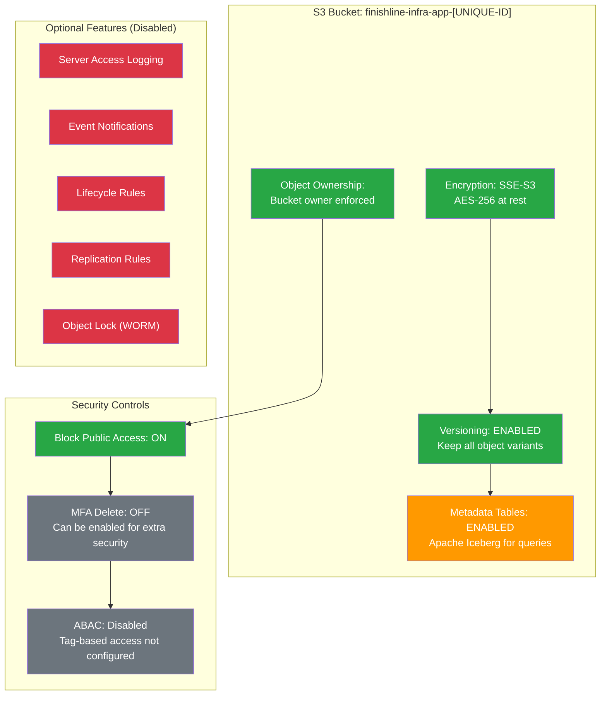
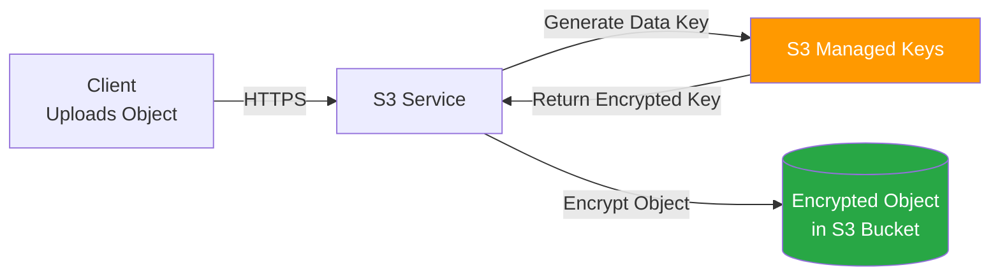

# FinishLine Infrastructure Documentation Hub

> [!NOTE]
> **The 101 Concept:** Welcome to the brain of the FinishLine Infrastructure project! If Terraform and Terragrunt are the engine and steering wheel of our environments, this folder is the driver's manual. We do not just build infrastructure here; we document _why_ we built it, _how_ to operate it, and _what_ to do when it breaks.
>
> If you are a new DevSecOps engineer onboarding to this repository, **start here.**

> [!TIP]
> **The DevSecOps Angle:** Security isn't just about firewalls and IAM roles; it's about **traceability and operational clarity**. When an incident occurs in production at 3:00 AM, ambiguous documentation is a critical vulnerability. Our guides are written pedagogically—explaining exactly what underlying AWS/Kubernetes APIs a CLI command triggers, ensuring you operate with total confidence and zero guesswork.

## High-Level Architecture Summary

The FinishLine Infrastructure is architected for **High Availability (HA)** and **Fault Tolerance** across the `us-east-1` region.

### Core Specifications:

- **Availability Zones**: 3-AZ Design (`us-east-1a`, `us-east-1b`, `us-east-1c`) to ensure the cluster can survive the total failure of any single AWS data center.
- **Subnet Strategy**: 6 Subnets per VPC (3 Public for Ingress/NAT, 3 Private for EKS Workloads).
- **Networking Isolation**: All compute resources reside in Private subnets with zero direct inbound access from the internet.
- **Environment Parity**: Dev, Stage, and Prod environments use identical 3-AZ topologies with varying CIDR ranges (`10.0.0.0/16` through `10.2.0.0/16`).

---

## S3 Backend Bucket Configuration

The Terraform state is stored in a versioned S3 bucket that serves as the single source of truth for all infrastructure deployments.

### Bucket Overview

| Property                | Value                                                                      |
| :---------------------- | :------------------------------------------------------------------------- |
| **AWS Region**          | `US East (N. Virginia) us-east-1`                                          |
| **Bucket Name**         | `finishline-infra-app-[UNIQUE-ID]` (e.g., `finishline-infra-app-e534d5ea`) |
| **ARN**                 | `arn:aws:s3:::finishline-infra-app-[UNIQUE-ID]`                            |
| **Creation Date**       | March 29, 2026                                                             |
| **Bucket Versioning**   | **Enabled**                                                                |
| **MFA Delete**          | Disabled                                                                   |
| **Object Ownership**    | Bucket owner enforced (ACLs disabled)                                      |
| **Default Encryption**  | SSE-S3 (Server-side encryption with Amazon S3 managed keys)                |
| **Block Public Access** | **On** (All public access blocked)                                         |

### Bucket Architecture Diagram



---

### Feature Deep Dive: Enabled Settings

#### 1. Bucket Versioning (Enabled)

**What it does:** Versioning keeps multiple variants of an object in the same bucket. When versioning is enabled:

- Every `PUT` operation creates a new version ID
- Deleted objects get a **delete marker** (not permanently removed)
- You can restore any previous version of a Terraform state file

**Why it matters for Terraform:**
| Scenario | Without Versioning | With Versioning |
| :--- | :--- | :--- |
| Accidental `terraform destroy` | State file deleted, lost forever | Delete marker added; restore previous version |
| Corrupted state file | Overwritten, unrecoverable | Roll back to last known good version |
| Audit trail | No history of changes | Full version history with timestamps |
| Concurrent writes | Last write wins (race condition) | All versions preserved; conflicts detectable |

**Verification Command:**

```bash
aws s3api get-bucket-versioning --bucket finishline-infra-app-[UNIQUE-ID]
# Expected: {"Status": "Enabled"}
```

---

#### 2. Server-Side Encryption (SSE-S3)

**What it does:** Automatically encrypts all objects at rest using AES-256 encryption with S3-managed keys.

**Encryption Flow:**



**Key Properties:**
| Property | Description |
| :--- | :--- |
| **Algorithm** | AES-256 (Advanced Encryption Standard) |
| **Key Management** | S3 automatically manages key rotation |
| **Cost** | No additional charge (included in S3 pricing) |
| **Compliance** | Meets most regulatory requirements for data at rest |

> [!NOTE]
> **Bucket Key Status:** Disabled (only applies to SSE-KMS, not SSE-S3)

---

#### 3. Block Public Access (Enabled)

**What it does:** Enforces a hard boundary that prevents any object or bucket policy from granting public access.

**Individual Settings (All Enabled):**
| Setting | Status | Effect |
| :--- | :--- | :--- |
| `BlockPublicAcls` | **ON** | Blocks new public ACLs and uploading public objects |
| `IgnorePublicAcls` | **ON** | Ignores all existing public ACLs |
| `BlockPublicPolicy` | **ON** | Blocks new public bucket policies |
| `RestrictPublicBuckets` | **ON** | Restricts access to buckets with public policies |

**Why this matters:** Even if a misconfigured Terraform module tries to apply a public bucket policy, AWS will reject it at the API level.

---

#### 4. Object Ownership: Bucket Owner Enforced

**What it does:** Disables ACLs and ensures the bucket owner automatically owns all objects uploaded to the bucket.

**ACL Behavior:**
| Grantee | Objects | Bucket ACL |
| :--- | :--- | :--- |
| **Bucket Owner** | Read, Write | Full Control |
| **Everyone (Public)** | — | — |
| **Authenticated Users** | — | — |
| **S3 Log Delivery** | — | — |

**Why this matters:** Simplifies access control by using only bucket policies instead of managing complex ACL hierarchies.

---

### Feature Deep Dive: Disabled Settings (Optional Enhancements)

#### 1. S3 Object Metadata Tables (Recommended Addition)

> [!TIP]
> See [RUNBOOK.md](./RUNBOOK.md#enabling-s3-object-metadata-tables) for setup instructions.

**What it would do:** Automatically generates near real-time metadata in Apache Iceberg tables for querying object inventory.

**Use Cases:**

- Audit state file changes over time with SQL queries
- Track who modified what and when
- Build compliance reports on infrastructure changes
- Integrate with SIEM tools for security monitoring

---

#### 2. Server Access Logging (Disabled)

**What it would do:** Logs all requests made to the bucket (who accessed what, when, from which IP).

**Typical Use Case:** Security audits and forensic analysis after an incident.

**Configuration (if enabled):**

```json
{
	"TargetBucket": "security-logs-bucket",
	"TargetPrefix": "s3-access-logs/finishline-state-bucket/",
	"TargetGrants": []
}
```

---

#### 3. Event Notifications (Disabled)

**What it would do:** Sends notifications (SNS, SQS, Lambda) when specific events occur (e.g., `s3:ObjectCreated:*`, `s3:ObjectRemoved:*`).

**Typical Use Case:** Trigger Lambda functions to validate state files or send Slack alerts on changes.

---

#### 4. Lifecycle Rules (Disabled)

**What it would do:** Automatically transition or delete objects based on age.

**Recommended Rules for State Buckets:**
| Rule Name | Status | Scope | Current Version Action | Noncurrent Version Action |
| :--- | :--- | :--- | :--- | :--- |
| `Expire-Old-Versions` | Disabled | All objects | — | Transition to IA after 30 days, Expire after 90 days |
| `Abort-Incomplete-Multipart` | Disabled | All objects | — | Abort after 7 days |

---

#### 5. AWS CloudTrail Data Events (Not Configured)

**What it would do:** Log all S3 object-level API calls (GetObject, PutObject, DeleteObject) to CloudTrail.

**Why enable it:** Provides an immutable audit trail of every state file read/write operation.

---

#### 6. Object Lock / WORM (Disabled)

**What it would do:** Prevents objects from being deleted or overwritten for a fixed retention period (Write-Once-Read-Many).

**Use Case:** Compliance requirements (SEC 17a-4, FINRA) where state files must be immutable.

---

### Permissions Overview

#### Bucket Policy Status

- **Current Policy:** None (relies on IAM policies for access control)
- **Public Access:** Blocked via Block Public Access settings

#### IAM Permissions Required for Terraform Operations

| Action                   | Purpose                                    |
| :----------------------- | :----------------------------------------- |
| `s3:ListBucket`          | List objects in the state bucket           |
| `s3:GetObject`           | Read state files during `terraform plan`   |
| `s3:PutObject`           | Write state files during `terraform apply` |
| `s3:DeleteObject`        | Remove state files (rarely used)           |
| `s3:GetBucketVersioning` | Verify versioning status                   |
| `s3:PutBucketVersioning` | Enable versioning (bootstrap only)         |

---

### Cost Considerations

| Component               | Estimated Monthly Cost (Dev)                 |
| :---------------------- | :------------------------------------------- |
| **S3 Standard Storage** | ~$0.023/GB (state files are small, ~1-10 MB) |
| **S3 Requests**         | ~$0.005 per 1,000 PUT/COPY/POST/LIST         |
| **Versioning Storage**  | Depends on state file change frequency       |
| **Metadata Tables**     | ~$0.50/TB scanned + storage costs            |

**Total Expected Cost:** < $5/month for typical development usage.

---

## Directory Index

Please refer to the following guides based on your current mission:

### 1. 🚀 Deployment & Operations

**File:** [RUNBOOK.md](./RUNBOOK.md)

This is your primary operational manual. It covers:

- The exact step-by-step dependency sequence for deploying the `vpc`, `security`, and `compute` modules via Terragrunt block resolution.
- Pre-launch security hardening checklists (verifying open CIDRs, validating IAM strictness).
- Pedagogical breakdowns of exactly how `aws sts get-caller-identity` negotiates trust and how `kubectl` natively authenticates via `~/.kube/config`.

### 2. 🧯 Incident Response & Troubleshooting

**File:** [KARPENTER_FIXES.md](./KARPENTER_FIXES.md)

If the `karpenter` EC2-auto-provisioner fails to natively schedule Kubernetes pods, consult this guide. It covers:

- Debugging AWS STS Trust Relationships and IAM OIDC Provider loops bridging EKS to AWS.
- IRSA (IAM Roles for Service Accounts) logic flow.
- CrashLoopBackOff remediations for the Karpenter Helm Release.

### 3. 🔍 Security & Compliance

**File:** [AUDIT_LOG.md](./AUDIT_LOG.md)

The historical log of infrastructure compliance audits, vulnerability remediations, and architectural pivots required to pass strict industrial-grade security reviews before migrating code from `dev` to `prod`.

### 4. 📚 Project Specifications

- **Original Challenge Set (Part 1):** [Finishline_Infra_Project_Assignment.pdf](./Finishline_Infra_Project_Assignment.pdf)
- **Karpenter Expansion (Part 2):** [Finishline_Karpenter_Project.pdf](./Finishline_Karpenter_Project.pdf)

---

## How to Read This Repository

Each underlying Terraform module (e.g., `compute/eks/README.md`) contains its own localized documentation breaking down its specific resources.

However, all core modules adhere to a strict **pedagogical framework** comprising:

1.  **The 101 Concept:** A jargon-free explanation of the architectural components.
2.  **The DevSecOps Angle:** The explicit security and operational reasoning behind the architectural design (i.e. Least Privilege, isolating Bastion Hosts, dropping inbound SSH).

Always review the module-level READMEs before executing `terragrunt apply` on an unfamiliar component.
