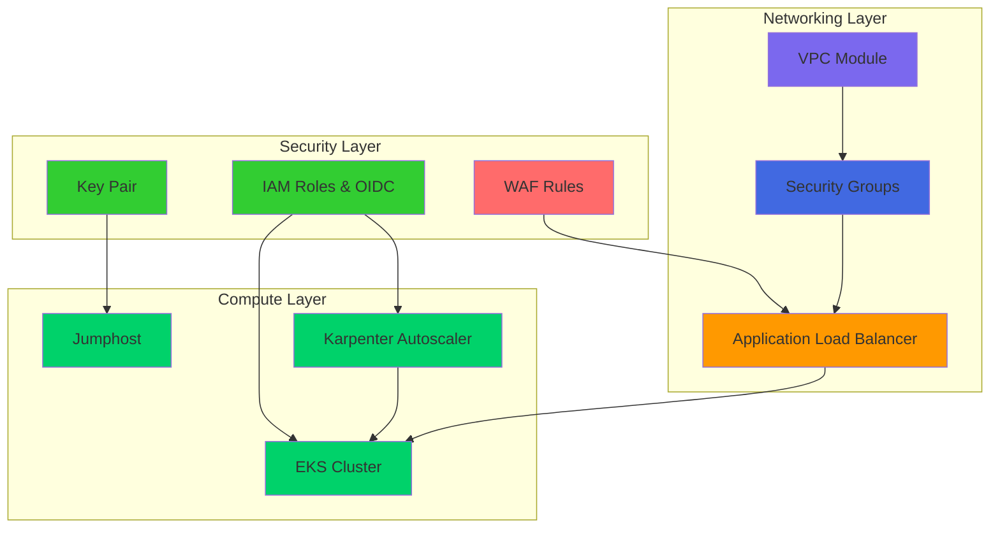

# FinishLine Infrastructure Runbook

**Document Owner:** FinishLine Infrastructure Team
**Last Updated:** March 26, 2026
**Environments:** Dev, Stage, Prod
**Classification:** Internal Operations
**Version:** 3.0

---

## Table of Contents

- [Overview](#overview)
  - [Infrastructure Architecture](#infrastructure-architecture)
  - [Deployment Order](#deployment-order)
  - [Environment Configuration](#environment-configuration)
  - [Karpenter Configuration by Environment](#karpenter-configuration-by-environment)
- [Prerequisites](#prerequisites)
  - [Required Tools](#required-tools)
  - [AWS Configuration](#aws-configuration)
  - [Clone Repository](#clone-repository)
- [Known Issues and Fixes](#known-issues-and-fixes)
  - [NAT Gateway Availability Mode Error](#nat-gateway-availability-mode-error)
  - [Terragrunt Module Path Issues](#terragrunt-module-path-issues)
  - [Missing Variable Errors](#missing-variable-errors)
  - [Dependency Output Errors](#dependency-output-errors)
  - [Helm Provider set Block Syntax Error](#helm-provider-set-block-syntax-error)
- [Part 1: Networking Deployment](#part-1-networking-deployment)
  - [Step 1: Bootstrap State Backend](#step-1-bootstrap-state-backend)
  - [Step 2: Deploy VPC](#step-2-deploy-vpc)
  - [Step 3: Deploy Security Groups](#step-3-deploy-security-groups)
  - [Step 4: Deploy ALB](#step-4-deploy-alb)
  - [Step 5: Verify Networking](#step-5-verify-networking)
- [Part 2: Security Module Deployment](#part-2-security-module-deployment)
  - [Step 1: Deploy Key Pair](#step-1-deploy-key-pair)
  - [Step 2: Deploy IAM Roles](#step-2-deploy-iam-roles)
  - [Step 3: Configure OIDC for IRSA](#step-3-configure-oidc-for-irsa)
- [Part 3: Compute Deployment](#part-3-compute-deployment)
  - [Step 1: Deploy EKS Cluster](#step-1-deploy-eks-cluster)
  - [Step 2: Deploy Jumphost](#step-2-deploy-jumphost)
  - [Step 3: Deploy Karpenter](#step-3-deploy-karpenter)
    - [3.1 Apply Terraform Module (EC2NodeClass & NodePool)](#31-apply-terraform-module-ec2nodeclass--nodepool)
    - [3.2 Install Karpenter Helm Chart](#32-install-karpenter-helm-chart)
    - [3.3 Verify Karpenter](#33-verify-karpenter)
    - [3.4 Test Karpenter Scaling](#34-test-karpenter-scaling)
    - [3.5 Karpenter Troubleshooting](#35-karpenter-troubleshooting)
- [Part 4: Security Hardening](#part-4-security-hardening)
  - [Enable HTTPS/TLS](#enable-httpstls)
  - [Deploy AWS WAF](#deploy-aws-waf)
  - [Enable Access Logging](#enable-access-logging)
  - [Configure Monitoring](#configure-monitoring)
- [Verification Guide](#verification-guide)
  - [Verify Networking](#verify-networking)
  - [Verify Security](#verify-security)
  - [Verify Compute](#verify-compute)
  - [Verify Karpenter](#verify-karpenter)
- [Operations](#operations)
  - [Daily Checks](#daily-checks)
  - [Incident Response](#incident-response)
  - [Troubleshooting](#troubleshooting)
- [Appendix](#appendix)
  - [A. Cost Estimates](#a-cost-estimates)
  - [B. Quick Reference Commands](#b-quick-reference-commands)
  - [C. Related Documentation](#c-related-documentation)

---

## Overview

This runbook provides step-by-step instructions for deploying and operating the FinishLine Infrastructure on AWS using Terraform and Terragrunt.

### Infrastructure Architecture



### Deployment Order

```mermaid
gantt
    title Infrastructure Deployment Sequence
    dateFormat X
    axisFormat Step %s

    section Networking (Part 1)
    Bootstrap          :0, 1
    VPC Module         :1, 2
    Security Groups    :3, 2
    ALB Module         :5, 2
    Verification       :7, 1

    section Security (Part 2)
    Key Pair           :8, 1
    IAM Roles          :9, 2
    OIDC Config        :11, 2

    section Compute (Part 3)
    EKS Cluster        :14, 3
    Jumphost           :17, 2
    Karpenter TF       :19, 2
    Karpenter Helm     :21, 2

    section Hardening (Part 4)
    HTTPS/WAF/Logging  :24, 3
```



### Environment Configuration

| Environment | AWS Region | VPC CIDR    | Karpenter Enabled | Purpose               |
| ----------- | ---------- | ----------- | ----------------- | --------------------- |
| **Dev**     | us-east-1  | 10.0.0.0/16 | Yes               | Development & Testing |
| **Stage**   | us-east-1  | 10.1.0.0/16 | Yes               | Staging/Pre-prod      |
| **Prod**    | us-east-1  | 10.2.0.0/16 | Yes               | Production            |

### Karpenter Configuration by Environment

| Environment | Instance Types                             | Max CPU | Capacity Types  |
| ----------- | ------------------------------------------ | ------- | --------------- |
| **Dev**     | m5.large, m5.xlarge, c5.large              | 50      | spot, on-demand |
| **Stage**   | m5.large, m5.xlarge, m5.2xlarge, c5.large  | 100     | spot, on-demand |
| **Prod**    | m5.large, m5.xlarge, m5.2xlarge, c5.xlarge | 500     | on-demand, spot |

---

## Prerequisites

### Required Tools

| Tool       | Version   | Installation              |
| ---------- | --------- | ------------------------- |
| Terraform  | >= 1.5.0  | `tfenv install 1.6.0`     |
| Terragrunt | >= 0.50.0 | `brew install terragrunt` |
| AWS CLI    | >= 2.0    | `brew install awscli`     |
| kubectl    | >= 1.28   | `brew install kubectl`    |
| Helm       | >= 3.12.0 | `brew install helm`       |
| jq         | >= 1.6    | `brew install jq`         |

### AWS Configuration

```bash
# Configure AWS credentials
aws configure

# Verify configuration
aws sts get-caller-identity

# Expected output:
# {
#     "UserId": "AIDAXXXXXXXXXXXXXXXXX",
#     "Account": "123456789012",
#     "Arn": "arn:aws:iam::123456789012:user/your-user"
# }
```

### Clone Repository

```bash
git clone https://github.com/finishline/finishline_infra_app.git
cd finishline_infra_app/terraform
```

---

## Known Issues and Fixes

### NAT Gateway Availability Mode Error

**Error:**

```
Error: creating EC2 NAT Gateway: operation error EC2: CreateNatGateway,
api error MissingParameter: VpcId is not supported for a NAT gateway with availability mode zonal.
```

**Cause:** The AWS Terraform provider introduced a new `availability_mode` attribute for NAT gateways.

**Resolution:**

1. Open `terraform/modules/networking/vpc/main.tf`
2. Locate the `aws_nat_gateway` resource
3. Remove the `vpc_id` attribute (it's derived from `subnet_id`)
4. Set `availability_mode = "zonal"` explicitly

```hcl
resource "aws_nat_gateway" "finishline_nat_gw" {
  count = length(var.public_subnets_cidr)

  subnet_id         = aws_subnet.finishline_public_subnet[count.index].id
  allocation_id     = aws_eip.finishline_eip[count.index].id
  availability_mode = "zonal"

  tags = {
    Name        = "${var.project_name}-${var.environment}-nat-gw-${count.index + 1}"
    Project     = var.project_name
    Environment = var.environment
    ManagedBy   = var.managed_by
  }
}
```

### Terragrunt Module Path Issues

**Error:**

```
error occurred: stat /home/ganil/Documents/finishline_infra_app/terraform/environments/modules: no such file or directory
```

**Cause:** The `source` path in `terragrunt.hcl` uses incorrect relative path depth.

**Resolution:**

```hcl
# Incorrect (3 levels up):
source = "${get_terragrunt_dir()}/../../../modules//networking/alb"

# Correct (4 levels up):
source = "${get_terragrunt_dir()}/../../../../modules//networking/alb"
```

### Missing Variable Errors

**Error:**

```
var.alb_name
  Name of the Application Load Balancer
  Enter a value:
```

**Cause:** Required module variables are not defined in the `terragrunt.hcl` inputs block.

**Resolution:**

Add missing variables to the `inputs` block in `terragrunt.hcl`:

```hcl
inputs = {
  alb_name              = "${local.project_name}-${local.environment}-alb"
  alb_type              = "application"
  security_group_id     = dependency.sg.outputs.security_group_id
  # ... other inputs
}
```

### Dependency Output Errors

**Error:**

```
Error: Unknown variable
  on terragrunt.hcl line XX:
  XX:   cluster_name = dependency.eks.outputs.cluster_name
There is no variable named "dependency".
```

**Cause:** Terragrunt cannot fetch outputs from dependencies that haven't been applied yet.

**Resolution:**

Apply dependencies in order:

```bash
# 1. Apply IAM first
cd environments/dev/security/iam
terragrunt apply

# 2. Apply EKS
cd environments/dev/compute/eks
terragrunt apply

# 3. Apply Karpenter
cd environments/dev/compute/karpenter
terragrunt apply
```

### Helm Provider set Block Syntax Error

**Error:**

```
Error: Unsupported block type
  on main.tf line 18, in resource "helm_release" "karpenter":
  18:   set {
Blocks of type "set" are not expected here. Did you mean to define argument
"set"? If so, use the equals sign to assign it a value.
```

**Cause:** Helm provider v3.0+ changed `set` from a block type to an argument using `=` assignment. The old block syntax (`set { name = "...", value = "..." }`) is no longer supported.

**Resolution:**

Convert `set` blocks to the new `set` argument syntax in `terraform/modules/compute/karpenter/main.tf`:

```hcl
# Old (Helm provider v2.x) - INVALID:
set {
  name  = "settings.clusterName"
  value = var.cluster_name
}

dynamic "set" {
  for_each = var.queue_name != "" ? [1] : []
  content {
    name  = "settings.interruptionQueue"
    value = var.queue_name
  }
}

# New (Helm provider v3.0+) - CORRECT:
set = [
  {
    name  = "settings.clusterName"
    value = var.cluster_name
  },
  {
    name  = "settings.clusterEndpoint"
    value = var.cluster_endpoint
  },
  {
    name  = "replicas"
    value = "1"
  }
]

# For conditional values, use a conditional expression:
set_sensitive = var.karpenter_interruption_queue_name != "" ? [
  {
    name  = "settings.interruptionQueue"
    value = var.karpenter_interruption_queue_name
  }
] : []
```

After fixing, run:

```bash
cd environments/dev/compute/karpenter
terragrunt init -upgrade
terragrunt validate
terragrunt plan
```

---

## Part 1: Networking Deployment

### Step 1: Bootstrap State Backend

**Purpose:** Create S3 bucket for Terraform state storage.

```bash
# Navigate to bootstrap directory
cd terraform/environments/dev/bootstrap

# Review configuration
cat terragrunt.hcl

# Deploy bootstrap
terragrunt init
terragrunt apply

# Expected output:
# Apply complete! Resources: 1 added, 0 changed, 0 destroyed.
# S3 bucket: finishline-infra-app-ba3347ce
```

**Verify:**

```bash
# Check S3 bucket exists
aws s3 ls s3://finishline-infra-app-ba3347ce

# Check versioning is enabled
aws s3api get-bucket-versioning --bucket finishline-infra-app-ba3347ce
```

---

### Step 2: Deploy VPC

**Purpose:** Create VPC, subnets, Internet Gateway, and route tables.

```bash
# Navigate to VPC module
cd ../networking/vpc

# Review configuration
cat terragrunt.hcl

# Plan deployment
terragrunt plan -out=tfplan

# Apply configuration
terragrunt apply tfplan
```

**Configuration Summary:**

| Setting            | Value                                    |
| ------------------ | ---------------------------------------- |
| VPC CIDR           | 10.0.0.0/16                              |
| Public Subnets     | 10.0.1.0/24, 10.0.2.0/24, 10.0.3.0/24    |
| Private Subnets    | 10.0.10.0/24, 10.0.11.0/24, 10.0.12.0/24 |
| Availability Zones | us-east-1a, us-east-1b, us-east-1c       |
| DNS Support        | Enabled                                  |
| DNS Hostnames      | Enabled                                  |

**Verify:**

```bash
# Check VPC
aws ec2 describe-vpcs --filters "Name=tag:Name,Values=finishline-infra-app-dev-vpc"

# Check subnets
aws ec2 describe-subnets --filters "Name=vpc-id,Values=vpc-xxx"

# Check Internet Gateway
aws ec2 describe-internet-gateways --filters "Name=attachment.vpc-id,Values=vpc-xxx"

# Check route tables
aws ec2 describe-route-tables --filters "Name=vpc-id,Values=vpc-xxx"
```

---

### Step 3: Deploy Security Groups

**Purpose:** Create security groups for ALB, EKS, and application traffic.

```bash
# Navigate to Security Group module
cd ../sg

# Review configuration
cat terragrunt.hcl

# Plan deployment
terragrunt plan -out=tfplan

# Apply configuration
terragrunt apply tfplan
```

**Security Group Rules:**

| Security Group    | Ingress                                                  | Egress          |
| ----------------- | -------------------------------------------------------- | --------------- |
| **finishline-sg** | 80, 443 (0.0.0.0/0), 22 (10.0.0.0/16), 30000-32768 (EKS) | All (0.0.0.0/0) |

**Verify:**

```bash
# List security groups
aws ec2 describe-security-groups --filters "Name=tag:Name,Values=finishline-infra-app-dev-sg"

# Check ingress rules
aws ec2 describe-security-groups \
  --filters "Name=group-name,Values=finishline-infra-app-dev-sg" \
  --query 'SecurityGroups[0].IpPermissions'
```

---

### Step 4: Deploy ALB

**Purpose:** Create Application Load Balancer with Target Group and Listener.

```bash
# Navigate to ALB module
cd ../alb

# Review configuration
cat terragrunt.hcl

# Plan deployment
terragrunt plan -out=tfplan

# Apply configuration
terragrunt apply tfplan
```

**ALB Configuration:**

| Setting        | Value                         |
| -------------- | ----------------------------- |
| Type           | Application (Internet-facing) |
| Subnets        | Public subnets from VPC       |
| Security Group | Dedicated ALB SG              |
| Listener       | HTTP (Port 80)                |
| Target Group   | Port 80, HTTP protocol        |
| Health Check   | /, 30s interval               |

**Verify:**

```bash
# Check ALB
aws elbv2 describe-load-balancers --query "LoadBalancers[?contains(LoadBalancerName, 'finishline')]"

# Check Target Group
aws elbv2 describe-target-groups --query "TargetGroups[?contains(TargetGroupName, 'finishline')]"

# Check Listener
aws elbv2 describe-listeners --load-balancer-arn <alb-arn>

# Get ALB DNS name
aws elbv2 describe-load-balancers \
  --query "LoadBalancers[0].DNSName" \
  --output text
```

---

### Step 5: Verify Networking

```bash
# Create verification script
cat > /tmp/verify-networking.sh << 'EOF'
#!/bin/bash

echo "=== Networking Verification ==="
echo ""

# VPC Check
echo "1. VPC Status:"
VPC_ID=$(aws ec2 describe-vpcs --filters "Name=tag:Name,Values=finishline-infra-app-dev-vpc" --query "Vpcs[0].VpcId" --output text)
echo "   VPC ID: $VPC_ID"

# Subnet Check
echo ""
echo "2. Subnet Status:"
aws ec2 describe-subnets --filters "Name=vpc-id,Values=$VPC_ID" \
  --query "Subnets[*].[AvailabilityZone,CidrBlock,State]" --output table

# ALB Check
echo ""
echo "3. ALB Status:"
ALB_DNS=$(aws elbv2 describe-load-balancers --query "LoadBalancers[0].DNSName" --output text)
echo "   ALB DNS: $ALB_DNS"

# Connectivity Test
echo ""
echo "4. Connectivity Test:"
curl -s -o /dev/null -w "   HTTP Response: %{http_code}\n" http://$ALB_DNS/ || echo "   (Expected: 403/503 - no targets)"

echo ""
echo "=== Verification Complete ==="
EOF

chmod +x /tmp/verify-networking.sh
/tmp/verify-networking.sh
```

---

## Part 2: Security Module Deployment

### Step 1: Deploy Key Pair

**Purpose:** Create SSH key pair for jumphost access.

```bash
# Navigate to Key Pair module
cd ../../security/key_pair

# Review configuration
cat terragrunt.hcl

# Plan deployment
terragrunt plan -out=tfplan

# Apply configuration
terragrunt apply tfplan
```

**Outputs:**

```
key_name = finishline-infra-app-dev-key
private_key_path = /path/to/finishline-infra-app-dev-key.pem
```

**Verify:**

```bash
# List key pairs
aws ec2 describe-key-pairs --filters "Name=key-name,Values=finishline*"

# Set correct permissions on private key
chmod 400 /path/to/finishline-infra-app-dev-key.pem
```

---

### Step 2: Deploy IAM Roles

**Purpose:** Create IAM roles for EKS cluster, worker nodes, OIDC integration, and Karpenter autoscaler.

```bash
# Navigate to IAM module
cd ../iam

# Review configuration
cat terragrunt.hcl

# Plan deployment
terragrunt plan -out=tfplan

# Apply configuration
terragrunt apply tfplan
```

**IAM Roles Created:**

| Role                                  | Purpose              | Trust Entity      |
| ------------------------------------- | -------------------- | ----------------- |
| `finishline-dev-cluster-role`         | EKS Cluster          | eks.amazonaws.com |
| `finishline-dev-nodegroup-role`       | EKS Worker Nodes     | ec2.amazonaws.com |
| `finishline-dev-oidc-role`            | Generic Workloads    | OIDC (IRSA)       |
| `finishline-dev-karpenter-controller` | Karpenter Controller | OIDC (IRSA)       |
| `finishline-dev-karpenter-node`       | Karpenter Nodes      | ec2.amazonaws.com |

**Verify:**

```bash
# List IAM roles
aws iam list-roles --query "Roles[?contains(RoleName, 'finishline')].[RoleName,Arn]" --output table

# Check trust policies
aws iam get-role --role-name finishline-dev-cluster-role --query "Role.AssumeRolePolicyDocument"

# Get Karpenter outputs (needed later)
terragrunt output karpenter_controller_role_arn
terragrunt output karpenter_node_instance_profile_name
```

---

### Step 3: Configure OIDC for IRSA

**Purpose:** Enable IAM Roles for Service Accounts (IRSA) for Karpenter and workloads.

#### 3.1 Get OIDC URL from EKS Cluster

**Note:** This must be done AFTER EKS cluster is created (Part 3, Step 1).

```bash
# After EKS cluster is created, get OIDC issuer URL
aws eks describe-cluster \
  --name finishline-infra-app-dev-eks \
  --query "cluster.identity.oidc.issuer" \
  --output text

# Expected output: https://oidc.eks.us-east-1.amazonaws.com/id/XXXXXXXXXXXXX
```

#### 3.2 Get OIDC Thumbprint

```bash
# Get the thumbprint for the OIDC provider
openssl s_client -showcerts -connect oidc.eks.us-east-1.amazonaws.com:443 \
  | openssl x509 -fingerprint -sha256 -noout \
  | cut -d= -f2 \
  | tr -d ':'

# Expected output: XXXXXXXXXXXXXXXXXXXXXXXXXXXXXXXX (64 characters)
```

#### 3.3 Update IAM Terragrunt Configuration

```bash
# Edit terragrunt.hcl with OIDC values
cd ../../security/iam
vi terragrunt.hcl

# Update the following variables:
# eks_oidc_url        = "https://oidc.eks.us-east-1.amazonaws.com/id/XXXXXXXXXXXXX"
# oidc_thumbprint     = "XXXXXXXXXXXXXXXXXXXXXXXXXXXXXXXX"
# eks_oidc_namespace  = "karpenter"
# eks_oidc_service_account = "karpenter"
# eks_oidc_subject    = "system:serviceaccount:karpenter:karpenter"
```

#### 3.4 Re-apply IAM Module

```bash
# Apply OIDC configuration
terragrunt apply
```

#### 3.5 Verify OIDC Provider

```bash
# List OIDC providers
aws iam list-open-id-connect-providers

# Get provider details
aws iam get-open-id-connect-provider \
  --open-id-connect-provider-arn arn:aws:iam::ACCOUNT:oidc-provider/oidc.eks.us-east-1.amazonaws.com/id/XXXXX
```

---

## Part 3: Compute Deployment

### Step 1: Deploy EKS Cluster

**Purpose:** Create EKS cluster for container workloads.

```bash
# Navigate to EKS module
cd ../../compute/eks

# Review configuration
cat terragrunt.hcl

# Plan deployment
terragrunt plan -out=tfplan

# Apply configuration
terragrunt apply tfplan

# This takes 15-20 minutes
```

**Verify:**

```bash
# Update kubeconfig
aws eks update-kubeconfig --name finishline-infra-app-dev-eks --region us-east-1

# Check cluster status
kubectl cluster-info

# Check nodes
kubectl get nodes

# Expected:
# NAME                          STATUS   ROLES    AGE   VERSION
# ip-10-0-10-1.ec2.internal     Ready    <none>   5m    v1.30.x
# ip-10-0-11-1.ec2.internal     Ready    <none>   5m    v1.30.x
```

---

### Step 2: Deploy Jumphost

**Purpose:** Create bastion host for private subnet access.

```bash
# Navigate to Jumphost module
cd ../jumphost

# Review configuration
cat terragrunt.hcl

# Plan deployment
terragrunt plan -out=tfplan

# Apply configuration
terragrunt apply tfplan
```

**Connect to Jumphost:**

```bash
# Get jumphost public IP
JUMP_IP=$(aws ec2 describe-instances \
  --filters "Name=tag:Name,Values=finishline-infra-app-dev-jumphost" \
  --query "Reservations[0].Instances[0].PublicIpAddress" \
  --output text)

# SSH to jumphost
ssh -i /path/to/finishline-infra-app-dev-key.pem ec2-user@$JUMP_IP
```

---

### Step 3: Deploy Karpenter

**Purpose:** Install Karpenter autoscaler for efficient node provisioning.

**Important Prerequisites:**

Before deploying Karpenter, ensure:

1. EKS cluster has **public endpoint enabled** (for dev environment), OR
2. You are running from within the VPC (e.g., jumphost)

**Enable EKS Public Access (Dev Only):**

```bash
# 1. Update EKS configuration to enable public access
cd ../../compute/eks
vi terragrunt.hcl

# Change:
# endpoint_public_access = false
# To:
# endpoint_public_access = true

# 2. Apply the change
terragrunt apply

# 3. Verify public access is enabled
aws eks describe-cluster --name finishline-infra-app-dev-eks \
  --query "cluster.resourcesVpcConfig.{endpointPrivateAccess:endpointPrivateAccess,endpointPublicAccess:endpointPublicAccess}"

# Expected: endpointPublicAccess = true

# 4. Navigate to Karpenter module
cd ../karpenter
```

#### 3.1 Apply Terraform Module (EC2NodeClass & NodePool)

**Important:** Apply the Terraform module FIRST to create EC2NodeClass and NodePool resources.

```bash
# Navigate to Karpenter module
cd ../karpenter

# Review configuration
cat terragrunt.hcl

# Initialize
terragrunt init

# Plan deployment
terragrunt plan -out=tfplan

# Apply - This creates EC2NodeClass and NodePool as kubernetes_manifest resources
terragrunt apply tfplan
```

**What this creates:**

- `kubernetes_manifest.karpenter_ec2_node_class` - EC2NodeClass resource
- `kubernetes_manifest.karpenter_node_pool` - NodePool resource

**Troubleshooting "cannot create REST client" Error:**

If you see this error:

```
Error: Failed to construct REST client
  with kubernetes_manifest.karpenter_ec2_node_class,
  cannot create REST client: no client config
```

**Resolution:**

1. Ensure EKS public endpoint is enabled (see above)
2. Wait 2-3 minutes after enabling public access for changes to propagate
3. Re-run `terragrunt apply`

**Alternative:** Apply from jumphost (inside VPC):

```bash
# SSH to jumphost
JUMP_IP=$(aws ec2 describe-instances \
  --filters "Name=tag:Name,Values=*jumphost*" \
  --query "Reservations[0].Instances[0].PublicIpAddress" \
  --output text)
ssh -i /path/to/key.pem ec2-user@$JUMP_IP

# From jumphost, apply Karpenter
cd /path/to/karpenter
terragrunt apply
```

#### 3.2 Install Karpenter Helm Chart

The Karpenter Helm chart is now managed by the `helm_release` resource in the Terraform module (`terraform/modules/compute/karpenter/main.tf`). The chart is installed from the AWS ECR public OCI registry:

```
oci://public.ecr.aws/karpenter
```

No manual `helm install` is required. When you run `terragrunt apply` on the Karpenter module, Terraform automatically installs/upgrades the Helm chart with the configured values.

**Important:** Ensure you are using Helm provider >= 3.0. If you encounter `Unsupported block type` errors for `set` blocks, see [Helm Provider set Block Syntax Error](#helm-provider-set-block-syntax-error).

**Manual Install (if needed for debugging):**

```bash
# Update kubeconfig (if not already done)
aws eks update-kubeconfig --name finishline-infra-app-dev-eks --region us-east-1

# Create karpenter namespace
kubectl create namespace karpenter

# Get Karpenter controller role ARN from IAM module
KARPENTER_ROLE_ARN=$(cd ../../security/iam && terragrunt output karpenter_controller_role_arn)
echo "Karpenter Role ARN: $KARPENTER_ROLE_ARN"

# Annotate service account with IAM role (IRSA)
kubectl apply -f - <<EOF
apiVersion: v1
kind: ServiceAccount
metadata:
  name: karpenter
  namespace: karpenter
  annotations:
    eks.amazonaws.com/role-arn: ${KARPENTER_ROLE_ARN}
EOF

# Verify annotation
kubectl get sa karpenter -n karpenter -o yaml | grep eks.amazonaws.com/role-arn

# Manual install from OCI registry (only if not using Terraform)
helm upgrade --install karpenter oci://public.ecr.aws/karpenter/karpenter \
  --namespace karpenter \
  --create-namespace \
  --version 1.0.8 \
  --set serviceAccount.name=karpenter \
  --set serviceAccount.annotations.eks\.amazonaws\.com/role-arn=${KARPENTER_ROLE_ARN} \
  --set settings.clusterName=finishline-infra-app-dev-eks \
  --set settings.clusterEndpoint=<eks-endpoint> \
  --set settings.interruptionQueue=finishline-infra-app-dev-eks \
  --set replicas=1 \
  --wait
```

#### 3.3 Verify Karpenter

```bash
# Check Terraform created the manifests
kubectl get ec2nodeclass
kubectl get nodepool

# Expected output:
# NAME      AGE
# default   2m

# Check Karpenter pods
kubectl get pods -n karpenter

# Expected:
# NAME                         READY   STATUS    RESTARTS   AGE
# karpenter-xxxxxxxxxx-xxxxx   1/1     Running   0          1m

# Check Karpenter logs
kubectl logs -n karpenter -l app.kubernetes.io/name=karpenter --tail=50

# Expected messages:
# "Discovered security group"
# "Discovered subnets"
# "Starting controller"
```

#### 3.4 Test Karpenter Scaling

```bash
# Create a test deployment that will trigger scaling
kubectl apply -f - <<EOF
apiVersion: apps/v1
kind: Deployment
metadata:
  name: inflate
spec:
  replicas: 10
  selector:
    matchLabels:
      app: inflate
  template:
    metadata:
      labels:
        app: inflate
    spec:
      containers:
      - name: inflate
        image: public.ecr.aws/eks-distro/kubernetes/pause:3.7
        resources:
          requests:
            cpu: 1
EOF

# Watch Karpenter provision nodes
kubectl get nodes --watch

# In another terminal, watch Karpenter logs
kubectl logs -n karpenter -l app.kubernetes.io/name=karpenter -f

# Expected: Should see "Created node" messages

# Clean up test workload (after testing)
kubectl delete deployment inflate
```

#### 3.5 Karpenter Troubleshooting

```bash
# Check if Karpenter can see pending pods
kubectl logs -n karpenter -l app.kubernetes.io/name=karpenter | grep -i "pending\|unschedulable"

# Check EC2NodeClass status
kubectl get ec2nodeclass default -o yaml

# Check NodePool status
kubectl get nodepool default -o yaml

# Common issues and resolutions:

# 1. "No security groups found"
# Resolution: Add karpenter.sh/discovery tag to security groups
aws ec2 create-tags --resources sg-xxx --tags Key=karpenter.sh/discovery,Value=finishline-infra-app-dev-eks

# 2. "No subnets found"
# Resolution: Add karpenter.sh/discovery tag to subnets
aws ec2 create-tags --resources subnet-xxx --tags Key=karpenter.sh/discovery,Value=finishline-infra-app-dev-eks

# 3. "No IAM instance profile"
# Resolution: Verify instance profile name in EC2NodeClass
terragrunt output karpenter_node_instance_profile_name

# 4. IRSA not working
# Resolution: Verify service account annotation
kubectl get sa karpenter -n karpenter -o yaml | grep eks.amazonaws.com/role-arn
```

---

## Part 4: Security Hardening

### Enable HTTPS/TLS

**Purpose:** Encrypt traffic between clients and ALB.

#### Step 1: Request SSL Certificate

```bash
# Request ACM certificate
aws acm request-certificate \
  --domain-name "*.finishline.example.com" \
  --subject-alternative-names "finishline.example.com" \
  --validation-method DNS \
  --region us-east-1

# Note the certificate ARN
# arn:aws:acm:us-east-1:123456789012:certificate/xxx-xxx-xxx
```

#### Step 2: Validate Certificate

```bash
# Get validation CNAME records
aws acm describe-certificate \
  --certificate-arn arn:aws:acm:us-east-1:123456789012:certificate/xxx \
  --query 'Certificate.DomainValidationOptions[0].ResourceRecord' \
  --output json

# Add CNAME record to Route53
# Name: _xxx.finishline.example.com
# Value: _yyy.acm-validations.aws
```

#### Step 3: Update ALB Configuration

```hcl
# environments/dev/networking/alb/terragrunt.hcl
inputs = {
  listener_port             = 443
  listener_protocol         = "HTTPS"
  listener_ssl_policy       = "ELBSecurityPolicy-TLS13-1-2-2021-06"
  listener_certificate_arn  = "arn:aws:acm:us-east-1:123456789012:certificate/xxx"
}
```

```bash
# Apply changes
cd environments/dev/networking/alb
terragrunt apply
```

#### Step 4: Verify HTTPS

```bash
# Test HTTPS endpoint
curl -v https://your-alb.us-east-1.elb.amazonaws.com/

# Check TLS version
openssl s_client -connect your-alb.us-east-1.elb.amazonaws.com:443 -tls1_3
```

---

### Deploy AWS WAF

**Purpose:** Protect against common web attacks (SQLi, XSS, etc.).

#### Step 1: Create WAF Module

Add WAF configuration to your ALB module or create a separate WAF module.

#### Step 2: Apply WAF Configuration

```bash
cd environments/dev/networking/alb
terragrunt apply
```

#### Step 3: Verify WAF

```bash
# Check WAF Web ACL
aws wafv2 get-web-acl --name finishline-infra-app-dev-alb-waf --scope REGIONAL

# Check association
aws wafv2 list-resources-for-web-acl --scope REGIONAL --web-acl-arn <arn>
```

---

### Enable Access Logging

**Purpose:** Create audit trail for security analysis.

#### Step 1: Create S3 Bucket for Logs

```bash
# Create S3 bucket for ALB logs
aws s3 mb s3://finishline-infra-app-alb-logs-dev

# Enable versioning
aws s3api put-bucket-versioning --bucket finishline-infra-app-alb-logs-dev --versioning-configuration Status=Enabled

# Enable encryption
aws s3api put-bucket-encryption --bucket finishline-infra-app-alb-logs-dev \
  --server-side-encryption-configuration '{"Rules":[{"ApplyServerSideEncryptionByDefault":{"SSEAlgorithm":"AES256"}}]}'
```

#### Step 2: Enable ALB Access Logs

```bash
# Get ALB ARN
ALB_ARN=$(aws elbv2 describe-load-balancers --query "LoadBalancers[0].LoadBalancerArn" --output text)

# Enable access logs
aws elbv2 modify-load-balancer-attributes \
  --load-balancer-arn $ALB_ARN \
  --attributes Key=access_logs.s3.enabled,Value=true \
  --attributes Key=access_logs.s3.bucket,Value=finishline-infra-app-alb-logs-dev \
  --attributes Key=access_logs.s3.prefix,Value=alb-access-logs
```

#### Step 3: Query Logs with Athena

```sql
-- Create Athena table
CREATE EXTERNAL TABLE alb_logs (
  type string,
  time string,
  elb string,
  client_ip string,
  request_verb string,
  request_url string,
  elb_status_code int
)
LOCATION 's3://finishline-infra-app-alb-logs-dev/alb-access-logs/';

-- Query top IPs
SELECT client_ip, COUNT(*) as requests
FROM alb_logs
GROUP BY client_ip
ORDER BY requests DESC
LIMIT 10;
```

---

### Configure Monitoring

**Purpose:** Set up alerts for operational visibility.

#### Step 1: Create CloudWatch Alarms

```bash
# High 5xx error rate
aws cloudwatch put-metric-alarm \
  --alarm-name "finishline-alb-high-5xx" \
  --alarm-description "ALB 5xx error rate is too high" \
  --metric-name HTTPCode_ELB_5XX_Count \
  --namespace AWS/ApplicationELB \
  --statistic Sum \
  --period 300 \
  --threshold 50 \
  --comparison-operator GreaterThanThreshold \
  --evaluation-periods 2 \
  --alarm-actions arn:aws:sns:us-east-1:ACCOUNT:alerts

# Unhealthy hosts
aws cloudwatch put-metric-alarm \
  --alarm-name "finishline-alb-unhealthy-hosts" \
  --alarm-description "ALB has unhealthy hosts" \
  --metric-name UnHealthyHostCount \
  --namespace AWS/ApplicationELB \
  --statistic Average \
  --period 300 \
  --threshold 0 \
  --comparison-operator GreaterThanThreshold \
  --evaluation-periods 2 \
  --alarm-actions arn:aws:sns:us-east-1:ACCOUNT:alerts
```

#### Step 2: Create Dashboard

```bash
# Create CloudWatch Dashboard
aws cloudwatch put-dashboard \
  --dashboard-name FinishLine-Infrastructure \
  --dashboard-body '{
    "DashboardName": "FinishLine-Infrastructure",
    "DashboardBody": "{\"widgets\": [{\"type\": \"metric\", \"x\": 0, \"y\": 0, \"width\": 12, \"height\": 6, \"properties\": {\"metrics\": [[\"AWS/ApplicationELB\", \"RequestCount\", \"LoadBalancer\", \"app/finishline-dev\"]], \"period\": 300, \"stat\": \"Sum\", \"region\": \"us-east-1\"}}]}'
  }
```

---

## Verification Guide

### Verify Networking

```bash
#!/bin/bash
echo "=== Networking Verification ==="

# VPC
VPC_ID=$(aws ec2 describe-vpcs --filters "Name=tag:Name,Values=finishline-infra-app-dev-vpc" --query "Vpcs[0].VpcId" --output text)
echo "✓ VPC ID: $VPC_ID"

# Subnets
SUBNET_COUNT=$(aws ec2 describe-subnets --filters "Name=vpc-id,Values=$VPC_ID" --query "Subnets | length(@)" --output text)
echo "✓ Subnets: $SUBNET_COUNT"

# Internet Gateway
IGW=$(aws ec2 describe-internet-gateways --filters "Name=attachment.vpc-id,Values=$VPC_ID" --query "InternetGateways | length(@)" --output text)
echo "✓ Internet Gateways: $IGW"

# ALB
ALB_DNS=$(aws elbv2 describe-load-balancers --query "LoadBalancers[0].DNSName" --output text)
echo "✓ ALB DNS: $ALB_DNS"

# ALB Health Check
HTTP_CODE=$(curl -s -o /dev/null -w "%{http_code}" http://$ALB_DNS/)
echo "✓ ALB HTTP Response: $HTTP_CODE"

echo "=== Networking Verification Complete ==="
```

### Verify Security

```bash
#!/bin/bash
echo "=== Security Verification ==="

# Key Pair
KEY_NAME=$(aws ec2 describe-key-pairs --filters "Name=key-name,Values=finishline*" --query "KeyPairs[0].KeyName" --output text)
echo "✓ Key Pair: $KEY_NAME"

# IAM Roles
IAM_ROLES=$(aws iam list-roles --query "Roles[?contains(RoleName, 'finishline')].RoleName" --output text)
echo "✓ IAM Roles:"
echo "$IAM_ROLES" | tr ' ' '\n' | sed 's/^/  /'

# OIDC Provider
OIDC_COUNT=$(aws iam list-open-id-connect-providers --query "OpenIDConnectProviderList | length(@)" --output text)
echo "✓ OIDC Providers: $OIDC_COUNT"

# Security Groups
SG_COUNT=$(aws ec2 describe-security-groups --filters "Name=tag:Project,Values=finishline-infra-app" --query "SecurityGroups | length(@)" --output text)
echo "✓ Security Groups: $SG_COUNT"

echo "=== Security Verification Complete ==="
```

### Verify Compute

```bash
#!/bin/bash
echo "=== Compute Verification ==="

# EKS Cluster
CLUSTER_NAME=$(aws eks list-clusters --query "clusters[0]" --output text)
echo "✓ EKS Cluster: $CLUSTER_NAME"

# EKS Nodes
NODE_COUNT=$(kubectl get nodes --no-headers 2>/dev/null | wc -l)
echo "✓ EKS Nodes: $NODE_COUNT"

# Jumphost
JUMP_IP=$(aws ec2 describe-instances --filters "Name=tag:Name,Values=*jumphost*" --query "Reservations[0].Instances[0].PublicIpAddress" --output text)
echo "✓ Jumphost IP: $JUMP_IP"

# Karpenter
KARPENTER_POD=$(kubectl get pods -n karpenter --no-headers 2>/dev/null | wc -l)
echo "✓ Karpenter Pods: $KARPENTER_POD"

echo "=== Compute Verification Complete ==="
```

### Verify Karpenter

```bash
#!/bin/bash
echo "=== Karpenter Verification ==="

# EC2NodeClass
EC2NC=$(kubectl get ec2nodeclass default --no-headers 2>/dev/null)
if [ -n "$EC2NC" ]; then
  echo "✓ EC2NodeClass: default"
else
  echo "✗ EC2NodeClass: NOT FOUND"
fi

# NodePool
NODEPOOL=$(kubectl get nodepool default --no-headers 2>/dev/null)
if [ -n "$NODEPOOL" ]; then
  echo "✓ NodePool: default"
else
  echo "✗ NodePool: NOT FOUND"
fi

# Karpenter Controller
KARPENTER_POD=$(kubectl get pods -n karpenter -l app.kubernetes.io/name=karpenter --no-headers 2>/dev/null)
if [ -n "$KARPENTER_POD" ]; then
  echo "✓ Karpenter Controller: Running"
else
  echo "✗ Karpenter Controller: NOT RUNNING"
fi

# IRSA Annotation
IRSA=$(kubectl get sa karpenter -n karpenter -o jsonpath='{.metadata.annotations.eks\.amazonaws\.com/role-arn}' 2>/dev/null)
if [ -n "$IRSA" ]; then
  echo "✓ IRSA: Configured"
else
  echo "✗ IRSA: NOT CONFIGURED"
fi

echo "=== Karpenter Verification Complete ==="
```

---

## Operations

### Daily Checks

```bash
#!/bin/bash
# daily-check.sh

echo "=== Daily Infrastructure Check ==="

# ALB Target Health
echo "1. ALB Target Health:"
TG_ARN=$(aws elbv2 describe-target-groups --query "TargetGroups[0].TargetGroupArn" --output text)
aws elbv2 describe-target-health --target-group-arn $TG_ARN \
  --query "TargetHealthDescriptions[].TargetHealth.State" --output table

# CloudWatch Alarms
echo ""
echo "2. CloudWatch Alarms:"
aws cloudwatch describe-alarms \
  --query "MetricAlarms[?StateValue=='ALARM'].[AlarmName,StateReason]" \
  --output table

# EKS Nodes
echo ""
echo "3. EKS Node Status:"
kubectl get nodes --show-labels

# Karpenter Status
echo ""
echo "4. Karpenter Status:"
kubectl get pods -n karpenter

# Cost Check (weekly)
echo ""
echo "5. Estimated Daily Cost:"
aws ce get-cost-and-usage \
  --time-period Start=$(date -d yesterday +%Y-%m-%01),End=$(date +%Y-%m-%d) \
  --granularity DAILY \
  --metrics BlendedCost \
  --query "ResultsByTime[0].Total.BlendedCost.Amount"
```

---

### Incident Response

#### P1: Active Attack

```bash
# 1. Enable WAF block mode immediately
aws wafv2 update-web-acl \
  --name finishline-alb-waf \
  --scope REGIONAL \
  --id <web-acl-id> \
  --default-action Block

# 2. Contact AWS Support
aws support create-case \
  --subject "DDoS Attack - P1" \
  --service-code "aws-support-api" \
  --severity-code "urgent" \
  --category-code "technical" \
  --communication-body "Active DDoS attack detected. Requesting Shield Advanced support."

# 3. Preserve logs
aws s3 cp s3://finishline-alb-logs/ s3://forensics-bucket/ --recursive

# 4. Enable Shield Advanced (if not already)
aws shield create-protection \
  --name "finishline-alb-shield" \
  --resource-arn <alb-arn>
```

#### P2: Suspicious Activity

```bash
# 1. Review WAF logs
aws athena start-query-execution \
  --query-string "SELECT source_ip, COUNT(*) FROM waf_logs WHERE action='BLOCK' GROUP BY source_ip ORDER BY COUNT(*) DESC LIMIT 10"

# 2. Add rate limiting
# Update WAF rule with lower threshold

# 3. Block suspicious IPs
aws wafv2 update-ip-set \
  --name finishline-bad-ips \
  --addresses "1.2.3.4/32" "5.6.7.8/32"
```

---

### Troubleshooting

| Issue                 | Command                               | Resolution                        |
| --------------------- | ------------------------------------- | --------------------------------- |
| ALB 502 errors        | `aws elbv2 describe-target-health`    | Check target registration         |
| SSL errors            | `openssl s_client -connect <alb>:443` | Verify ACM certificate            |
| WAF false positives   | Check CloudWatch WAF logs             | Add rule exclusions               |
| EKS nodes NotReady    | `kubectl describe node <node>`        | Check IAM roles, security groups  |
| Karpenter not scaling | `kubectl logs -n karpenter`           | Check subnet/SG tags              |
| IRSA not working      | `kubectl get sa -n karpenter -o yaml` | Verify service account annotation |

---

## Appendix

### A. Cost Estimates

| Component   | Dev/Month | Stage/Month | Prod/Month |
| ----------- | --------- | ----------- | ---------- |
| VPC         | $0        | $0          | $0         |
| NAT Gateway | $32.40    | $32.40      | $97.20     |
| ALB         | $34.43    | $34.43      | $88.43     |
| WAF         | $5.00     | $5.00       | $15.00     |
| EKS         | $73.00    | $73.00      | $219.00    |
| Jumphost    | $15.00    | $15.00      | $30.00     |
| Karpenter   | Variable  | Variable    | Variable   |
| **Total**   | **~$160** | **~$160**   | **~$450**  |

### B. Quick Reference Commands

```bash
# Terraform state operations
terragrunt state list
terragrunt state show <resource>
terragrunt import <resource> <id>

# AWS CLI shortcuts
alias k='kubectl'
alias aws-who='aws sts get-caller-identity'
alias alb-dns='aws elbv2 describe-load-balancers --query LoadBalancers[0].DNSName'

# Karpenter shortcuts
alias karpenter-logs='kubectl logs -n karpenter -l app.kubernetes.io/name=karpenter -f'
alias karpenter-nodes='watch kubectl get nodes'
```

### C. Related Documentation

- [Networking Module README](../terraform/modules/networking/README.md)
- [Security Module README](../terraform/modules/security/README.md)
- [Compute Module README](../terraform/modules/compute/README.md)
- [Terraform Documentation](https://www.terraform.io/docs)
- [Terragrunt Documentation](https://terragrunt.gruntwork.io)
- [AWS EKS Best Practices](https://aws.github.io/aws-eks-best-practices/)
- [Karpenter Documentation](https://karpenter.sh/docs/)

---

**END OF RUNBOOK**
