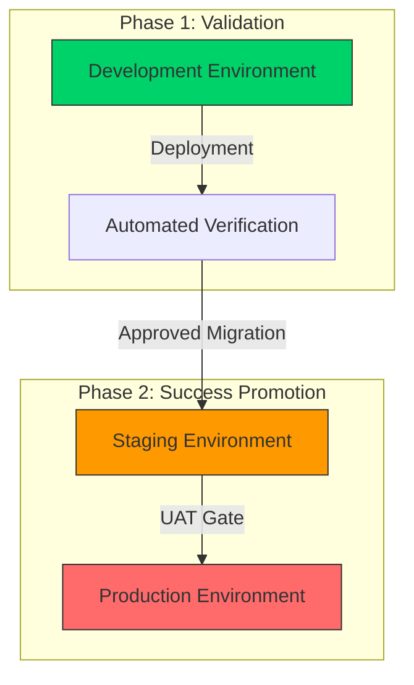

# FinishLine Infrastructure Runbook: Master Guide

**Document Owner:** FinishLine Infrastructure Team
**Major Version:** 5.0 (Comprehensive Terraform Audit Edition)
**Last Updated:** March 30, 2026
**Author:** Ganil Batist Yan (DevSecOps Lead)

---

## Table of Contents

- [FinishLine Infrastructure Runbook: Master Guide](#finishline-infrastructure-runbook-master-guide)
  - [Table of Contents](#table-of-contents)
  - [Infrastructure Overview](#infrastructure-overview)
    - [The Dev-First Promotion Mindset](#the-dev-first-promotion-mindset)
    - [High-Level Architecture](#high-level-architecture)
    - [Terraform Module Architecture](#terraform-module-architecture)
  - [Part 1: Prerequisites \& Initial Setup](#part-1-prerequisites--initial-setup)
    - [Required Toolchain](#required-toolchain)
    - [AWS CLI Authentication (IAM 101)](#aws-cli-authentication-iam-101)
  - [Part 2: Step 0 - Bootstrapping the Project](#part-2-step-0---bootstrapping-the-project)
    - [Creating the Remote State Infrastructure](#creating-the-remote-state-infrastructure)
    - [Enabling State Versioning \& Governance](#enabling-state-versioning--governance)
    - [Terragrunt Root Configuration](#terragrunt-root-configuration)
  - [Part 3: Phase 1 - Launching Development (Dev)](#part-3-phase-1---launching-development-dev)
    - [Step 1: Network Foundation (VPC, SG, ALB)](#step-1-network-foundation-vpc-sg-alb)
      - [1.1 Deploy the VPC (Virtual Private Cloud)](#11-deploy-the-vpc-virtual-private-cloud)
      - [1.2 Network ACLs (NACLs): Master the Stateless Layer](#12-network-acls-nacls-master-the-stateless-layer)
      - [1.3 Deploy Security Groups](#13-deploy-security-groups)
      - [1.4 Deploy the Shared ALB](#14-deploy-the-shared-alb)
    - [Step 2: Identity \& Access (IAM, OIDC)](#step-2-identity--access-iam-oidc)
      - [2.1 Generate the SSH Key Pair](#21-generate-the-ssh-key-pair)
      - [2.2 Provision IAM Roles](#22-provision-iam-roles)
    - [Step 3: Compute \& Scaling (EKS, Karpenter)](#step-3-compute--scaling-eks-karpenter)
      - [3.1 Deploy the EKS Cluster](#31-deploy-the-eks-cluster)
      - [3.2 Deploy the Karpenter Autoscaler](#32-deploy-the-karpenter-autoscaler)
    - [Step 4: Dev Verification Scripts](#step-4-dev-verification-scripts)
    - [Step 4.1: Comprehensive EKS Cluster Verification](#step-41-comprehensive-eks-cluster-verification)
      - [4.1.1 Cluster Information \& Status](#411-cluster-information--status)
      - [4.1.2 Node Group Verification](#412-node-group-verification)
      - [4.1.3 EKS Addons Verification](#413-eks-addons-verification)
      - [4.1.4 Kubernetes Cluster Verification (kubectl)](#414-kubernetes-cluster-verification-kubectl)
      - [4.1.5 EKS Access \& Authentication Verification](#415-eks-access--authentication-verification)
      - [4.1.6 VPC CNI \& Network Verification](#416-vpc-cni--network-verification)
      - [4.1.7 EKS Control Plane Logs](#417-eks-control-plane-logs)
      - [4.1.8 EKS Cost \& Resource Utilization](#418-eks-cost--resource-utilization)
      - [4.1.9 EKS Security Verification](#419-eks-security-verification)
      - [4.1.10 Quick Health Check Script](#4110-quick-health-check-script)
  - [Part 4: Phase 2 - Environment Promotion (Stage \& Prod)](#part-4-phase-2---environment-promotion-stage--prod)
    - [Step 5: Migrating to Stage (10.1.x.x)](#step-5-migrating-to-stage-101xx)
      - [5.1 Environment Variable Management](#51-environment-variable-management)
      - [5.2 Deploy Stage](#52-deploy-stage)
    - [Step 6: Launching Production (10.2.x.x)](#step-6-launching-production-102xx)
      - [6.1 UAT Approval \& Pre-Launch](#61-uat-approval--pre-launch)
      - [6.2 Deploy Production](#62-deploy-production)
    - [Environment-Specific Configurations](#environment-specific-configurations)
  - [Part 5: DevSecOps Hardening](#part-5-devsecops-hardening)
    - [Step 7: SSL/TLS (HTTPS) Management](#step-7-ssltls-https-management)
    - [Step 8: WAF (Web Application Firewall)](#step-8-waf-web-application-firewall)
    - [Step 9: Access Logging \& Audit Chains](#step-9-access-logging--audit-chains)
  - [Part 6: Operations \& Troubleshooting](#part-6-operations--troubleshooting)
    - [Step 10: Daily Health Checks](#step-10-daily-health-checks)
    - [Step 11: Infrastructure Decommissioning (Destroy)](#step-11-infrastructure-decommissioning-destroy)
    - [Step 12: Manual S3 Version Deletion Guide](#step-12-manual-s3-version-deletion-guide)
    - [Automated Deployment Scripts](#automated-deployment-scripts)
  - [Part 7: Trunk-Based Development (TBD) Workflow with Karpenter](#part-7-trunk-based-development-tbd-workflow-with-karpenter)
    - [What is Trunk-Based Development (TBD)?](#what-is-trunk-based-development-tbd)
    - [Step-by-Step TBD Workflow for Karpenter](#step-by-step-tbd-workflow-for-karpenter)
  - [Part 8: Operation \& Troubleshooting (Continued)](#part-8-operation--troubleshooting-continued)
  - [Appendix: Technical Reference](#appendix-technical-reference)
    - [Terraform Module Inventory](#terraform-module-inventory)
    - [IAM Role Inventory](#iam-role-inventory)
      - [EKS Cluster Roles](#eks-cluster-roles)
      - [EKS Node Group Roles](#eks-node-group-roles)
      - [Karpenter Roles (Dev Only)](#karpenter-roles-dev-only)
      - [EBS CSI Driver Roles](#ebs-csi-driver-roles)
      - [Jumphost Roles](#jumphost-roles)
    - [VPC Endpoints Configuration](#vpc-endpoints-configuration)
    - [Common Error Codes \& Fixes](#common-error-codes--fixes)
      - [Terraform/Terragrunt Errors](#terraformterragrunt-errors)
      - [Kubernetes/kubectl Errors](#kuberneteskubectl-errors)
      - [Karpenter-Specific Errors](#karpenter-specific-errors)
      - [ALB/Networking Errors](#albnetworking-errors)
    - [Quick Troubleshooting Commands](#quick-troubleshooting-commands)

---

## Infrastructure Overview

### The Dev-First Promotion Mindset

This project is built on the **"Dev-First" standard**. This means that no code or infrastructure configuration is ever applied directly to Production.

1.  **Development (`dev`)**: A Sandbox for failure. We test spot instances, aggressive scaling, and initial security policies.
2.  **Stage (`stage`)**: A mirror of Prod. We validate that the `dev` configurations work in a highly available, multi-AZ environment.
3.  **Production (`prod`)**: The hardened environment. High-priority, on-demand capacity, and restricted public access.

### High-Level Architecture



### Terraform Module Architecture

The infrastructure is organized using a modular Terragrunt structure:

```
terraform/
├── root.hcl                          # Root Terragrunt configuration (Global Tags & Backend)
├── environments/
│   ├── dev/                          # Modular development environment
│   │   ├── networking/               # VPC, Security Groups, ALB
│   │   ├── security/                 # IAM, SSH Key Pairs
│   │   └── compute/                  # EKS, Karpenter, Jumphost
│   ├── stage/                        # Modular staging environment
│   │   ├── networking/
│   │   ├── security/
│   │   └── compute/
│   └── prod/                         # Modular production environment
│       ├── networking/
│       ├── security/
│       └── compute/
├── modules/
│   ├── compute/                      # Reusable compute resources
│   │   ├── eks/                      # EKS, Node Groups, Core Addons
│   │   ├── karpenter/                # Autoscaling CRDs & Controller
│   │   └── jumphost/                 # Bastion host & SSM Access
│   ├── networking/                   # Reusable network resources
│   │   ├── vpc/                      # Core VPC & Subnets
│   │   ├── sg/                       # Centralized Firewalls
│   │   └── alb/                      # External Load Balancers (with S3 bucket policy)
│   └── security/                     # Reusable security resources
│       ├── iam/                      # Roles for EKS & IRSA
│       └── key_pair/                 # SSH Keys with Auto-Copy
└── scripts/
    ├── run-all.sh                    # Automated deployment orchestrator
    ├── verify-karpenter.sh           # Autoscaler validation script
    └── jumphost-install-tools.sh     # Bastion bootstrap script
```

---

## Part 1: Prerequisites & Initial Setup

### Required Toolchain

| Tool           | Recommended version | Purpose                                                                       |
| :------------- | :------------------ | :---------------------------------------------------------------------------- |
| **Terraform**  | `1.6.0+`            | The engine for Infrastructure as Code (IaC).                                  |
| **Terragrunt** | `0.54.0+`           | The wrapper for keeping Terraform configurations DRY (Don't Repeat Yourself). |
| **AWS CLI**    | `2.15.0+`           | Communicates your terminal commands to the AWS cloud.                         |
| **eksctl**     | `0.170.0+`          | The official CLI for creating, managing, and interacting with EKS clusters.   |
| **kubectl**    | `1.29+`             | The CLI for managing Kubernetes (EKS) workloads.                              |
| **Helm**       | `3.14.0+`           | The package manager for Kubernetes applications (Karpenter).                  |

### AWS CLI Authentication (IAM 101)

> [!NOTE]
> **What this does:** Before the project can build anything, your computer must be granted permission. `aws configure` creates a local profile that Terrafom uses to "Assume a Role" or use an "IAM User" identity.

```bash
# 1. Configure your local AWS profile
aws configure

# 2. Verify who the terminal thinks you are
aws sts get-caller-identity

# Success Output (Example):
# {
#     "UserId": "AIDAXxxxxxxxxxxxxxxx",
#     "Account": "123456789012",
#     "Arn": "arn:aws:iam::123456789012:user/devsecops-admin"
# }
```

---

## Part 2: Step 0 - Bootstrapping the Project

In professional DevOps, the "State" (the blueprint of what is actually built) must be stored in a shared, remote, and highly available location. This project uses an **S3 Bucket** for the Terraform backend.

### Creating the Remote State Infrastructure

Before running any `terragrunt` or `terraform` command, you **MUST** manually create the foundation for the configuration files to live in.

> [!IMPORTANT]
> **DevOps 101: The S3 Global Namespace Masterclass**
> **Concept:** Unlike almost every other AWS resource, **S3 bucket names are GLOBALLY UNIQUE** across all AWS accounts in the entire world.
>
> **Why it's necessary:** When you name a bucket `my-terraform-state`, AWS converts it into a DNS record. If _anyone_ else on earth has used that name, your command will fail with `BucketAlreadyExists`.
>
> **The Suffix/Prefix Strategy:** We use a unique 8-character hex string (like `e534d5ea`) at the end of our bucket names. This ensures:
>
> 1.  **Zero Collisions:** Your project doesn't conflict with other students or companies.
> 2.  **Governance:** You can track resource ownership in the AWS bill.
> 3.  **Security:** It prevents "bucket squatting" attacks where a malicious actor guesses your bucket name and creates it first.
>
> **How to create your own unique ID:**
> If `e534d5ea` is already taken or you want a fresh project, run this command in your terminal to generate a random 8-character string:
>
> ```bash
> openssl rand -hex 4
> ```

```bash
# 1. Create the S3 State Bucket (FinishLine Master Bucket)
#    CRITICAL: Replace 'e534d5ea' with YOUR unique ID if the command fails.
aws s3api create-bucket \
    --bucket finishline-infra-app-e534d5ea \
    --region us-east-1

# 2. Update the 'bucket' value in terraform/root.hcl
#    The code MUST match the manual bucket you just created.
#    ...
#    bucket = "finishline-infra-app-[YOUR-UNIQUE-ID]"
#    ...

# 3. Enable Versioning on the Bucket
#    Critical: This allows you to "roll back" to an older state file if a deployment crashes.
aws s3api put-bucket-versioning \
    --bucket finishline-infra-app-e534d5ea \
    --versioning-configuration Status=Enabled

# 4. Enable Server-Side Encryption (AES-256)
aws s3api put-bucket-encryption \
    --bucket finishline-infra-app-e534d5ea \
    --server-side-encryption-configuration '{
        "Rules": [
            {
                "ApplyServerSideEncryptionByDefault": {
                    "SSEAlgorithm": "AES256"
                }
            }
        ]
    }'
```

### Enabling State Versioning & Governance

Verify the bucket is ready via the CLI:

```bash
# Check bucket status
aws s3api get-bucket-versioning --bucket finishline-infra-app-e534d5ea
```

### Terragrunt Root Configuration

The [`terraform/root.hcl`](terraform/root.hcl) file contains the central configuration:

**Key Configurations:**

- **S3 Backend:** `finishline-infra-app-e534d5ea` with encryption and lockfile enabled
- **Region:** `us-east-1`
- **Common Tags:** Project, Environment, ManagedBy, Terraform
- **Provider Generation:** Automatic AWS, Kubernetes, Helm, and Kubectl providers
- **Conditional Logic:** Kubernetes providers only generated for EKS/Karpenter modules

```hcl
remote_state {
  backend = "s3"
  config = {
    bucket       = "finishline-infra-app-e534d5ea"
    key          = "${path_relative_to_include()}/terraform.tfstate"
    region       = "us-east-1"
    encrypt      = true
    use_lockfile = true
  }
}
```

---

## Part 3: Architecture Deep Dive (What We Build)

This section provides a technical deep-dive into the decoupled, modular components that make up the FinishLine environment. You do not need to deploy these manually; refer to **Part 4: Automated Infrastructure Deployment** for deployment execution strategies.

### Step 1: Network Foundation (VPC, SG, ALB)

**Goal:** Build the secure "virtual house" where your servers will live. No compute can run without a stable VPC, security boundaries (Firewalls), and a front door (ALB).

#### 1.1 Deploy the VPC (Virtual Private Cloud)

The VPC is our private segment of the AWS Cloud. It isolates your infrastructure from the internet, providing a secure boundary for your application data.


> [!IMPORTANT]
> **DevSecOps Masterclass: Regional Resilience (3-AZs)**
> **Concept:** Why 3 AZs instead of 2?
> **The Why:** A 2-AZ setup is "High Availability," but a 3-AZ setup is **Resilient**. If one AWS Data Center goes offline (AZ-a), your cluster still maintains **Quorum** (AZ-b and AZ-c). This ensures the EKS control plane and your application remain operational without split-brain scenarios.

**Dev VPC Subnet Architecture:**
| Subnet Type | Availability Zone | CIDR Block | IP Count | Purpose |
| :--- | :--- | :--- | :--- | :--- |
| **Public A** | us-east-1a | `10.0.1.0/24` | 251 | ALB listeners, IGW ingress |
| **Public B** | us-east-1b | `10.0.2.0/24` | 251 | High Availability peer for ALB |
| **Public C** | us-east-1c | `10.0.3.0/24` | 251 | High Availability peer for ALB |
| **Private A** | us-east-1a | `10.0.10.0/24` | 251 | EKS Managed Worker Nodes |
| **Private B** | us-east-1b | `10.0.11.0/24` | 251 | High Availability for workloads |
| **Private C** | us-east-1c | `10.0.12.0/24` | 251 | High Availability for workloads |

**VPC Configuration:**

| Configuration           | Value                              | Description                      |
| :---------------------- | :--------------------------------- | :------------------------------- |
| **VPC Name**            | `finishline-infra-app-dev-vpc`     | Unique VPC identifier            |
| **VPC CIDR**            | `10.0.0.0/16`                      | 65,536 IP addresses available    |
| **DNS Support**         | Enabled                            | Required for DNS resolution      |
| **DNS Hostnames**       | Enabled                            | Required for ALB and private DNS |
| **Availability Zones**  | us-east-1a, us-east-1b, us-east-1c | 3-AZ deployment                  |
| **NAT Gateway**         | 1 (Single)                         | Cost-optimized for dev           |
| **Internet Gateway**    | 1                                  | Public internet access           |
| **VPC Endpoints**       | EKS, STS, EC2, S3                  | Private AWS service access       |
| **Karpenter Discovery** | Enabled                            | Subnets tagged for Karpenter     |

**Route Table Configuration:**

| Route Table    | Destination   | Target           | Subnets                   |
| :------------- | :------------ | :--------------- | :------------------------ |
| **Public RT**  | `10.0.0.0/16` | Local            | All VPC subnets           |
| **Public RT**  | `0.0.0.0/0`   | Internet Gateway | Public subnets (A, B, C)  |
| **Private RT** | `10.0.0.0/16` | Local            | All VPC subnets           |
| **Private RT** | `0.0.0.0/0`   | NAT Gateway      | Private subnets (A, B, C) |

**VPC Endpoints Created:**

| Endpoint | Service                       | Type      | Purpose                       |
| :------- | :---------------------------- | :-------- | :---------------------------- |
| **EKS**  | `com.amazonaws.us-east-1.eks` | Interface | Private EKS API access        |
| **STS**  | `com.amazonaws.us-east-1.sts` | Interface | IAM token exchange            |
| **EC2**  | `com.amazonaws.us-east-1.ec2` | Interface | Private EC2 API access        |
| **S3**   | `com.amazonaws.us-east-1.s3`  | Gateway   | Private S3 access (ECR pulls) |

**VPC Features:**

- **NAT Gateway:** Single NAT gateway in public subnet A for cost optimization in dev
- **VPC Endpoints:** Private connectivity to AWS services without internet egress
- **Karpenter Discovery:** All subnets tagged with `karpenter.sh/discovery=finishline-infra-app-dev-eks`
- **DNS Resolution:** Full DNS support for service discovery within VPC

**Verify VPC Deployment:**

```bash
# 1. Get VPC details
aws ec2 describe-vpcs --filters "Name=tag:Name,Values=finishline-infra-app-dev-vpc" \
  --query "Vpcs[0].{VpcId: VpcId, CidrBlock: CidrBlock, State: State, InstanceTenancy: InstanceTenancy}"

# 2. List all subnets
aws ec2 describe-subnets --filters "Name=tag:Name,Values=finishline-infra-app-dev-*" \
  --query "Subnets[*].{SubnetId: SubnetId, CidrBlock: CidrBlock, AZ: AvailabilityZone, Type: Tags[?Key=='Type'].Value|[0]}"

# 3. Check Internet Gateway
aws ec2 describe-internet-gateways --filters "Name=tag:Name,Values=finishline-infra-app-dev-igw" \
  --query "InternetGateways[0].{IgwId: InternetGatewayId, VpcId: Attachments[0].VpcId, State: Attachments[0].State}"

# 4. Check NAT Gateway
aws ec2 describe-nat-gateways --filter "Name=tag:Name,Values=finishline-infra-app-dev-nat-gw" \
  --query "NatGateways[0].{NatGwId: NatGatewayId, State: State, SubnetId: SubnetId}"

# 5. List VPC Endpoints
aws ec2 describe-vpc-endpoints --filters "Name=vpc-id,Values=$(aws ec2 describe-vpcs --filters 'Name=tag:Name,Values=finishline-infra-app-dev-vpc' --query 'Vpcs[0].VpcId' --output text)" \
  --query "VpcEndpoints[*].{ServiceName: ServiceName, VpcEndpointType: VpcEndpointType, State: State}"

# 6. Check route tables
aws ec2 describe-route-tables --filters "Name=vpc-id,Values=$(aws ec2 describe-vpcs --filters 'Name=tag:Name,Values=finishline-infra-app-dev-vpc' --query 'Vpcs[0].VpcId' --output text)" \
  --query "RouteTables[*].{RouteTableId: RouteTableId, Associations: Associations[*].SubnetId, Routes: Routes[*].{Destination: DestinationCidrBlock, Target: GatewayId || NatGatewayId}}"

# 7. Verify Karpenter subnet tags
aws ec2 describe-subnets --filters "Name=tag:karpenter.sh/discovery,Values=finishline-infra-app-dev-eks" \
  --query "Subnets[*].{SubnetId: SubnetId, CidrBlock: CidrBlock, AZ: AvailabilityZone}"
```

#### 1.2 Network ACLs (NACLs): Master the Stateless Layer

While Security Groups are "Stateful" (they remember traffic), Network ACLs are **Stateless**. They act as a hard outer shell for each subnet, evaluating every single packet from scratch.

> [!IMPORTANT]
> **DevSecOps Angle: Defense in Depth**
> We use NACLs to block broad, high-risk traffic before it even reaches a Security Group. This "layered" approach (NACL -> SG -> Pod) ensures that a configuration error at one level doesn't leave the whole cluster exposed.

**NACL Rules Explained:**

| Rule #  | Protocol | Port(s)      | Action | CIDR Block  | Purpose                          | Direction |
| :------ | :------- | :----------- | :----- | :---------- | :------------------------------- | :-------- |
| **100** | TCP      | `80`         | ALLOW  | `0.0.0.0/0` | Standard HTTP Web Traffic        | Inbound   |
| **110** | TCP      | `443`        | ALLOW  | `0.0.0.0/0` | Secure HTTPS Web Traffic         | Inbound   |
| **120** | TCP      | `22`         | ALLOW  | `0.0.0.0/0` | SSH Access (restricted via SG)   | Inbound   |
| **130** | TCP      | `1024-65535` | ALLOW  | `0.0.0.0/0` | Ephemeral ports (return traffic) | Inbound   |
| **100** | TCP      | `80`         | ALLOW  | `0.0.0.0/0` | Outbound HTTP                    | Outbound  |
| **110** | TCP      | `443`        | ALLOW  | `0.0.0.0/0` | Outbound HTTPS                   | Outbound  |
| **120** | TCP      | `1024-65535` | ALLOW  | `0.0.0.0/0` | Ephemeral ports (outbound)       | Outbound  |
| **\***  | All      | All          | DENY   | `0.0.0.0/0` | Default deny (implicit)          | Both      |

**NACL vs Security Group:**

| Feature         | Network ACL                                           | Security Group                                     |
| :-------------- | :---------------------------------------------------- | :------------------------------------------------- |
| **Operates at** | Subnet level                                          | Instance/ENI level                                 |
| **State**       | Stateless (return traffic must be explicitly allowed) | Stateful (return traffic is automatically allowed) |
| **Rules**       | Separate inbound and outbound rules                   | Separate inbound and outbound rules                |
| **Evaluation**  | Rules evaluated in numerical order                    | All rules evaluated before allowing traffic        |
| **Default**     | Default NACL allows all traffic                       | Default SG denies all inbound traffic              |

**Verify NACL Configuration:**

```bash
# List NACLs for the VPC
aws ec2 describe-network-acls --filters "Name=vpc-id,Values=$(aws ec2 describe-vpcs --filters 'Name=tag:Name,Values=finishline-infra-app-dev-vpc' --query 'Vpcs[0].VpcId' --output text)" \
  --query "NetworkAcls[*].{NetworkAclId: NetworkAclId, Subnets: Associations[*].SubnetId, InboundRules: Entries[?Egress==\`false\`], OutboundRules: Entries[?Egress==\`true\`]}"
```

---

#### 1.3 Deploy Security Groups

**What is a Security Group?**

A Security Group (SG) is a **stateful virtual firewall** that controls inbound and outbound traffic for AWS resources at the network interface level. Unlike NACLs (which are stateless and operate at the subnet level), Security Groups:

- **Track Connection State:** If you allow inbound traffic on port 443, the response is automatically allowed outbound—no need for a return rule.
- **Are Instance-Specific:** Each EC2 instance, ENI (Elastic Network Interface), or EKS node can have its own SG assignment.
- **Default Deny All:** By default, all inbound traffic is blocked. You must explicitly allow every port/protocol combination.
- **Support Referencing:** Security Groups can reference other Security Groups as sources, enabling secure internal communication without hardcoding IPs.

> [!IMPORTANT]
> **DevSecOps Angle: The Principle of Least Privilege**
> Security Groups enforce the "Principle of Least Privilege" at the network layer. Only the minimum required ports are opened, and only from trusted sources. This reduces the "blast radius" if a single component is compromised.

**Security Group Inventory:**

| Group Name      | Protocol | Port(s)   | Source                                  | Purpose                                                            |
| :-------------- | :------- | :-------- | :-------------------------------------- | :----------------------------------------------------------------- |
| **EKS Cluster** | TCP      | `443`     | VPC CIDR                                | Control Plane communication. Allows kubelets to talk to API server |
| **ALB Shared**  | TCP      | `80, 443` | `0.0.0.0/0`                             | Public Internet ingress. HTTP redirects to HTTPS in production     |
| **Jumphost**    | TCP      | `22`      | Authorized IP (e.g., `203.0.113.50/32`) | Strictly restricted SSH access for admin operations                |
| **MySQL**       | TCP      | `3306`    | VPC CIDR                                | Database access from within VPC only                               |
| **EKS Kubelet** | TCP      | `10250`   | VPC CIDR                                | Internal EKS node communication                                    |

**Security Group Details:**

| Security Group        | Inbound Rules                                                                                                     | Outbound Rules           | Attached To              |
| :-------------------- | :---------------------------------------------------------------------------------------------------------------- | :----------------------- | :----------------------- |
| **finishline-dev-sg** | SSH (22) from executor IP, HTTP (80), HTTPS (443) from 0.0.0.0/0, MySQL (3306) from VPC, Kubelet (10250) from VPC | All traffic to 0.0.0.0/0 | ALB, Jumphost, EKS nodes |
| **EKS Cluster SG**    | HTTPS (443) from VPC CIDR                                                                                         | All traffic to 0.0.0.0/0 | EKS Control Plane        |


**Verify Security Groups:**

```bash
# 1. List all security groups for the VPC
aws ec2 describe-security-groups --filters "Name=vpc-id,Values=$(aws ec2 describe-vpcs --filters 'Name=tag:Name,Values=finishline-infra-app-dev-vpc' --query 'Vpcs[0].VpcId' --output text)" \
  --query "SecurityGroups[*].{GroupId: GroupId, GroupName: GroupName, Description: Description, InboundRules: IpPermissions[*].{FromPort: FromPort, ToPort: ToPort, Protocol: IpProtocol, CidrBlocks: IpRanges[*].CidrIp}, OutboundRules: IpPermissionsEgress[*].{FromPort: FromPort, ToPort: ToPort, Protocol: IpProtocol}}"

# 2. Get specific security group details
aws ec2 describe-security-groups --filters "Name=group-name,Values=finishline-dev-sg" \
  --query "SecurityGroups[0].{GroupId: GroupId, Inbound: IpPermissions, Outbound: IpPermissionsEgress}"

# 3. Check security group references
aws ec2 describe-security-groups --filters "Name=vpc-id,Values=$(aws ec2 describe-vpcs --filters 'Name=tag:Name,Values=finishline-infra-app-dev-vpc' --query 'Vpcs[0].VpcId' --output text)" \
  --query "SecurityGroups[*].{GroupName: GroupName, ReferencedByVpc: VpcPeeringConnectionId}"
```

---

#### 1.4 Deploy the Shared ALB

**What is an Application Load Balancer (ALB)?**

An Application Load Balancer (ALB) is a **Layer 7 (Application Layer) load balancer** that distributes incoming traffic across multiple targets (EC2 instances, IP addresses, or Kubernetes Pods) in one or more Availability Zones. The ALB is the "Front Door" of your application.

**Key ALB Capabilities:**

| Feature                   | Description                                                                   |
| :------------------------ | :---------------------------------------------------------------------------- |
| **Content-Based Routing** | Route traffic based on URL path (`/api/*` → API service, `/static/*` → S3).   |
| **Host-Based Routing**    | Route traffic based on hostname (`api.example.com` vs `www.example.com`).     |
| **SSL/TLS Termination**   | Decrypt HTTPS traffic at the ALB, reducing CPU load on backend servers.       |
| **Health Checks**         | Continuously monitor target health and route traffic only to healthy targets. |
| **Sticky Sessions**       | Route requests from the same client to the same target (session affinity).    |
| **WebSocket Support**     | Maintain persistent connections for real-time applications.                   |

> [!IMPORTANT]
> **DevSecOps Angle: Single Point of Entry**
> By funneling all external traffic through the ALB, you create a **chokepoint** for security enforcement. This allows you to:
>
> - Attach WAF (Web Application Firewall) rules to block SQL injection, XSS, and bot traffic.
> - Centralize SSL/TLS certificate management via ACM.
> - Capture access logs for every HTTP request for audit purposes.
> - Hide backend infrastructure details (IPs, ports, topology) from the public internet.

**ALB Configuration (Dev):**

| Configuration                 | Value                                                  | Description                        |
| :---------------------------- | :----------------------------------------------------- | :--------------------------------- |
| **Name**                      | `finishline-infra-app-dev-alb`                         | Unique ALB identifier              |
| **Type**                      | `application`                                          | Layer 7 load balancer              |
| **Scheme**                    | Internet-facing (`internal = false`)                   | Publicly accessible                |
| **Subnets**                   | Public A, B, C (10.0.1.0/24, 10.0.2.0/24, 10.0.3.0/24) | Multi-AZ deployment                |
| **Security Groups**           | finishline-dev-sg                                      | Controls inbound/outbound traffic  |
| **HTTP/2**                    | Enabled                                                | Modern protocol support            |
| **Cross-Zone Load Balancing** | Enabled                                                | Distributes traffic across all AZs |
| **Deletion Protection**       | Disabled (Dev)                                         | Enabled in production              |
| **Target Group Port**         | 80                                                     | HTTP traffic                       |
| **Target Group Protocol**     | HTTP                                                   | Unencrypted to targets             |
| **Target Type**               | `instance`                                             | EC2 instances as targets           |
| **Health Check Path**         | `/health`                                              | Application health endpoint        |
| **Health Check Matcher**      | `200`                                                  | Expected HTTP status code          |
| **Health Check Interval**     | 5 seconds                                              | Frequency of health checks         |
| **Health Check Timeout**      | 4 seconds                                              | Time to wait for response          |
| **Healthy Threshold**         | 3                                                      | Consecutive successes required     |
| **Unhealthy Threshold**       | 3                                                      | Consecutive failures required      |
| **Stickiness Type**           | `lb_cookie`                                            | Load balancer-generated cookie     |
| **Stickiness Duration**       | 86400 seconds (24 hours)                               | Cookie expiration                  |
| **Listener Port**             | 80                                                     | HTTP listener                      |
| **Listener Protocol**         | HTTP                                                   | Unencrypted listener               |
| **Default Action**            | `forward`                                              | Forward to target group            |

**ALB Resources Created:**
| Resource | Name Pattern | Purpose |
| :--- | :--- | :--- |
| **Listener** | Port 80 HTTP | Accepts incoming connections |

---

---

### Step 2: Identity & Access (IAM, OIDC)

**Goal:** Secure the identity of the cluster and its users.

#### 2.1 Generate the SSH Key Pair

Create the private/public key used for Jumphost access.


**Key Pair Configuration:**
| Configuration | Value | Description |
| :--- | :--- | :--- |
| **Key Name** | `finishline-dev-key` | Unique key identifier |
| **Algorithm** | RSA | Asymmetric encryption |
| **Key Length** | 4096 bits | High-security key size |
| **Output Format** | PEM | Privacy Enhanced Mail format |

**Downloading and Configuring the Private Key:**

After running `terragrunt apply`, the private key is automatically saved to your Terraform working directory. Follow these steps to properly configure it:

```bash
# Step 1: Verify the key file was created
# The key will be saved to: C:\Users\ganil\Documents\finishline_infra_app\terraform\environments\dev\finishline-dev-key.pem
ls -la environments/dev/finishline-dev-key.pem

# Step 2: Move the key to your SSH directory (recommended for Linux/Mac/WSL)
mkdir -p ~/.ssh
mv environments/dev/finishline-dev-key.pem ~/.ssh/

# For Windows PowerShell (without WSL):
# Move-Item environments/dev/finishline-dev-key.pem $env:USERPROFILE\.ssh\

# Step 3: Set correct permissions (CRITICAL - SSH will refuse the key without this)
chmod 400 ~/.ssh/finishline-dev-key.pem

# For Windows PowerShell (without WSL):
# icacls $env:USERPROFILE\.ssh\finishline-dev-key.pem /inheritance:r /grant:r "$($env:USERNAME):(R)"

# Step 4: Verify the key fingerprint
ssh-keygen -lf ~/.ssh/finishline-dev-key.pem

# Expected output example:
# 4096 SHA256:xxxxxxxxxxxxxxxxxxxxxxxxxxxxxxxxxxx finishline-dev-key (RSA)
```

**Connecting to Jumphost:**

```bash
# Get the Jumphost public IP
JUMPHOST_IP=$(aws ec2 describe-instances \
  --filters "Name=tag:Name,Values=finishline-infra-app-dev-jumphost" \
  --query "Reservations[*].Instances[*].PublicIpAddress" \
  --output text)

# SSH to Jumphost
ssh -i ~/.ssh/finishline-dev-key.pem ec2-user@$JUMPHOST_IP

# For Windows PowerShell (without WSL):
# ssh -i $env:USERPROFILE\.ssh\finishline-dev-key.pem ec2-user@$JUMPHOST_IP
```

**Adding to SSH Agent (Optional but Recommended):**

```bash
# Start ssh-agent (if not running)
eval "$(ssh-agent -s)"

# Add your key to the agent (you'll only need to enter the passphrase once per session)
ssh-add ~/.ssh/finishline-dev-key.pem

# Verify the key is added
ssh-add -l

# Now you can SSH without specifying the key file each time
ssh ec2-user@$JUMPHOST_IP
```

**SSH Config Entry (Optional):**

For easier access, add an entry to your SSH config file:

```bash
# Edit SSH config
# Linux/Mac: nano ~/.ssh/config
# Windows: notepad $env:USERPROFILE\.ssh\config

# Add the following entry:
Host finishline-dev-jumphost
    HostName <JUMPHOST_PUBLIC_IP>
    User ec2-user
    IdentityFile ~/.ssh/finishline-dev-key.pem
    IdentitiesOnly yes
    ServerAliveInterval 60
    ServerAliveCountMax 3

# Now you can connect with a simple command:
ssh finishline-dev-jumphost
```

**Security Best Practices:**

| Practice                                  | Description                                                         |
| :---------------------------------------- | :------------------------------------------------------------------ |
| **Never commit keys to Git**              | Add `*.pem` to your `.gitignore` file                               |
| **Use separate keys per environment**     | Dev, Stage, and Prod should have different keys                     |
| **Rotate keys periodically**              | Every 90 days for production environments                           |
| **Use SSM Session Manager when possible** | No SSH keys required for EC2 access                                 |
| **Delete from project directory**         | After copying to `~/.ssh/`, delete from Terraform working directory |

**Troubleshooting:**

| Issue                                    | Solution                                                                            |
| :--------------------------------------- | :---------------------------------------------------------------------------------- |
| `WARNING: UNPROTECTED PRIVATE KEY FILE!` | Run `chmod 400 ~/.ssh/finishline-dev-key.pem`                                       |
| `Permission denied (publickey)`          | Verify the key is associated with the Jumphost instance and permissions are correct |
| Key file not found                       | Re-run `terragrunt apply` in the `security/key_pair` directory                      |
| `Load key "...": error in libcrypto`     | Key may be corrupted; regenerate by re-applying the module                          |

**Alternative: Retrieve Key from AWS Systems Manager (if configured)**

If the key was stored in SSM Parameter Store:

```bash
# Retrieve the private key from SSM Parameter Store
aws ssm get-parameter \
  --name "/ec2/keypair/finishline-dev-key" \
  --with-decryption \
  --query "Parameter.Value" \
  --output text > ~/.ssh/finishline-dev-key.pem

# Set permissions
chmod 400 ~/.ssh/finishline-dev-key.pem
```

**Verification:** Ensure `finishline-dev-key.pem` is created in your `environments/dev/` directory.

```bash
# Verify key file exists
ls -la environments/dev/finishline-dev-key.pem

# Set proper permissions (required for SSH)
chmod 400 environments/dev/finishline-dev-key.pem

# Verify key fingerprint
ssh-keygen -lf environments/dev/finishline-dev-key.pem
```

#### 2.2 Provision IAM Roles

IAM is the "Key Master" of AWS. These roles allow the EKS cluster and the Karpenter controller to create and manage EC2 resources on your behalf using the Principle of Least Privilege.


**IAM Role Inventory:**

| Role Name                                                  | Trusted Entity       | Purpose                                      |
| :--------------------------------------------------------- | :------------------- | :------------------------------------------- |
| **finishline-infra-app-dev-eks-cluster-role**              | `eks.amazonaws.com`  | Permissions for the EKS Control Plane.       |
| **finishline-infra-app-dev-eks-nodegroup-role**            | `ec2.amazonaws.com`  | Permissions for the EC2 worker nodes.        |
| **finishline-infra-app-dev-eks-karpenter-controller-role** | `oidc.eks.us-east-1` | Permissions for Karpenter to provision EC2s. |
| **finishline-infra-app-dev-eks-ebs-csi-driver-role**       | `oidc.eks.us-east-1` | Permissions for EBS CSI driver.              |
| **finishline-infra-app-dev-jumphost-role**                 | `ec2.amazonaws.com`  | Permissions for Jumphost EC2 instance.       |

**IAM Policies Attached:**

| Role                     | Attached Policies                                                                         | Purpose                      |
| :----------------------- | :---------------------------------------------------------------------------------------- | :--------------------------- |
| **EKS Cluster Role**     | `AmazonEKSClusterPolicy`                                                                  | EKS control plane management |
| **EKS Nodegroup Role**   | `AmazonEKSWorkerNodePolicy`, `AmazonEKS_CNI_Policy`, `AmazonEC2ContainerRegistryReadOnly` | Node networking, ECR access  |
| **Karpenter Controller** | Custom inline policy (EC2, IAM, EKS, SSM, Pricing)                                        | Dynamic node provisioning    |
| **EBS CSI Driver**       | `AmazonEBSCSIDriverPolicy`                                                                | EBS volume management        |
| **Jumphost**             | `AmazonSSMManagedInstanceCore`, Custom EKS access policy                                  | SSM access, EKS describe     |

**IAM Policies Detailed:**

**EKS Nodegroup Role Policies:**

- `AmazonEKSWorkerNodePolicy` - EKS node authentication and basic permissions
- `AmazonEKS_CNI_Policy` - VPC CNI plugin for pod networking (ENI management)
- `AmazonEC2ContainerRegistryReadOnly` - Pull container images from ECR

**Karpenter Controller Custom Policy:**

```json
{
	"Statement": [
		{
			"Action": [
				"ec2:RunInstances",
				"ec2:CreateFleet",
				"ec2:CreateLaunchTemplate",
				"ec2:CreateLaunchTemplateVersion",
				"ec2:DeleteLaunchTemplate",
				"ec2:DescribeInstances",
				"ec2:DescribeInstanceTypes",
				"ec2:DescribeLaunchTemplates",
				"ec2:DescribeSecurityGroups",
				"ec2:DescribeSubnets",
				"ec2:TerminateInstances"
			],
			"Effect": "Allow",
			"Resource": "*"
		},
		{
			"Action": ["iam:PassRole"],
			"Effect": "Allow",
			"Resource": "arn:aws:iam::*:role/finishline-infra-app-dev-eks-karpenter-node-role"
		},
		{
			"Action": ["eks:DescribeCluster", "eks:DescribeNodegroup"],
			"Effect": "Allow",
			"Resource": "*"
		},
		{
			"Action": ["ssm:GetParameter"],
			"Effect": "Allow",
			"Resource": "arn:aws:ssm:*:*:parameter/aws/service/*"
		},
		{
			"Action": ["pricing:GetProducts"],
			"Effect": "Allow",
			"Resource": "*"
		}
	],
	"Version": "2012-10-17"
}
```

**EBS CSI Driver Policy:**

- `AmazonEBSCSIDriverPolicy` - Full EBS volume management (create, attach, delete, snapshot)

**Jumphost Policies:**

- `AmazonSSMManagedInstanceCore` - AWS Systems Manager Session Manager access
- Custom EKS access policy - Describe cluster and nodegroup information

**Verify IAM Roles:**

```bash
# 1. List all IAM roles created
aws iam list-roles --query "Roles[?contains(RoleName, 'finishline-infra-app-dev')].{Name: RoleName, Arn: Arn, CreateDate: CreateDate}"

# 2. Get EKS cluster role details
aws iam get-role --role-name finishline-infra-app-dev-eks-cluster-role \
  --query "Role.{RoleName: RoleName, Arn: Arn, CreateDate: CreateDate, TrustPolicy: AssumeRolePolicyDocument}"

# 3. Get nodegroup role details
aws iam get-role --role-name finishline-infra-app-dev-eks-nodegroup-role \
  --query "Role.{RoleName: RoleName, Arn: Arn, AttachedPolicies: AttachedPolicies}"

# 4. Get Karpenter controller role details
aws iam get-role --role-name finishline-infra-app-dev-eks-karpenter-controller-role \
  --query "Role.{RoleName: RoleName, Arn: Arn, TrustPolicy: AssumeRolePolicyDocument}"

# 5. Verify OIDC trust relationship for Karpenter
aws iam get-role --role-name finishline-infra-app-dev-eks-karpenter-controller-role \
  --query "Role.AssumeRolePolicyDocument.Statement[?Action=='sts:AssumeRoleWithWebIdentity'].Principal"

# 6. List attached policies for a role
aws iam list-attached-role-policies --role-name finishline-infra-app-dev-eks-nodegroup-role

# 7. Get inline policy document
aws iam get-role-policy --role-name finishline-infra-app-dev-eks-karpenter-controller-role \
  --policy-name KarpenterControllerPolicy --query "PolicyDocument"
```

**OIDC Provider Configuration:**

After EKS cluster creation, the IAM module updates to create IRSA (IAM Roles for Service Accounts) roles that trust the EKS OIDC provider.

```bash
# Get OIDC provider URL from EKS cluster
OIDC_URL=$(aws eks describe-cluster --name finishline-infra-app-dev-eks --region us-east-1 \
  --query "cluster.identity.oidc.issuer" --output text | sed 's|https://||')
echo "OIDC Provider URL: $OIDC_URL"

# List OIDC providers
aws iam list-open-id-connect-providers

# Get OIDC provider details
aws iam get-open-id-connect-provider --provider-arn arn:aws:iam::$(aws sts get-caller-identity --query 'Account' --output text):oidc-provider/$OIDC_URL \
  --query "{Thumbprints: ThumbprintList, ClientIDs: ClientIDList, Url: Url}"
```

---

---

### Step 3: Compute & Scaling (EKS, Karpenter)

**Goal:** Launch the EKS cluster (The brain) and Karpenter (The brawn) to handle container workloads.

#### 3.1 Deploy the EKS Cluster


**EKS Cluster Configuration (Dev):**

| Configuration                   | Value                                                     | Description                               |
| :------------------------------ | :-------------------------------------------------------- | :---------------------------------------- |
| **Cluster Name**                | `finishline-infra-app-dev-eks`                            | Unique cluster identifier                 |
| **Kubernetes Version**          | `1.35`                                                    | Latest stable K8s version                 |
| **Endpoint Public Access**      | `true`                                                    | Enabled for dev (disabled in prod)        |
| **Endpoint Private Access**     | `true`                                                    | Always enabled for internal communication |
| **Public Access CIDRs**         | `0.0.0.0/0`                                               | Restricted in production                  |
| **Authentication Mode**         | `API`                                                     | EKS API-based authentication              |
| **Bootstrap Admin Permissions** | `true`                                                    | Creator gets admin access                 |
| **Enabled Log Types**           | `api, audit, authenticator, controllerManager, scheduler` | Full control plane logging                |
| **Node Group Name**             | `default-nodegroup`                                       | Static node group name                    |
| **Node Instance Types**         | `t3.medium`                                               | General purpose compute                   |
| **Node AMI Type**               | `BOTTLEROCKET_x86_64`                                     | Container-optimized OS                    |
| **Node Capacity Type**          | `ON_DEMAND`                                               | Predictable pricing                       |
| **Node Disk Size**              | `50 GB`                                                   | gp3 storage                               |
| **Scaling Config**              | `desired: 2, min: 2, max: 2`                              | Fixed size for dev                        |
| **Update Config**               | `max_unavailable: 1`                                      | Rolling update strategy                   |

**EKS Addons Deployed:**
| Addon | Purpose | Management |
| :--- | :--- | :--- |
| **vpc-cni** | Amazon VPC CNI for pods | AWS managed |
| **coredns** | Kubernetes DNS service | AWS managed |
| **kube-proxy** | Network proxy for services | AWS managed |
| **aws-ebs-csi-driver** | EBS volume provisioning | AWS managed with IRSA |

**3.1.1 Configure Local Kubeconfig:**

```bash
# Update kubeconfig with EKS cluster credentials
aws eks update-kubeconfig --name finishline-infra-app-dev-eks --region us-east-1

# Verify cluster connectivity
kubectl cluster-info

# Check node status
kubectl get nodes -o wide

# View cluster information
kubectl version --short
```

**3.1.2 Verify EKS Cluster via AWS CLI:**

```bash
# Get cluster details
aws eks describe-cluster --name finishline-infra-app-dev-eks --region us-east-1

# Check cluster status
aws eks describe-cluster --name finishline-infra-app-dev-eks --region us-east-1 \
  --query 'cluster.{status:status,version:version,endpoint:endpoint}'

# List node groups
aws eks list-nodegroups --cluster-name finishline-infra-app-dev-eks --region us-east-1

# Get node group details
aws eks describe-nodegroup --cluster-name finishline-infra-app-dev-eks --region us-east-1 \
  --nodegroup-name default-nodegroup
```

#### 3.2 Deploy the Karpenter Autoscaler


**Karpenter Configuration (Dev):**

| Configuration            | Value                           | Description                    |
| :----------------------- | :------------------------------ | :----------------------------- |
| **Cluster Name**         | `finishline-infra-app-dev-eks`  | Target EKS cluster             |
| **Namespace**            | `karpenter`                     | Karpenter controller namespace |
| **Helm Chart Version**   | `1.0.8`                         | Karpenter controller version   |
| **Instance Types**       | `m5.large, m5.xlarge, c5.large` | Compute optimized families     |
| **Capacity Types**       | `spot, on-demand`               | Cost-optimized mix             |
| **AMI Family**           | `Bottlerocket`                  | Container-optimized OS         |
| **Volume Size**          | `50Gi`                          | Root volume for nodes          |
| **Volume Type**          | `gp3`                           | General purpose SSD            |
| **Max CPU**              | `50 cores`                      | Cluster-wide limit             |
| **Architecture**         | `amd64`                         | x86_64 instances only          |
| **OS**                   | `linux`                         | Linux containers               |
| **Consolidation Policy** | `WhenEmpty`                     | Remove empty nodes             |
| **Consolidate After**    | `30s`                           | Delay before consolidation     |
| **Expire After**         | `720h (30 days)`                | Node expiration                |
| **Detailed Monitoring**  | `false`                         | CloudWatch detailed monitoring |
| **Interruption Queue**   | Not configured                  | SQS for spot interruption      |

**EKS Readiness Gate (Monolithic Dev Special):**

> [!IMPORTANT]
> **DevOps Masterclass: The API Race Condition Mitigation**
> **Concept:** When creating a monolithic infrastructure stack, the EKS control plane API and OIDC issuer may take up to 2-3 minutes _after_ the Terraform resource shows "Created" before they are truly interactive via Kubernetes providers (Helm/Kubectl).
>
> **The Solution:** We implement a **120-second Readiness Gate** (`time_sleep.eks_readiness_gate`) in the `composition/dev` module. This gate forces Karpenter to wait until the EKS API is fully functional before attempting to install the Helm chart or CRDs, preventing "Connection Refused" errors during the initial bootstrap.

**Karpenter CRDs & Management:**
Karpenter 1.0.8 manages its own CRDs via the Helm chart (`skip_crds = false`). We have standardized on this approach to ensure that the API definitions (NodePool, EC2NodeClass) are always in sync with the controller version.

**Karpenter CRDs Installed:**
| CRD | Purpose | API Group |
| :--- | :--- | :--- |
| **EC2NodeClass** | Defines EC2 configuration (AMI, subnet, security group, IAM) | `karpenter.k8s.aws/v1` |
| **NodePool** | Defines provisioning constraints and limits | `karpenter.sh/v1` |
| **NodeClaim** | Represents a requested node capacity | `karpenter.sh/v1` |

**Karpenter IAM Permissions (Controller Role):**

- `ec2:*` - Full EC2 management for node provisioning
- `iam:PassRole` - Pass node IAM role to EC2
- `eks:DescribeCluster` - Cluster endpoint discovery
- `eks:DescribeNodegroup` - Node group information
- `ssm:GetParameter` - AMI lookup from SSM
- `pricing:GetProducts` - Spot pricing for optimization

**3.2.1 Verify Karpenter Status:**

```bash
# 1. Check if the controller is running
kubectl get pods -n karpenter -o wide

# 2. Verify IRSA (IAM Roles for Service Accounts)
#    This ensures the Karpenter pod has the AWS permissions to create EC2s.
kubectl get sa karpenter -n karpenter -o jsonpath='{.metadata.annotations.eks\.amazonaws\.com/role-arn}'

# 3. Check CRDs installation
kubectl get crds | grep karpenter

# 4. Verify EC2NodeClass configuration
kubectl get ec2nodeclass default -o yaml

# 5. Verify NodePool configuration
kubectl get nodepool default -o yaml

# 6. Check Karpenter logs for provisioning activity
kubectl logs -n karpenter -l app.kubernetes.io/name=karpenter --tail=50

# 7. Test Karpenter scaling (create a pending pod)
kubectl run scale-test --image=nginx --overrides='
{
  "spec": {
    "containers": [{
      "name": "nginx",
      "image": "nginx",
      "resources": {
        "requests": {
          "cpu": "2",
          "memory": "4Gi"
        }
      }
    }]
  }
}' --dry-run=client -o yaml | kubectl apply -f -

# Watch for new node provisioning
watch kubectl get nodes
```

**3.2.2 Karpenter Troubleshooting:**

```bash
# Check for provisioning errors
kubectl logs -n karpenter -l app.kubernetes.io/name=karpenter | grep -i error

# Verify subnet discovery (must have karpenter.sh/discovery tag)
aws ec2 describe-subnets --filters "Name=tag:karpenter.sh/discovery,Values=finishline-infra-app-dev-eks"

# Verify security group discovery
aws ec2 describe-security-groups --filters "Name=tag:karpenter.sh/discovery,Values=finishline-infra-app-dev-eks"

# Check node claims
kubectl get nodeclaims -o wide

# Check node pool status
kubectl describe nodepool default
```

---

---

## Part 4: Automated Infrastructure Deployment (Dev, Stage, Prod)

This project uses an automated orchestration script (`terraform/scripts/run-all.sh`) which resolves dependencies automatically across `dev`, `stage`, and `prod` modules. It relies on the decoupled Terragrunt architecture to sequentially provision:
**IAM -> Key Pair -> VPC -> Security Groups -> ALB -> EKS -> IAM(OIDC) -> Karpenter -> Jumphost**

### 4.1 Deploying an Environment

The `run-all.sh` orchestration script ensures 100% feature parity between environments while applying the appropriate environment variables automatically based on the target execution environment.

```bash
# 1. Deploy Development (Default environment)
./terraform/scripts/run-all.sh apply

# 2. Plan Staging Changes (Pre-flight validation)
./terraform/scripts/run-all.sh -e stage plan

# 3. Apply Staging
./terraform/scripts/run-all.sh -e stage apply

# 4. Apply Production (Requires UAT Approval)
./terraform/scripts/run-all.sh -e prod apply

# Destroy All Environments (Reverse dependency order handled automatically)
./terraform/scripts/run-all.sh --all destroy
```

### Environment-Specific Configurations

| Configuration                 | Dev                                                     | Stage                                                   | Prod                                                    |
| :---------------------------- | :------------------------------------------------------ | :------------------------------------------------------ | :------------------------------------------------------ |
| **EKS Version**               | 1.31                                                    | 1.31                                                    | 1.31                                                    |
| **Endpoint Public Access**    | ✅ Enabled                                              | ❌ Disabled                                             | ❌ Disabled                                             |
| **Endpoint Private Access**   | ✅ Enabled                                              | ✅ Enabled                                              | ✅ Enabled                                              |
| **Node Group Size**           | 2 nodes                                                 | 3 nodes                                                 | 3 nodes                                                 |
| **Node Disk Size**            | 50GB                                                    | 100GB                                                   | 100GB                                                   |
| **Node Instance Type**        | t3.medium                                               | t3.medium                                               | t3.medium                                               |
| **Capacity Type**             | ON_DEMAND                                               | ON_DEMAND                                               | ON_DEMAND                                               |
| **AMI Type**                  | BOTTLEROCKET_x86_64                                     | Bottlerocket                                            | Bottlerocket                                            |
| **Authentication Mode**       | API                                                     | API                                                     | API                                                     |
| **Cluster Logging**           | api, audit, authenticator, controllerManager, scheduler | api, audit, authenticator, controllerManager, scheduler | api, audit, authenticator, controllerManager, scheduler |
| **Karpenter Max CPU**         | 50 cores                                                | -                                                       | -                                                       |
| **Karpenter Instance Types**  | m5.large, m5.xlarge, c5.large                           | -                                                       | -                                                       |
| **Karpenter Capacity Types**  | spot, on-demand                                         | -                                                       | -                                                       |
| **Karpenter AMI Family**      | Bottlerocket                                            | Disabled                                                | Disabled                                                |
| **Karpenter Volume Size**     | 50Gi                                                    | -                                                       | -                                                       |
| **Jumphost Instance Type**    | t3.micro                                                | t3.micro                                                | t3.micro                                                |
| **Jumphost Root Volume**      | 30GB gp3                                                | 30GB gp3                                                | 30GB gp3                                                |
| **VPC CIDR**                  | 10.0.0.0/16                                             | 10.1.0.0/16                                             | 10.2.0.0/16                                             |
| **Availability Zones**        | us-east-1a, us-east-1b, us-east-1c                      | us-east-1a, us-east-1b, us-east-1c                      | us-east-1a, us-east-1b, us-east-1c                      |
| **ALB Health Check Path**     | /health                                                 | /health                                                 | /health                                                 |
| **ALB Health Check Interval** | 5 seconds                                               | 5 seconds                                               | 5 seconds                                               |

> [!NOTE]
> **Unified Modular Architecture:** All environments (Dev, Stage, and Prod) follow a standardized modular Terragrunt structure with separate `terragrunt.hcl` files for each module (networking, security, compute). This ensures total consistency and allows for a true "Build Once, Promote Everywhere" DevSecOps workflow.

> [!IMPORTANT]
> **Production Hardening Requirements:**
>
> - **Endpoint Access**: Public access must be disabled (`endpoint_public_access = false`)
> - **Private Access Only**: All kubectl traffic must route through the Jumphost
> - **Karpenter Disabled**: Production uses static node groups for predictable capacity
> - **Larger Disk**: 100GB vs 50GB in dev for production workloads
> - **More Nodes**: 3 nodes minimum for high availability vs 2 in dev

---

---

## Part 5: Post-Deployment Verification

### Step 4: Dev Verification Scripts

Don't trust—verify. Run these scripts to ensure the `dev` environment is 100% stable before promotion.

```bash
# 1. Verify Networking (VPC, Subnets, ALB)
./terraform/scripts/verify-addons.sh

# 2. Verify Karpenter Scaling
#    This script will "pressure" the cluster to see if Karpenter spins up a new node.
./terraform/scripts/verify-karpenter.sh
```

**Karpenter Verification Script ([`verify-karpenter.sh`](terraform/scripts/verify-karpenter.sh)) checks:**

1. EC2NodeClass existence
2. NodePool configuration
3. Karpenter controller pod status
4. IRSA (IAM Roles for Service Accounts) annotation
5. CRD installation (3 CRDs expected)
6. Subnet discovery functionality

---

### Step 4.1: Comprehensive EKS Cluster Verification

The following commands provide in-depth verification of the EKS cluster, node groups, addons, and workloads.

#### 4.1.1 Cluster Information & Status

```bash
# Set environment variables for reuse
export CLUSTER_NAME="finishline-infra-app-dev-eks"
export REGION="us-east-1"

# 1. Get detailed cluster information
aws eks describe-cluster --name $CLUSTER_NAME --region $REGION

# 2. Extract key cluster details
aws eks describe-cluster --name $CLUSTER_NAME --region $REGION \
  --query '{
    Name: cluster.name,
    Version: cluster.version,
    Status: cluster.status,
    Endpoint: cluster.endpoint,
    OIDCIssuer: cluster.identity.oidc.issuer,
    PlatformVersion: cluster.platformVersion,
    Arn: cluster.arn
  }'

# 3. Check cluster endpoint access configuration
aws eks describe-cluster --name $CLUSTER_NAME --region $REGION \
  --query '{
    PublicAccess: cluster.resourcesVpcConfig.endpointPublicAccess,
    PrivateAccess: cluster.resourcesVpcConfig.endpointPrivateAccess,
    PublicAccessCIDRs: cluster.resourcesVpcConfig.publicAccessCidrs,
    SecurityGroups: cluster.resourcesVpcConfig.securityGroupIds,
    Subnets: cluster.resourcesVpcConfig.subnetIds
  }'

# 4. Verify cluster logging configuration
aws eks describe-cluster --name $CLUSTER_NAME --region $REGION \
  --query 'cluster.logging.clusterLogging[*].{Types: types, Enabled: enabled}'

# 5. Check cluster health status
aws eks describe-cluster --name $CLUSTER_NAME --region $REGION \
  --query 'cluster.health.{Issues: issues[*].{Code: code, Message: message, ResourceIds: resourceIds}}'
```

#### 4.1.2 Node Group Verification

```bash
# 1. List all node groups in the cluster
aws eks list-nodegroups --cluster-name $CLUSTER_NAME --region $REGION

# 2. Get detailed node group information
aws eks describe-nodegroup --cluster-name $CLUSTER_NAME --region $REGION \
  --nodegroup-name default-nodegroup

# 3. Check node group scaling configuration
aws eks describe-nodegroup --cluster-name $CLUSTER_NAME --region $REGION \
  --nodegroup-name default-nodegroup \
  --query '{
    NodegroupName: nodegroup.nodegroup_name,
    Status: nodegroup.status,
    AMIType: nodegroup.ami_type,
    CapacityType: nodegroup.capacity_type,
    InstanceTypes: nodegroup.instance_types,
    DiskSize: nodegroup.disk_size,
    ScalingConfig: nodegroup.scaling_config,
    Subnets: nodegroup.subnets,
    NodeRole: nodegroup.node_role
  }'

# 4. Get node group Auto Scaling Group details
aws eks describe-nodegroup --cluster-name $CLUSTER_NAME --region $REGION \
  --nodegroup-name default-nodegroup \
  --query 'nodegroup.resources.autoscalingGroups[*].name'

# 5. List EC2 instances in the node group
NODEGROUP_ASG=$(aws eks describe-nodegroup --cluster-name $CLUSTER_NAME --region $REGION \
  --nodegroup-name default-nodegroup \
  --query 'nodegroup.resources.autoscalingGroups[0].name' --output text)

aws autoscaling describe-auto-scaling-groups \
  --auto-scaling-group-names $NODEGROUP_ASG \
  --query 'AutoScalingGroups[0].{
    DesiredCapacity: DesiredCapacity,
    MinSize: MinSize,
    MaxSize: MaxSize,
    Instances: Instances[*].{InstanceId: InstanceId, LifecycleState: LifecycleState, HealthStatus: HealthStatus}
  }'
```

#### 4.1.3 EKS Addons Verification

```bash
# 1. List all addons in the cluster
aws eks list-addons --cluster-name $CLUSTER_NAME --region $REGION

# 2. Get detailed status for each addon
for addon in vpc-cni coredns kube-proxy aws-ebs-csi-driver; do
  echo "=== $addon ==="
  aws eks describe-addon --cluster-name $CLUSTER_NAME --region $REGION \
    --addon-name $addon \
    --query '{
      AddonName: addon.addon_name,
      Status: addon.status,
      Version: addon.addonVersion,
      MarketplaceInformation: addon.marketplaceInformation,
      Owner: addon.owner,
      CreatedAt: addon.createdAt,
      ModifiedAt: addon.modifiedAt
    }'
  echo ""
done

# 3. Check addon health issues
aws eks describe-addon --cluster-name $CLUSTER_NAME --region $REGION \
  --addon-name vpc-cni \
  --query 'addon.health.{Issues: issues[*].{Code: code, Message: message}}'

# 4. Verify addon compatibility with cluster version
aws eks describe-addon-versions --cluster-version $(aws eks describe-cluster --name $CLUSTER_NAME --region $REGION --query 'cluster.version' --output text) \
  --addon-names vpc-cni coredns kube-proxy aws-ebs-csi-driver \
  --query 'addons[*].{Name: addonName, LatestVersion: addonVersions[-1].addonVersion}'
```

#### 4.1.4 Kubernetes Cluster Verification (kubectl)

```bash
# 1. Update kubeconfig for the cluster
aws eks update-kubeconfig --name $CLUSTER_NAME --region $REGION

# 2. Verify cluster connectivity
kubectl cluster-info

# 3. Get all nodes with detailed information
kubectl get nodes -o wide

# 4. Get nodes with custom columns for capacity and conditions
kubectl get nodes -o custom-columns='
NAME:.metadata.name,
STATUS:.status.conditions[-1].type,
CPU_CAPACITY:.status.capacity.cpu,
MEMORY_CAPACITY:.status.capacity.memory,
OS_IMAGE:.status.nodeInfo.osImage,
KUBELET_VERSION:.status.nodeInfo.kubeletVersion,
CONTAINER_VERSION:.status.nodeInfo.containerRuntimeVersion
'

# 5. Check node conditions (Ready, MemoryPressure, DiskPressure, PIDPressure)
kubectl get nodes -o jsonpath='{range .items[*]}{.metadata.name}{"\t"}{range .status.conditions[*]}{.type}={.status}{" "}{end}{"\n"}{end}'

# 6. List all pods across all namespaces
kubectl get pods -A -o wide

# 7. Check pods by namespace
kubectl get pods -n kube-system -o wide
kubectl get pods -n karpenter -o wide

# 8. Verify system-critical pods are running
kubectl get pods -n kube-system -l k8s-app=kube-proxy
kubectl get pods -n kube-system -l k8s-app=aws-node
kubectl get pods -n kube-system -l k8s-app=coredns
kubectl get pods -n kube-system -l app=aws-ebs-csi-controller

# 9. Check for pending pods (indicates scheduling issues)
kubectl get pods --all-namespaces --field-selector=status.phase=Pending

# 10. Describe a specific pod for troubleshooting
kubectl describe pod -n kube-system -l k8s-app=coredns
```

#### 4.1.5 EKS Access & Authentication Verification

```bash
# 1. List EKS access entries
aws eks list-access-entries --cluster-name $CLUSTER_NAME --region $REGION

# 2. Get access entry details
aws eks describe-access-entry --cluster-name $CLUSTER_NAME --region $REGION \
  --principal-arn arn:aws:iam::$(aws sts get-caller-identity --query 'Account' --output text):root \
  --query '{
    PrincipalArn: accessEntry.principalArn,
    KubernetesGroups: accessEntry.kubernetesGroups,
    Type: accessEntry.type,
    CreatedAt: accessEntry.createdAt,
    ModifiedAt: accessEntry.modifiedAt
  }'

# 3. List access policy associations
aws eks list-access-policy-associations --cluster-name $CLUSTER_NAME --region $REGION \
  --principal-arn arn:aws:iam::$(aws sts get-caller-identity --query 'Account' --output text):root

# 4. Verify OIDC provider configuration
OIDC_ISSUER=$(aws eks describe-cluster --name $CLUSTER_NAME --region $REGION \
  --query 'cluster.identity.oidc.issuer' --output text)
echo "OIDC Issuer URL: $OIDC_ISSUER"

# Extract OIDC provider ARN
OIDC_PROVIDER_ARN=$(aws iam list-open-id-connect-providers | grep -o "oidc-provider/${OIDC_ISSUER#*://}" || echo "")
echo "OIDC Provider ARN: $OIDC_PROVIDER_ARN"

# 5. Check OIDC provider thumbprint
aws iam get-open-id-connect-provider --provider-arn $OIDC_PROVIDER_ARN \
  --query '{Thumbprints: ThumbprintList, ClientIDList: ClientIDList}'
```

#### 4.1.6 VPC CNI & Network Verification

```bash
# 1. Check VPC CNI configuration
kubectl get daemonset aws-node -n kube-system -o yaml

# 2. Verify VPC CNI environment variables
kubectl get daemonset aws-node -n kube-system -o jsonpath='{.spec.template.spec.containers[0].env}'

# 3. Check aws-node pod logs
kubectl logs -n kube-system -l k8s-app=aws-node --tail=50

# 4. Verify ENI configuration on nodes
kubectl run eni-check --image=amazonlinux:2 --rm -it --restart=Never -- \
  bash -c "yum install -y jq && curl -s http://169.254.169.254/latest/meta-data/network/interfaces/macs/ | head -1 | xargs -I {} curl -s http://169.254.169.254/latest/meta-data/network/interfaces/{}/"

# 5. Test DNS resolution from within cluster
kubectl run dns-test --image=busybox:1.28 --rm -it --restart=Never -- \
  nslookup kubernetes.default

# 6. Verify CoreDNS configuration
kubectl get configmap coredns -n kube-system -o yaml
kubectl get deployment coredns -n kube-system -o wide
```

#### 4.1.7 EKS Control Plane Logs

```bash
# 1. Check if CloudWatch log groups exist
aws logs describe-log-groups --log-group-name-prefix /aws/eks/$CLUSTER_NAME/cluster

# 2. Get recent cluster API logs
aws logs tail "/aws/eks/$CLUSTER_NAME/cluster/api" --limit 20

# 3. Get recent audit logs
aws logs tail "/aws/eks/$CLUSTER_NAME/cluster/audit" --limit 20

# 4. Get authenticator logs
aws logs tail "/aws/eks/$CLUSTER_NAME/cluster/authenticator" --limit 20
```

#### 4.1.8 EKS Cost & Resource Utilization

```bash
# 1. Get EC2 instances running for EKS
aws ec2 describe-instances --filters \
  "Name=tag:aws:eks:cluster-name,Values=$CLUSTER_NAME" \
  --query 'Reservations[*].Instances[*].{
    InstanceId: InstanceId,
    InstanceType: InstanceType,
    State: State.Name,
    LaunchTime: LaunchTime,
    PrivateIp: PrivateIpAddress,
    SubnetId: SubnetId
  }'

# 2. Check EBS volumes attached to EKS nodes
aws ec2 describe-volumes --filters \
  "Name=attachment.instance-id,Values=$(aws ec2 describe-instances --filters 'Name=tag:aws:eks:cluster-name,Values=$CLUSTER_NAME' --query 'Reservations[*].Instances[*].InstanceId' --output text)" \
  --query 'Volumes[*].{VolumeId: VolumeId, Size: Size, VolumeType: VolumeType, State: State, Attachments: Attachments[*].{InstanceId: InstanceId, Device: Device}}'

# 3. Get cluster resource tags for cost allocation
aws eks describe-cluster --name $CLUSTER_NAME --region $REGION \
  --query 'cluster.tags'
```

#### 4.1.9 EKS Security Verification

```bash
# 1. Check security groups associated with EKS cluster
SECURITY_GROUP_ID=$(aws eks describe-cluster --name $CLUSTER_NAME --region $REGION \
  --query 'cluster.resourcesVpcConfig.securityGroupIds[0]' --output text)

aws ec2 describe-security-groups --group-ids $SECURITY_GROUP_ID \
  --query 'SecurityGroups[0].{
    GroupId: GroupId,
    GroupName: GroupName,
    IngressRules: IpPermissions[*].{FromPort: FromPort, ToPort: ToPort, Protocol: IpProtocol, CidrBlocks: IpRanges[*].CidrIp},
    EgressRules: IpPermissionsEgress[*].{FromPort: FromPort, ToPort: ToPort, Protocol: IpProtocol, CidrBlocks: IpRanges[*].CidrIp}
  }'

# 2. Verify IAM roles for service accounts (IRSA)
kubectl get sa -A -o jsonpath='{range .items[*]}{.metadata.name}{"\t"}{.metadata.annotations.eks\.amazonaws\.com/role-arn}{"\n"}{end}'

# 3. Check Karpenter IRSA configuration
kubectl get sa karpenter -n karpenter -o jsonpath='{.metadata.annotations.eks\.amazonaws\.com/role-arn}'

# 4. Verify EBS CSI Driver IRSA
kubectl get sa ebs-csi-controller-sa -n kube-system -o jsonpath='{.metadata.annotations.eks\.amazonaws\.com/role-arn}'
```

#### 4.1.10 Quick Health Check Script

```bash
#!/bin/bash
# Quick EKS Health Check
CLUSTER_NAME="finishline-infra-app-dev-eks"
REGION="us-east-1"

echo "=== EKS Cluster Health Check ==="
echo ""

# Cluster Status
echo "1. Cluster Status:"
aws eks describe-cluster --name $CLUSTER_NAME --region $REGION \
  --query '{Name: cluster.name, Status: cluster.status, Version: cluster.version}'

# Node Status
echo ""
echo "2. Node Group Status:"
aws eks list-nodegroups --cluster-name $CLUSTER_NAME --region $REGION \
  --query 'nodegroups'

# Addon Status
echo ""
echo "3. Addon Status:"
aws eks list-addons --cluster-name $CLUSTER_NAME --region $REGION \
  --query 'addons'

# Kubernetes Nodes
echo ""
echo "4. Kubernetes Nodes:"
aws eks update-kubeconfig --name $CLUSTER_NAME --region $REGION --quiet
kubectl get nodes -o custom-columns='NAME:.metadata.name,STATUS:.status.conditions[-1].type,CPU:.status.capacity.cpu,MEMORY:.status.capacity.memory'

# Pending Pods
echo ""
echo "5. Pending Pods:"
kubectl get pods --all-namespaces --field-selector=status.phase=Pending --no-headers | wc -l | xargs -I {} echo "{} pending pods"

echo ""
echo "=== Health Check Complete ==="
```

---

---

## Part 5: DevSecOps Hardening

**Goal:** Transform the base infrastructure into a "Fortress" for the FinishLine application.

### Step 7: SSL/TLS (HTTPS) Management

Never send data in the clear.

1.  **Request Certificate:** Use ACM (AWS Certificate Manager) to request a public cert for your domain.
2.  **Validate DNS:** Ensure the CNAME records are added to your Route53 zone.
3.  **Attach to ALB:** Update the `alb` module inputs to reference the ACM Certificate ARN.

### Step 8: WAF (Web Application Firewall)

Protect the front door against SQL injection, XSS, and bot scrapers.

- The `alb` module includes an `enable_waf = true` flag.
- Ensure the "Common Rule Set" and "Known Bad Inputs" rules are enabled.

### Step 9: Access Logging & Audit Chains

Ensure all traffic and modifications are logged for legal and security audits.

- Enable **VPC Flow Logs** for network visibility.
- Enable **ALB Access Logs** to capture HTTP/S request headers.
- Store all logs in a restricted S3 bucket with Lifecycle Policies.

=======================================================

# **Operations & Troubleshooting**

=======================================================

## Part 7: Trunk-Based Development (TBD) Workflow with Karpenter

**Goal:** Implement a High-Velocity, Infrastructure-as-Code (IaC) delivery pipeline using Trunk-Based Development.

> [!NOTE]
> **DevOps 101: What is "Trunk-Based Development" (TBD)?**
> Imagine a tree. The **Trunk** is your `main` branch—it is the strong, single source of life for the whole tree. In TBD, we don't create "Living Branches" (like a `dev` branch that lives for months and slowly becomes different from `prod`).
> instead, we make **Short-Lived Feature Branches** that merge back into the Trunk as fast as possible. This prevents "Configuration Drift," where your environments stop matching each other.

### Why use TBD for Karpenter?

Karpenter is dynamic. One day you might need `t3.medium` instances, and the next day your team might launch a massive AI workload that needs `g4dn.xlarge` GPU instances. TBD allows you to:

1.  **Test the Scaling Logic** in `dev` first.
2.  **Peer Review** the change via a Pull Request (PR).
3.  **Promote with Confidence** knowing that what worked in `dev` is exactly what will run in `prod`.

---

### The Step-by-Step TBD Workflow

#### Step 1: Sync Your Trunk & Branch Out

Before you touch a single line of code, ensure your "Trunk" is fresh. Never branch off an old version of `main`.

```bash
git checkout main
git pull origin main

# Create a "Feature Branch" - give it a descriptive name!
git checkout -b feature/scale-up-karpenter-for-video-app
```

#### Step 2: Make the "Atomic Change"

An **Atomic Change** is the smallest possible update that achieves your goal. Open your `dev` environment file and adjust the Karpenter limits.

**File:** `terraform/environments/dev/compute/karpenter/terragrunt.hcl`

```hcl
# ...
karpenter_max_cpu = 100  # We are moving from 50 to 100 to handle the new app
karpenter_instance_types = ["t3.medium", "t3.large", "c5.xlarge"] # Adding c5.xlarge for power
# ...
```

#### Step 3: Local "Apply & Verify" (The Sandbox)

Since this is the `dev` environment, this is your sandbox to fail safely.

```bash
cd terraform/environments/dev/compute/karpenter
terragrunt apply
```

**The Junior DevOps Pro-Tip:** Don't just trust the green text. Run the health check script to see if Karpenter actually "sees" the new limits:

```bash
../../../../scripts/verify-karpenter.sh
```

#### Step 4: Merge Request (The Safety Gate)

Once you're happy, push your branch. This triggers a **Pull Request (PR)**. In a professional team, your manager or a senior engineer will review your code here.

```bash
git add .
git commit -m "feat(karpenter): increase CPU limits to 100 for dev scale test"
git push origin feature/scale-up-karpenter-for-video-app
```

#### Step 5: The "Merge-to-Main" Celebration

When the PR is approved and merged into `main`:

1.  **The Trunk is Updated:** `main` now officially requires 100 CPUs for Karpenter.
2.  **Continuous Deployment (CD):** In a real pipeline, an automated tool (like GitHub Actions) would now automatically `apply` this change across all environments.
3.  **Clean Up:** Delete your feature branch. It has served its purpose!

---

**CI/CD Pipeline Note:** In a mature TBD setup, GitHub Actions or GitLab CI will run `terragrunt plan` for all environments in the PR to ensure no breaking changes are introduced.

#### Step 5: Merge & Automatic Promotion

Once the PR is merged into `main`, the "Trunk" is updated.

- **Auto-Promotion:** The CI system automatically applies the change to `dev`.
- **Manual Promotion (Stage/Prod):** After successful `dev` validation on the trunk, you promote the code to `stage` or `prod` by applying the updated variables in their respective modular directories.

---

## Part 8: Operation & Troubleshooting (Continued)

Maintenance is 90% of a DevOps engineer's life. These playbooks ensure the infrastructure stays healthy and clean.

### Step 10: Daily Health Checks

Running these commands daily ensures that small issues don't turn into P1 incidents.

```bash
# 1. Check for EKS Node Pressure
kubectl get nodes -o custom-columns=NAME:.metadata.name,CPU:.status.capacity.cpu,MEMORY:.status.capacity.memory,STATUS:.status.conditions[-1].type

# 2. Check for "Pending" Pods (Karpenter should be scaling these)
kubectl get pods -A --field-selector=status.phase=Pending

# 3. Check ALB Target Health
aws elbv2 describe-target-health --target-group-arn <TARGET_GROUP_ARN>
```

### Step 10.1: Quick AWS Resource Assessment (CLI)

Use these commands to quickly assess what "programs" and resources are currently active in your account.

#### 1. The "Big Picture" (Resource Explorer)

If enabled, this finds everything across all regions:

```bash
aws resource-explorer-2 search --query-string "region:us-east-1"
```

#### 2. Compute & Containers

```bash
# List all EKS clusters
aws eks list-clusters

# List RUNNING EC2 instances only
aws ec2 describe-instances \
    --filters "Name=instance-state-name,Values=running" \
    --query "Reservations[*].Instances[*].{ID:InstanceId,Type:InstanceType,Name:Tags[?Key=='Name']|[0].Value}" \
    --output table

# List Lambda Functions
aws lambda list-functions --query "Functions[*].FunctionName"
```

#### 3. Networking & Databases

```bash
# List Load Balancers (ALB/NLB)
aws elbv2 describe-load-balancers --query "LoadBalancers[*].{Name:LoadBalancerName,DNS:DNSName,Type:Type}"

# List RDS Databases
aws rds describe-db-instances --query "DBInstances[*].{Identifier:DBInstanceIdentifier,Status:DBInstanceStatus,Engine:Engine}"

# List S3 Buckets
aws s3 ls
```

### Step 11: Infrastructure Decommissioning (Destroy)

If you need to tear down the environment (e.g., for cost savings or a clean reset), follow this **strict reverse order**.

1.  **Karpenter**: Remove NodePools first to terminate spot instances.
2.  **EKS**: Delete the cluster.
3.  **ALB**: Remove the load balancer.
4.  **VPC**: Delete the network.

```bash
# Automated Destroy Command (Dev)
cd terraform/environments/dev
terragrunt run-all destroy
```

### Step 12: Manual S3 Version Deletion Guide

**Problem:** Standard `aws s3 rm` does not delete versioned objects. If versioning is enabled (Step 0), the bucket will fail to delete even if it "looks" empty.

#### Deleting a Specific State File

To delete a specific Terraform state file from the S3 bucket:

```bash
# Delete a specific state file
aws s3 rm s3://finishline-infra-app-e534d5ea/environments/dev/networking/vpc/terraform.tfstate --region us-east-1

# Verify it's gone
aws s3 ls s3://finishline-infra-app-e534d5ea/environments/dev/networking/vpc/ --region us-east-1
```

> [!WARNING]
> **State File Deletion Impact:** Deleting a state file will cause Terraform to lose track of all resources managed by that module. On next `apply`, it will attempt to recreate everything. Always run `terragrunt destroy` first if your intent is to decommission resources.

#### Listing All State Files

To view all Terraform state files stored in the S3 bucket:

```bash
# List all state files in the bucket
aws s3 ls s3://finishline-infra-app-e534d5ea/ --recursive --region us-east-1

# List state files for a specific environment (dev)
aws s3 ls s3://finishline-infra-app-e534d5ea/environments/dev/ --recursive --region us-east-1

# List state files for a specific environment (stage)
aws s3 ls s3://finishline-infra-app-e534d5ea/environments/stage/ --recursive --region us-east-1

# List state files for a specific environment (prod)
aws s3 ls s3://finishline-infra-app-e534d5ea/environments/prod/ --recursive --region us-east-1
```

**Example Output:**

```
2026-04-02 21:30:45     12345 environments/dev/networking/vpc/terraform.tfstate
2026-04-02 21:35:12     23456 environments/dev/compute/eks/terraform.tfstate
2026-04-02 21:40:33     34567 environments/dev/security/iam/terraform.tfstate
```

#### Listing State File Versions

If versioning is enabled, you can view all versions of a specific state file:

```bash
# List all versions of a specific state file
aws s3api list-object-versions \
    --bucket finishline-infra-app-e534d5ea \
    --prefix environments/dev/networking/vpc/terraform.tfstate \
    --region us-east-1 \
    --query "Versions[*].{VersionId: VersionId, LastModified: LastModified, Size: Size, IsLatest: IsLatest}" \
    --output table
```

#### The Nuclear Option (Manual Cleanup):

Use this when you need to delete ALL objects from the bucket (e.g., before deleting the bucket itself):

```bash
# 1. List all object versions (Saved to file)
aws s3api list-object-versions \
    --bucket finishline-infra-app-e534d5ea \
    --output json > versions.json

# 2. Delete all versions using a script
#    Junior DevOps Note: Be extremely careful with this command.
aws s3api delete-objects \
    --bucket finishline-infra-app-e534d5ea \
    --delete "$(jq -c '{Objects: [.Versions[] | {Key: .Key, VersionId: .VersionId}], Quiet: true}' versions.json)"

# 3. Delete all markers (if any)
aws s3api delete-objects \
    --bucket finishline-infra-app-e534d5ea \
    --delete "$(jq -c '{Objects: [.DeleteMarkers[] | {Key: .Key, VersionId: .VersionId}], Quiet: true}' versions.json)"
```

### Automated Deployment Scripts

The [`terraform/scripts/run-all.sh`](terraform/scripts/run-all.sh) script provides automated deployment with proper dependency ordering:

**Usage:**

```bash
# Deploy dev environment (default)
./terraform/scripts/run-all.sh apply

# Plan staging changes
./terraform/scripts/run-all.sh -e stage plan

# Apply production
./terraform/scripts/run-all.sh --environment prod apply

# Destroy all environments
./terraform/scripts/run-all.sh --all destroy
```

**Deployment Order:**

1. IAM Module (creates roles needed by EKS)
2. Key Pair Module (creates SSH key for jumphost)
3. KMS Module (creates encryption keys for EKS) - only in prod
4. VPC Module (creates networking foundation)
5. Security Groups Module (depends on VPC)
6. ALB Module (depends on VPC and SG)
7. EKS Module (depends on IAM, VPC, SG, KMS)
8. IAM Module (OIDC Update - creates IRSA roles now that EKS exists)
9. Karpenter Module (depends on EKS and IRSA roles)
10. Jumphost Module (depends on VPC, SG, Key Pair, IAM)

**Features:**

- Prerequisites checking (Terraform, Terragrunt, AWS CLI, credentials)
- Retry logic for AWS throttling/timeout errors
- Detailed logging with color-coded output
- Environment validation
- Execution time tracking

---

### Step 13: Recovering from Stuck EKS Node Groups

**Problem:** Your EKS Node Group is stuck in `CREATE_FAILED` or `DEGRADED` because of a quota issue (like Fleet Request limits) or invalid configuration. Even after fixing the code, Terragrunt continues to report the old error because the "record" of the failure still exists in AWS.

**Terminal Fix Strategy:**

1.  **Check the failure reason:**
    See exactly what AWS is reporting under the hood:

    ```bash
    aws eks describe-nodegroup \
      --cluster-name finishline-infra-app-dev-eks \
      --nodegroup-name default-nodegroup \
      --query 'nodegroup.{status:status, health:health}'
    ```

2.  **Delete the failed record:**
    AWS prevents recreating a resource with the same name if a failed record still exists. Removing it resets the "state" in AWS:

    ```bash
    aws eks delete-nodegroup \
      --cluster-name finishline-infra-app-dev-eks \
      --nodegroup-name default-nodegroup
    ```

3.  **Wait for the cleanup:**
    Terragrunt will fail with "resource already exists" if you run it while the deletion is still in progress. Use this command to block until it's safe.

    ```bash
    aws eks wait nodegroup-deleted \
      --cluster-name finishline-infra-app-dev-eks \
      --nodegroup-name default-nodegroup
    ```

4.  **Re-deploy:**
    ```bash
    # Re-apply correctly this time (now using ON_DEMAND)
    cd terraform/environments/dev/compute/eks
    terragrunt apply
    ```

---

### Step 14: Provisioning MySQL Persistence

**Goal:** Establish a secure, scalable MySQL database for the FinishLine application.

#### 14.1 Option A: Local Helm Deployment (Dev Only)

For rapid development, we use the Bitnami MySQL chart within the EKS cluster.

1.  **Create a Dedicated Namespace:**

    ```bash
    kubectl create ns database
    ```

2.  **Establish Secure Credentials:**
    Generate a strong password and save it as a Kubernetes Secret.

    ```bash
    export DB_PASSWORD=$(openssl rand -base64 16)
    kubectl create secret generic mysql-pass --from-literal=mysql-root-password=$DB_PASSWORD -n database
    ```

3.  **Deploy the Helm Chart:**
    ```bash
    helm repo add bitnami https://charts.bitnami.com/bitnami
    helm install finishline-db bitnami/mysql \
      --namespace database \
      --set auth.existingSecret=mysql-pass \
      --set primary.persistence.size=10Gi
    ```

#### 14.2 Option B: AWS RDS Managed Database (Prod Ready)

For Production, we use a separate Terraform module to provision an Amazon RDS instance.

1.  **Security Rule Audit:**
    Ensure your `networking/sg` module has the following rule enabled:

    ```hcl
    {
      description = "MySQL - VPC internal only"
      from_port   = 3306
      to_port     = 3306
      protocol    = "tcp"
      cidr_blocks = ["10.0.0.0/16"] # Restricted to VPC CIDR
    }
    ```

2.  **Database Connection String:**
    Once applied, retrieve the endpoint from the outputs:
    ```bash
    aws rds describe-db-instances --query 'DBInstances[*].Endpoint.Address'
    ```

#### 14.3 Connection Verification

Test the reachability from the Jumphost:

```bash
# 1. Connect to Jumphost via SSM or SSH
# 2. Test SQL Connectivity
telnet <DB_ENDPOINT> 3306
```

---

## Appendix: Technical Reference

### Terraform Module Inventory

| Module              | Path                                                                         | Purpose                                                     |
| :------------------ | :--------------------------------------------------------------------------- | :---------------------------------------------------------- |
| **VPC**             | [`terraform/modules/networking/vpc`](terraform/modules/networking/vpc)       | VPC, subnets, NAT gateway, route tables, VPC endpoints      |
| **Security Groups** | [`terraform/modules/networking/sg`](terraform/modules/networking/sg)         | Security groups for EKS, ALB, Jumphost                      |
| **ALB**             | [`terraform/modules/networking/alb`](terraform/modules/networking/alb)       | Application Load Balancer, target groups, listeners         |
| **IAM**             | [`terraform/modules/security/iam`](terraform/modules/security/iam)           | IAM roles for EKS, nodegroups, Karpenter, EBS CSI, Jumphost |
| **Key Pair**        | [`terraform/modules/security/key_pair`](terraform/modules/security/key_pair) | SSH key pair for Jumphost access                            |
| **EKS**             | [`terraform/modules/compute/eks`](terraform/modules/compute/eks)             | EKS cluster, node groups, access entries                    |
| **Karpenter**       | [`terraform/modules/compute/karpenter`](terraform/modules/compute/karpenter) | Karpenter autoscaler, CRDs, NodePool, EC2NodeClass          |
| **Jumphost**        | [`terraform/modules/compute/jumphost`](terraform/modules/compute/jumphost)   | Bastion host for secure cluster access                      |
| **Dev Composition** | [`terraform/modules/composition/dev`](terraform/modules/composition/dev)     | Monolithic composition for dev environment                  |

### IAM Role Inventory

#### EKS Cluster Roles

| Role Name                                       | Trusted Entity      | Attached Policies        | Purpose                                                    |
| :---------------------------------------------- | :------------------ | :----------------------- | :--------------------------------------------------------- |
| **finishline-infra-app-dev-eks-cluster-role**   | `eks.amazonaws.com` | `AmazonEKSClusterPolicy` | EKS control plane permissions to manage cluster operations |
| **finishline-infra-app-stage-eks-cluster-role** | `eks.amazonaws.com` | `AmazonEKSClusterPolicy` | EKS control plane permissions for stage environment        |
| **finishline-infra-app-prod-eks-cluster-role**  | `eks.amazonaws.com` | `AmazonEKSClusterPolicy` | EKS control plane permissions for production environment   |

#### EKS Node Group Roles

| Role Name                                         | Trusted Entity      | Attached Policies                                                                         | Purpose                                                       |
| :------------------------------------------------ | :------------------ | :---------------------------------------------------------------------------------------- | :------------------------------------------------------------ |
| **finishline-infra-app-dev-eks-nodegroup-role**   | `ec2.amazonaws.com` | `AmazonEKSWorkerNodePolicy`, `AmazonEKS_CNI_Policy`, `AmazonEC2ContainerRegistryReadOnly` | EC2 worker node permissions for pod networking and ECR access |
| **finishline-infra-app-stage-eks-nodegroup-role** | `ec2.amazonaws.com` | `AmazonEKSWorkerNodePolicy`, `AmazonEKS_CNI_Policy`, `AmazonEC2ContainerRegistryReadOnly` | EC2 worker node permissions for stage environment             |
| **finishline-infra-app-prod-eks-nodegroup-role**  | `ec2.amazonaws.com` | `AmazonEKSWorkerNodePolicy`, `AmazonEKS_CNI_Policy`, `AmazonEC2ContainerRegistryReadOnly` | EC2 worker node permissions for production environment        |

#### Karpenter Roles (Dev Only)

| Role Name                                                  | Trusted Entity                          | Attached Policies                                                                                                         | Purpose                                                     |
| :--------------------------------------------------------- | :-------------------------------------- | :------------------------------------------------------------------------------------------------------------------------ | :---------------------------------------------------------- |
| **finishline-infra-app-dev-eks-karpenter-controller-role** | `oidc.eks.us-east-1.amazonaws.com/oidc` | Custom inline policy (see below)                                                                                          | Karpenter controller permissions to provision EC2 instances |
| **finishline-infra-app-dev-eks-karpenter-node-role**       | `ec2.amazonaws.com`                     | `AmazonEKSWorkerNodePolicy`, `AmazonEKS_CNI_Policy`, `AmazonEC2ContainerRegistryReadOnly`, `AmazonSSMManagedInstanceCore` | IAM instance profile for Karpenter-provisioned nodes        |

**Karpenter Controller Custom Policy:**

```json
{
	"Version": "2012-10-17",
	"Statement": [
		{
			"Effect": "Allow",
			"Action": [
				"ec2:RunInstances",
				"ec2:CreateFleet",
				"ec2:CreateLaunchTemplate",
				"ec2:CreateLaunchTemplateVersion",
				"ec2:DeleteLaunchTemplate",
				"ec2:DescribeInstances",
				"ec2:DescribeInstanceTypes",
				"ec2:DescribeLaunchTemplates",
				"ec2:DescribeSecurityGroups",
				"ec2:DescribeSubnets",
				"ec2:TerminateInstances"
			],
			"Resource": "*"
		},
		{
			"Effect": "Allow",
			"Action": ["iam:PassRole"],
			"Resource": "arn:aws:iam::*:role/finishline-infra-app-dev-eks-karpenter-node-role"
		},
		{
			"Effect": "Allow",
			"Action": ["eks:DescribeCluster", "eks:DescribeNodegroup"],
			"Resource": "*"
		},
		{
			"Effect": "Allow",
			"Action": ["ssm:GetParameter"],
			"Resource": "arn:aws:ssm:*:*:parameter/aws/service/*"
		},
		{
			"Effect": "Allow",
			"Action": ["pricing:GetProducts"],
			"Resource": "*"
		}
	]
}
```

#### EBS CSI Driver Roles

| Role Name                                              | Trusted Entity                          | Attached Policies          | Purpose                                                   |
| :----------------------------------------------------- | :-------------------------------------- | :------------------------- | :-------------------------------------------------------- |
| **finishline-infra-app-dev-eks-ebs-csi-driver-role**   | `oidc.eks.us-east-1.amazonaws.com/oidc` | `AmazonEBSCSIDriverPolicy` | EBS CSI controller permissions to manage EBS volumes      |
| **finishline-infra-app-stage-eks-ebs-csi-driver-role** | `oidc.eks.us-east-1.amazonaws.com/oidc` | `AmazonEBSCSIDriverPolicy` | EBS CSI controller permissions for stage environment      |
| **finishline-infra-app-prod-eks-ebs-csi-driver-role**  | `oidc.eks.us-east-1.amazonaws.com/oidc` | `AmazonEBSCSIDriverPolicy` | EBS CSI controller permissions for production environment |

#### Jumphost Roles

| Role Name                                    | Trusted Entity      | Attached Policies                                        | Purpose                                             |
| :------------------------------------------- | :------------------ | :------------------------------------------------------- | :-------------------------------------------------- |
| **finishline-infra-app-dev-jumphost-role**   | `ec2.amazonaws.com` | `AmazonSSMManagedInstanceCore`, Custom EKS access policy | Jumphost EC2 permissions for SSM and cluster access |
| **finishline-infra-app-stage-jumphost-role** | `ec2.amazonaws.com` | `AmazonSSMManagedInstanceCore`, Custom EKS access policy | Jumphost EC2 permissions for stage environment      |
| **finishline-infra-app-prod-jumphost-role**  | `ec2.amazonaws.com` | `AmazonSSMManagedInstanceCore`, Custom EKS access policy | Jumphost EC2 permissions for production environment |

**Jumphost EKS Access Policy:**

```json
{
	"Version": "2012-10-17",
	"Statement": [
		{
			"Effect": "Allow",
			"Action": [
				"eks:DescribeCluster",
				"eks:DescribeNodegroup",
				"eks:ListAccessEntries",
				"eks:DescribeAccessEntry"
			],
			"Resource": "arn:aws:eks:*:*:cluster/finishline-infra-app-*"
		}
	]
}
```

### VPC Endpoints Configuration

| Endpoint | Type      | Purpose                                        | Private Link |
| :------- | :-------- | :--------------------------------------------- | :----------- |
| **EKS**  | Interface | Private EKS API access without internet        | ✅           |
| **STS**  | Interface | Secure token service for IAM role assumption   | ✅           |
| **EC2**  | Interface | Private EC2 API access for instance management | ✅           |
| **S3**   | Gateway   | Private S3 access via Gateway VPC Endpoint     | ✅ (Gateway) |

**VPC Endpoint Security:**

- All interface endpoints use private subnets
- Security groups restrict access to EKS control plane traffic
- No public internet required for AWS service communication
- S3 Gateway endpoint enables private S3 access for ECR pulls

### Common Error Codes & Fixes

#### Terraform/Terragrunt Errors

| Error                             | Cause                                                       | Fix                                                                           |
| :-------------------------------- | :---------------------------------------------------------- | :---------------------------------------------------------------------------- |
| `DryRunOperation`                 | IAM Policy lacks `ec2:Submit` or resource-level permissions | Update the EKS Node Role with higher permissions or check resource ARNs       |
| `BucketNotEmpty`                  | S3 has hidden versions or delete markers                    | Follow the Manual Cleanup guide in Step 12 to delete all versions             |
| `Namespace NotFound`              | Helm pod started before namespace creation                  | Run `kubectl create ns karpenter` manually before applying Karpenter          |
| `RequestLimitExceeded`            | AWS API throttling due to too many requests                 | Retry logic in run-all.sh handles this automatically with exponential backoff |
| `Throttling`                      | AWS API rate limiting                                       | Wait and retry; run-all.sh includes exponential backoff (max 2 retries)       |
| `AccessDenied`                    | IAM permissions insufficient for the action                 | Check IAM role policies and trust relationships                               |
| `InvalidSubnetID.NotFound`        | Subnet doesn't exist in the region                          | Verify VPC module was applied successfully and subnets are created            |
| `InvalidSecurityGroupID.NotFound` | Security group doesn't exist                                | Verify SG module was applied and dependencies are met                         |
| `ClusterAlreadyExists`            | EKS cluster with same name exists                           | Use a different cluster name or delete existing cluster first                 |
| `ResourceInUse`                   | EKS cluster is being updated or deleted                     | Wait for cluster to reach ACTIVE or DELETED state                             |

#### Kubernetes/kubectl Errors

| Error                | Cause                                      | Fix                                                                |
| :------------------- | :----------------------------------------- | :----------------------------------------------------------------- |
| `Unauthorized`       | Invalid or expired kubeconfig              | Run `aws eks update-kubeconfig --name <cluster> --region <region>` |
| `Connection refused` | Cluster endpoint unreachable               | Check cluster status and endpoint access configuration             |
| `Forbidden`          | RBAC denies access                         | Verify EKS access entries and IAM role mappings                    |
| `Pending` pods       | No available nodes or resource constraints | Check node capacity, taints, and Karpenter provisioning            |
| `CrashLoopBackOff`   | Container failing to start                 | Check pod logs: `kubectl logs <pod> -n <namespace>`                |
| `ImagePullBackOff`   | Cannot pull container image                | Verify ECR permissions and image existence                         |
| `OOMKilled`          | Container exceeded memory limits           | Increase memory limits or optimize application                     |

#### Karpenter-Specific Errors

| Error                      | Cause                                      | Fix                                                                                                                                                                |
| :------------------------- | :----------------------------------------- | :----------------------------------------------------------------------------------------------------------------------------------------------------------------- |
| `No EC2NodeClass found`    | EC2NodeClass CRD not applied               | Apply EC2NodeClass manifest manually or re-run Karpenter module                                                                                                    |
| `No matching nodepool`     | NodePool requirements not met              | Check instance types, capacity types, and architecture constraints                                                                                                 |
| `Insufficient capacity`    | EC2 capacity unavailable in AZ             | Try different instance types or AZs                                                                                                                                |
| `IRSA not configured`      | Service account missing IAM annotation     | Patch service account: `kubectl patch sa karpenter -n karpenter -p '{"metadata":{"annotations":{"eks.amazonaws.com/role-arn":"arn:aws:iam::ACCOUNT:role/ROLE"}}}'` |
| `Subnet not discovered`    | Subnets missing karpenter.sh/discovery tag | Tag subnets with `karpenter.sh/discovery=<cluster-name>`                                                                                                           |
| `Security group not found` | Security group missing discovery tag       | Tag security groups with `karpenter.sh/discovery=<cluster-name>`                                                                                                   |

#### ALB/Networking Errors

| Error                         | Cause                                        | Fix                                                                                         |
| :---------------------------- | :------------------------------------------- | :------------------------------------------------------------------------------------------ |
| `Target unhealthy`            | Health checks failing on target instances    | Check security groups allow ALB health check traffic                                        |
| `No registered targets`       | Target group has no healthy instances        | Verify instances are in correct subnet and security group                                   |
| `Listener not configured`     | ALB listener missing or misconfigured        | Check ALB module configuration and listener rules                                           |
| `DNS resolution failed`       | Route53 or DNS misconfiguration              | Verify VPC DNS settings and Route53 records                                                 |
| `Access Denied for bucket`    | S3 bucket policy missing for ALB logs        | ALB module auto-creates bucket policy; verify bucket exists and `enable_access_logs = true` |
| `InvalidConfigurationRequest` | ALB access logs S3 permissions issue         | Check S3 bucket policy has `delivery.logs.amazonaws.com` service principal access           |
| `already exists`              | ALB exists in AWS but not in Terraform state | Delete existing ALB from AWS or import it into Terraform state                              |

**ALB "Already Exists" Error Resolution:**

When you encounter `Error: ELBv2 Load Balancer (finishline-infra-app-dev-alb) already exists`, it means the ALB was created outside of Terraform (manual creation, previous failed apply, etc.) but isn't tracked in your Terraform state.

**Option 1: Delete and Recreate (Recommended for Fresh Setups)**

This approach removes the existing ALB and lets Terraform recreate it with proper state tracking:

```bash
# 1. Get the ALB ARN
aws elbv2 describe-load-balancers \
    --names finishline-infra-app-dev-alb \
    --query "LoadBalancers[0].LoadBalancerArn" \
    --output text

# 2. Delete the existing ALB (this also deletes attached listeners)
aws elbv2 delete-load-balancer \
    --load-balancer-arn arn:aws:elasticloadbalancing:us-east-1:365269738775:loadbalancer/app/finishline-infra-app-dev-alb/f2929479433f4d88

# 3. Wait for deletion to complete (ALBs take 2-5 minutes)
# Check until you get "LoadBalancerNotFound"
aws elbv2 describe-load-balancers \
    --names finishline-infra-app-dev-alb

# 4. Delete the target group (if it exists)
aws elbv2 describe-target-groups \
    --names finishline-infra-app-dev-alb-tg \
    --query "TargetGroups[0].TargetGroupArn" \
    --output text

aws elbv2 delete-target-group \
    --target-group-arn arn:aws:elasticloadbalancing:us-east-1:365269738775:targetgroup/finishline-infra-app-dev-alb-tg/xxxxxxxxxxxxxxxx

# 5. Verify deletion is complete
aws elbv2 describe-load-balancers --names finishline-infra-app-dev-alb
# Expected error: "LoadBalancerNotFound"

# 6. Re-run Terragrunt to create fresh ALB
cd terraform/environments/dev/networking/alb
terragrunt apply
```

**Option 2: Import Existing ALB into Terraform State**

If you want to keep the existing ALB and bring it under Terraform management:

```bash
# 1. Navigate to ALB module
cd terraform/environments/dev/networking/alb

# 2. Import the ALB
terragrunt import aws_lb.finishline_alb arn:aws:elasticloadbalancing:us-east-1:365269738775:loadbalancer/app/finishline-infra-app-dev-alb/f2929479433f4d88

# 3. Import the target group (get ARN from AWS Console)
terragrunt import aws_lb_target_group.finishline_alb_tg arn:aws:elasticloadbalancing:us-east-1:365269738775:targetgroup/finishline-infra-app-dev-alb-tg/xxxxxxxxxxxxxxxx

# 4. Import the listener (get ARN from AWS Console)
terragrunt import aws_lb_listener.finishline_alb_listener arn:aws:elasticloadbalancing:us-east-1:365269738775:listener/app/finishline-infra-app-dev-alb/f2929479433f4d88/xxxxxxxxxxxxxxxx

# 5. Verify state
terragrunt state list

# 6. Run plan to see if configuration matches
terragrunt plan
```

> [!WARNING]
> **Import vs Delete Decision Guide:**
>
> - **Delete & Recreate**: Best for fresh setups, dev environments, or when the existing ALB has no traffic
> - **Import**: Best for production environments with active traffic, or when you can't afford downtime

**ALB Access Logs Troubleshooting:**

If you encounter `InvalidConfigurationRequest: Access Denied for bucket`:

1. **Verify S3 bucket exists**: The bucket specified in `access_logs_s3_bucket` must exist
2. **Check bucket policy**: The ALB module automatically creates the required S3 bucket policy with:
   - `ALBWriteAccess` - Allows ALB to write logs
   - `LogDeliveryWrite` - Allows AWS log delivery service
   - `LogDeliveryRead` - Allows AWS log delivery to read bucket ACL
3. **Verify bucket name**: Ensure the bucket name in `terragrunt.hcl` matches your actual S3 bucket
4. **Check AWS account ID**: The bucket policy uses `data.aws_caller_identity.current.account_id` automatically
5. **Dependency Order**: The ALB module has `depends_on = [aws_s3_bucket_policy.alb_access_logs]` to ensure the bucket policy is created before the ALB tries to use it

> [!NOTE]
> **Why the dependency matters:**
> The ALB must have the S3 bucket policy in place **before** it can enable access logs. The `depends_on` ensures Terraform creates the policy first. If you still get permission errors, the bucket policy may have failed to apply - check the Terraform output for any `aws_s3_bucket_policy` errors.

```bash
# Verify S3 bucket exists
aws s3api head-bucket --bucket finishline-infra-app-e534d5ea

# Check bucket policy
aws s3api get-bucket-policy --bucket finishline-infra-app-e534d5ea --output text

# Verify ALB access logs attribute
aws elbv2 describe-load-balancer-attributes \
    --load-balancer-arn $(aws elbv2 describe-load-balancers \
        --names finishline-infra-app-dev-alb \
        --query "LoadBalancers[0].LoadBalancerArn" --output text)

# Check S3 bucket for access logs
aws s3 ls s3://finishline-infra-app-e534d5ea/alb-access-logs/
```

### Quick Troubleshooting Commands

```bash
# Check Terraform state
terragrunt state list

# Refresh state without applying
terragrunt refresh

# Show planned changes
terragrunt plan -out=tfplan

# Import existing resource
terragrunt import <resource_type>.<resource_name> <aws_resource_id>

# Check AWS service quotas
aws service-quotas list-service-quotas --service-code eks

# Check EC2 capacity
aws ec2 describe-instance-type-offerings --region us-east-1

# Verify IAM role trust policy
aws iam get-role --role-name <role-name> --query 'Role.AssumeRolePolicyDocument'

# Check CloudWatch logs for EKS
aws logs tail /aws/eks/<cluster-name>/cluster/api --follow
```

**Final Reminder:** Always check your project tags. Every resource MUST have `Project: finishline-infra-app` and the correct `Environment` tag for cost tracking.

---

**END OF MASTER RUNBOOK**
