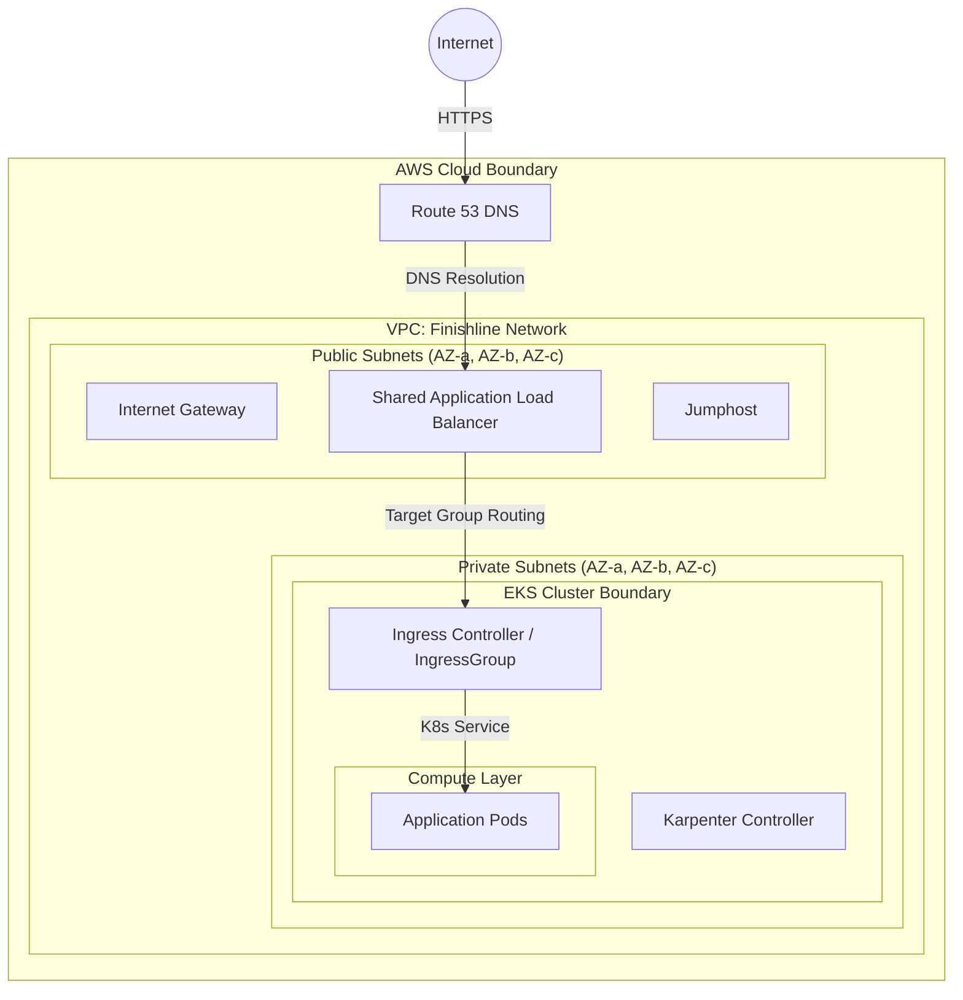
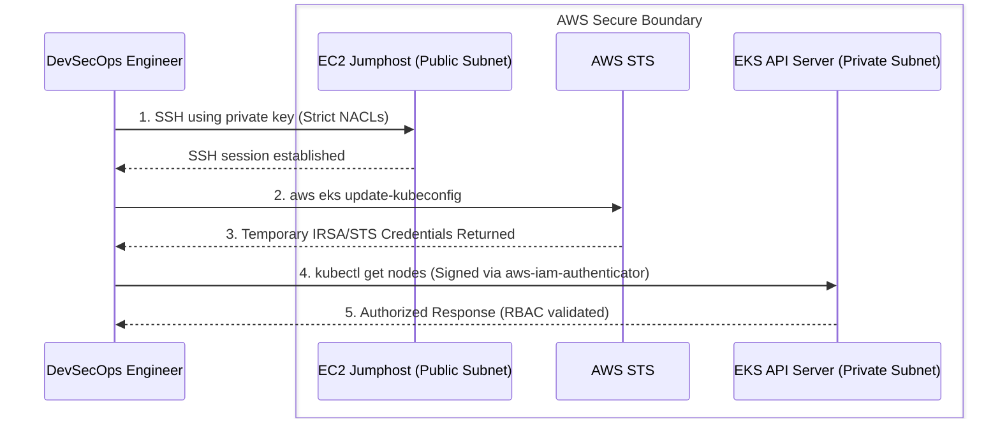
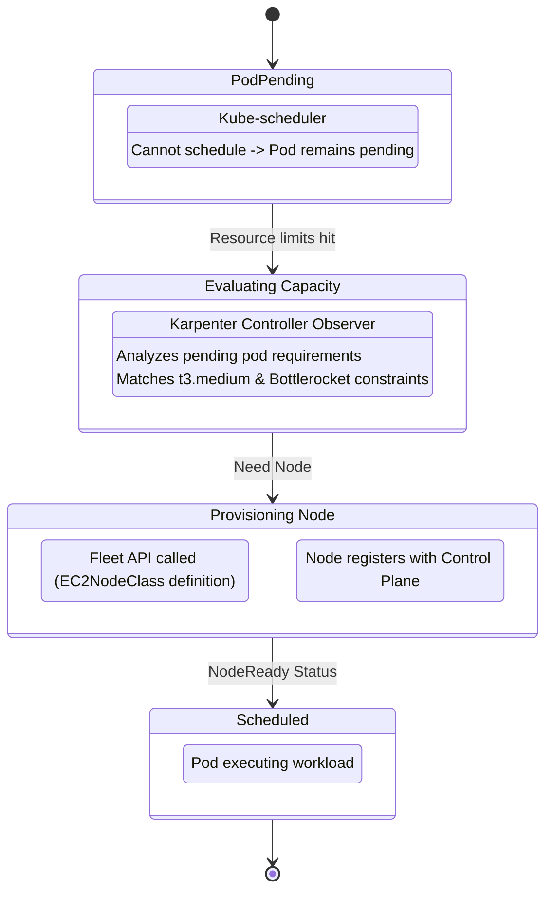

# FinishLine Infrastructure - Terraform

Production-ready AWS infrastructure for the FinishLine project, built with Terraform and Terragrunt.

## Overview

This repository contains the complete infrastructure-as-code (IaC) configuration for deploying the FinishLine application on AWS using Amazon EKS (Elastic Kubernetes Service).

### Infrastructure Components

| Component | Description | Module Path |
|-----------|-------------|-------------|
| **Networking** | VPC, subnets, security groups, ALB | `modules/networking/` |
| **Security** | IAM roles, OIDC provider, SSH keys | `modules/security/` |
| **Compute** | EKS cluster, Karpenter, Jumphost | `modules/compute/` |

### Environments

| Environment | Purpose | AWS Region | Availability Zones | VPC CIDR |
|-------------|---------|------------|--------------------|----------|
| **Dev** | Development & Testing | us-east-1 | 3 (a, b, c) | 10.0.0.0/16 |
| **Stage** | Staging/Pre-production | us-east-1 | 3 (a, b, c) | 10.1.0.0/16 |
| **Prod** | Production | us-east-1 | 3 (a, b, c) | 10.2.0.0/16 |

## Architecture

### 1. Ingress Routing & Network Flow


### 2. Jumphost -> EKS API Server Authentication


### 3. Karpenter Autoscaling Lifecycle


## Prerequisites

### Required Tools

| Tool | Version | Installation |
|------|---------|--------------|
| Terraform | >= 1.5.0 | `tfenv install 1.6.0` |
| Terragrunt | >= 0.50.0 | `brew install terragrunt` |
| AWS CLI | >= 2.0 | `brew install awscli` |
| kubectl | >= 1.28 | `brew install kubectl` |
| Helm | >= 3.12.0 | `brew install helm` |

### AWS Configuration

```bash
# Configure AWS credentials
aws configure

# Verify configuration
aws sts get-caller-identity
```

## Quick Start

### 1. Clone Repository

```bash
git clone https://github.com/finishline/finishline_infra_app.git
cd finishline_infra_app/terraform
```

### 2. Deploy Infrastructure (Dev Environment)

```bash
# Navigate to dev environment
cd environments/dev

# Deploy all resources in order
terragrunt run-all apply
```

### 3. Deployment Order

For production deployments, apply modules in this order:

```bash
# Phase 1: Networking
cd networking/vpc && terragrunt apply
cd ../sg && terragrunt apply
cd ../alb && terragrunt apply

# Phase 2: Security
cd ../../security/key_pair && terragrunt apply
cd ../iam && terragrunt apply

# Phase 3: Compute
cd ../../compute/eks && terragrunt apply
cd ../jumphost && terragrunt apply
cd ../karpenter && terragrunt apply
```

## Module Documentation

| Module | Description | README |
|--------|-------------|--------|
| **VPC** | VPC, subnets, IGW, NAT Gateway, route tables | [modules/networking/vpc/README.md](modules/networking/vpc/README.md) |
| **Security Groups** | Instance-level firewalls | [modules/networking/sg/README.md](modules/networking/sg/README.md) |
| **ALB** | Application Load Balancer | [modules/networking/alb/README.md](modules/networking/alb/README.md) |
| **IAM** | IAM roles, OIDC provider, IRSA | [modules/security/iam/README.md](modules/security/iam/README.md) |
| **Key Pair** | SSH key generation | [modules/security/key_pair/README.md](modules/security/key_pair/README.md) |
| **EKS** | EKS cluster, managed node groups | [modules/compute/eks/README.md](modules/compute/eks/README.md) |
| **Karpenter** | Kubernetes autoscaler | [modules/compute/karpenter/README.md](modules/compute/karpenter/README.md) |
| **Jumphost** | Bastion host for SSH access | [modules/compute/jumphost/README.md](modules/compute/jumphost/README.md) |

## Key Features

### Karpenter Autoscaling

The Karpenter module provides Kubernetes-native node autoscaling:

- **CRD Management** - Uses `kubectl_manifest` for reliable CRD installation
- **Helm Chart** - Installs Karpenter controller from OCI registry
- **EC2NodeClass** - Defines EC2 configuration (AMI, subnets, security groups)
- **NodePool** - Defines provisioning rules (instance types, capacity types)

**Resource Dependency Chain:**
```
kubectl_manifest.karpenter_crds
    └── helm_release.karpenter
        └── time_sleep (60s buffer)
            └── kubectl_manifest.karpenter_ec2_node_class
                └── kubectl_manifest.karpenter_node_pool
```

### IRSA (IAM Roles for Service Accounts)

Enable fine-grained IAM permissions for Kubernetes workloads:

```hcl
# In security/iam module
is_karpenter_enabled = true
eks_oidc_url = aws_eks_cluster.main.identity[0].oidc[0].issuer
oidc_thumbprint = data.tls_certificate.eks.thumbs[0]
```

### Multi-Environment Support

Deploy identical infrastructure across dev, stage, and prod:

```bash
# Deploy to specific environment
cd environments/dev && terragrunt run-all apply
cd environments/stage && terragrunt run-all apply
cd environments/prod && terragrunt run-all apply
```

## State Management

Terraform state is stored in S3 with DynamoDB locking (managed via Terragrunt):

- **Bucket:** `finishline-infra-app-e534d5ea`
- **Region:** us-east-1
- **Encryption:** Enabled
- **Locking:** DynamoDB

## Tagging Strategy & Perpetual Recreation Fix

To prevent AWS resources (like Elastic IPs and NAT Gateways) from being recreated or showing perpetual diffs during `terragrunt plan/apply`, we use a strict tagging alignment:

1. **Global Tags:** Managed in `root.hcl` via the AWS provider's `default_tags` block. These include `Project`, `Environment`, `ManagedBy`, and `Terraform`.
2. **Resource Tags:** Individual modules only set the `Name` tag (and other resource-specific tags). 
3. **The Fix:** We aligned the key casing between `default_tags` and `common_tags`. Crucially, `common_tags` passed from Terragrunt should be an empty map if the keys already exist in `default_tags` to avoid perpetual diffs.

## Verification

After deployment, verify the infrastructure:

```bash
# Update kubeconfig
aws eks update-kubeconfig --name finishline-infra-app-dev-eks --region us-east-1

# Check cluster
kubectl cluster-info

# Check nodes
kubectl get nodes

# Check Karpenter
kubectl get pods -n karpenter
kubectl get ec2nodeclass
kubectl get nodepool
```

## Troubleshooting

### Common Issues

| Issue | Resolution |
|-------|------------|
| EIPs/Resources recreating on every plan | Check for tag key casing mismatch between `default_tags` in `root.hcl` and `common_tags` in `terragrunt.hcl`. Align keys or use empty `common_tags`. |
| `AsgInstanceLaunchFailures` (Quota) | You've reached your quota for `Fleet Requests` or specific instance types. Check `aws service-quotas` for "Standard On-Demand" limits. Default for some accounts may be as low as 1.0 (1 node max). |
| CRD not found errors | See [Karpenter README](modules/compute/karpenter/README.md#troubleshooting) |
| Namespace not found | Module sets `create_namespace = true` |
| Helm provider errors | Ensure Helm provider >= 3.0 |

### Documentation

- [RUNBOOK.md](docs/RUNBOOK.md) - Complete deployment guide
- [KARPENTER_FIXES.md](docs/KARPENTER_FIXES.md) - Karpenter troubleshooting
- [Module READMEs](modules/) - Module-specific documentation

## Security Considerations

1. **SSH Access** - Restrict NACL rules to known IPs
2. **EKS Public Access** - Restrict `public_access_cidrs` in prod
3. **Private Keys** - Store in AWS Secrets Manager after deployment
4. **IAM Policies** - Follow least-privilege principle
5. **IRSA** - Use service account IAM instead of node roles

## Cost Optimization

- **Karpenter** - Uses spot instances for cost savings
- **Node Expiry** - Nodes expire after 720h (30 days)
- **Consolidation** - Empty nodes are consolidated after 30s

## Contributing

1. Create feature branch
2. Make changes in module
3. Test in dev environment
4. Submit PR with documentation updates

## Related Documentation

- [RUNBOOK](docs/RUNBOOK.md) - Operations runbook
- [Project Assignment](docs/Finishline_Infra_Project_Assignment.pdf)
- [Karpenter Project](docs/Finishline_Karpenter_Project.pdf)

## License

Internal use only - FinishLine Infrastructure Team
