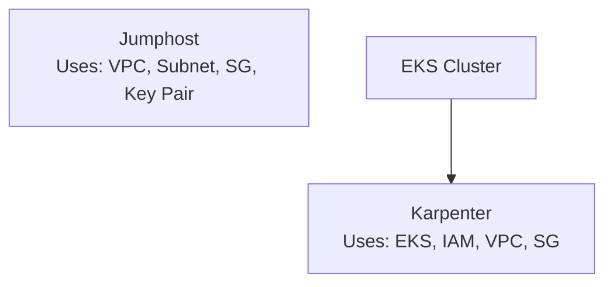
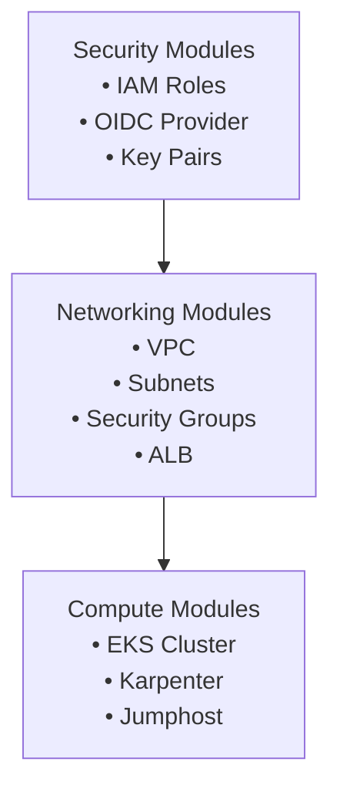
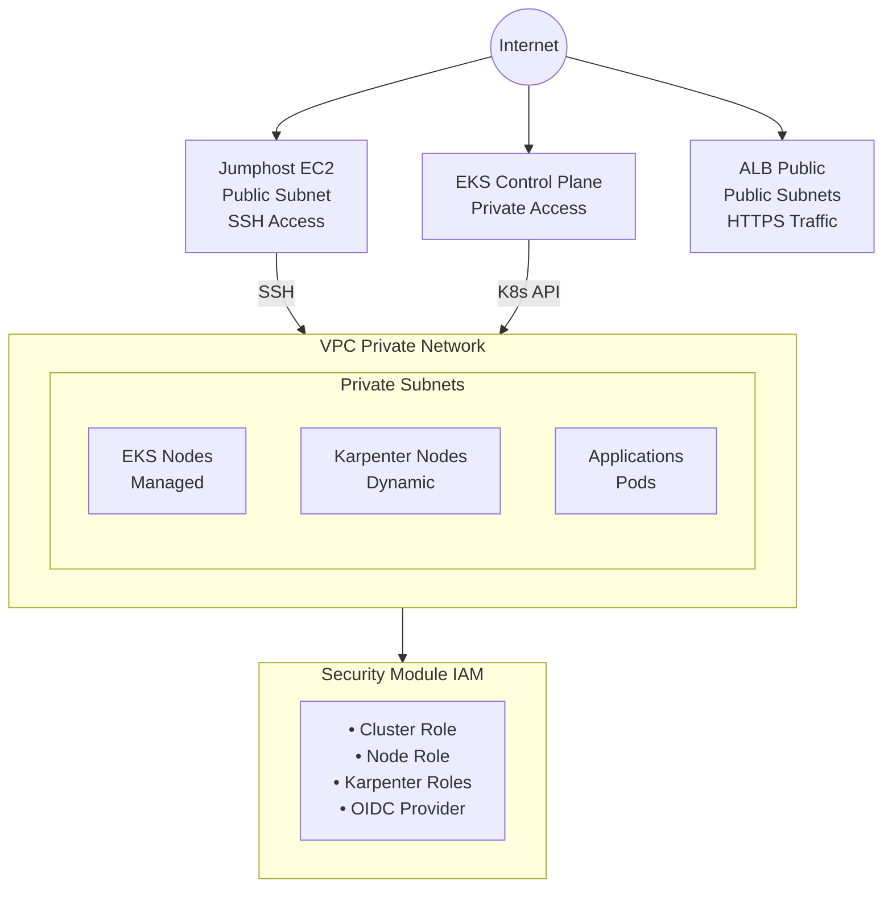
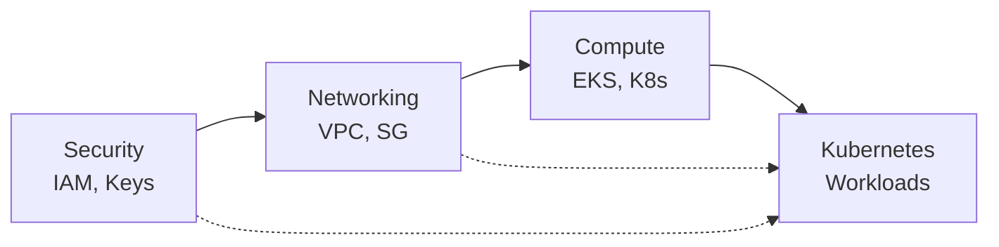
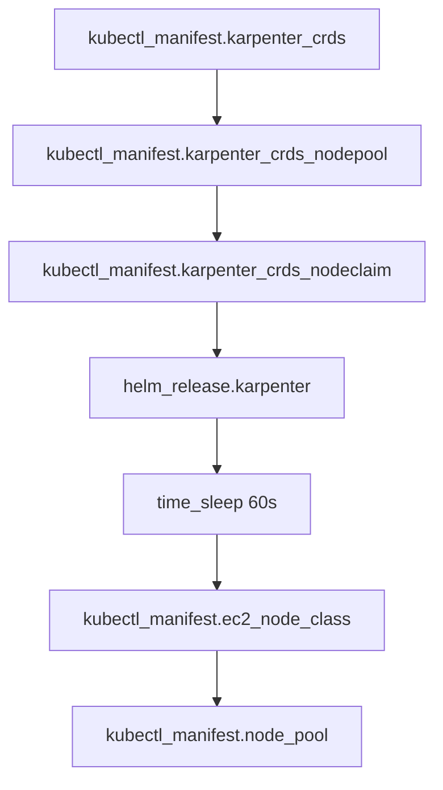
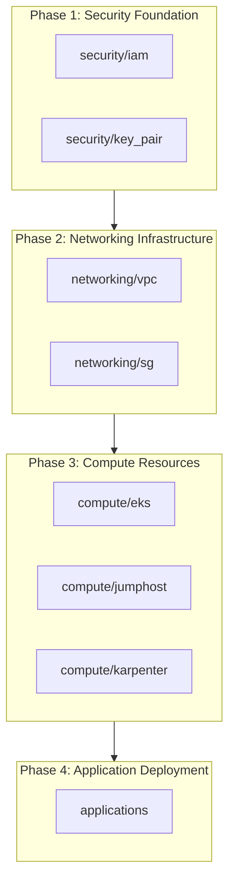

# Compute Modules

This directory contains the compute infrastructure modules for the Finishline project on AWS. These modules provide Kubernetes cluster management (EKS), automated node provisioning (Karpenter), and secure bastion host access (Jumphost).

**These compute modules work in conjunction with the [Networking Modules](../networking/README.md) and [Security Modules](../security/README.md)** to provide a complete, production-ready infrastructure:

- **Networking** provides the VPC, subnets, security groups, and load balancers
- **Security** provides IAM roles, OIDC configuration, and SSH key pairs
- **Compute** provides the EKS cluster, Karpenter autoscaling, and bastion host access

---

## Table of Contents

- [Overview](#overview)
- [Integration with Networking and Security Modules](#integration-with-networking-and-security-modules)
- [Module Architecture](#module-architecture)
- [Modules Summary](#modules-summary)
  - [EKS Module](#eks-module)
  - [Karpenter Module](#karpenter-module)
  - [Jumphost Module](#jumphost-module)
- [Module Relationships](#module-relationships)
- [Complete Usage Example](#complete-usage-example)
- [Deployment Order](#deployment-order)
- [Best Practices](#best-practices)
- [Troubleshooting Guide](#troubleshooting-guide)
- [Related Documentation](#related-documentation)

---

## Overview

The compute modules provide production-ready AWS compute infrastructure following AWS best practices and the Well-Architected Framework. Together, they deliver:

| Capability               | Description                                                |
| ------------------------ | ---------------------------------------------------------- |
| **EKS Cluster**          | Managed Kubernetes control plane with node groups          |
| **Karpenter**            | Kubernetes-native node autoscaling                         |
| **Jumphost**             | Secure bastion host for SSH access                         |
| **IRSA Integration**     | IAM Roles for Service Accounts via OIDC                    |
| **Multi-AZ Deployment**  | High availability across availability zones                |
| **Security Integration** | IAM roles from security/iam, networking from networking/\* |

### Module Dependencies



### Cross-Module Dependencies



---

## Integration with Networking and Security Modules

### EKS Module Integration

The EKS module requires resources from both networking and security modules:

```hcl
# ============================================================
# Dependency Chain for EKS
# ============================================================

# 1. Security Module (IAM Roles)
module "iam" {
  source = "../security/iam"

  is_eks_cluster_enabled   = true
  is_eks_role_enabled      = true
  is_eks_nodegroup_role_enabled = true
}

# 2. Networking Module (VPC, Subnets, Security Groups)
module "vpc" {
  source = "../networking/vpc"
  # ... VPC configuration
}

module "sg" {
  source = "../networking/sg"
  vpc_id = module.vpc.vpc_id
  # ... Security group configuration
}

# 3. Compute Module (EKS) - Uses outputs from both
module "eks" {
  source = "../compute/eks"

  # From Security Module
  eks_cluster_role_arn = module.iam.eks_cluster_role_arn
  node_group_role_arn  = module.iam.eks_nodegroup_role_arn

  # From Networking Module
  subnets          = module.vpc.private_subnets_ids
  security_group_ids = [module.sg.security_group_id]
}
```

### Karpenter Module Integration

Karpenter requires the most integration across all modules:

```hcl
# ============================================================
# Dependency Chain for Karpenter
# ============================================================

# 1. Security Module (Karpenter IAM Roles)
module "iam" {
  source = "../security/iam"

  is_karpenter_enabled     = true
  is_eks_cluster_enabled   = true
  eks_oidc_url             = aws_eks_cluster.main.identity[0].oidc[0].issuer
  oidc_thumbprint          = data.tls_certificate.eks.thumbs[0]
}

# 2. Networking Module (Subnet and SG Tags)
module "vpc" {
  source = "../networking/vpc"

  enable_karpenter_discovery = true
  karpenter_cluster_name     = "finishline-prod-eks"
}

module "sg" {
  source = "../networking/sg"

  enable_karpenter_discovery = true
  karpenter_cluster_name     = "finishline-prod-eks"
}

# 3. Compute Module (EKS first, then Karpenter)
module "eks" {
  source = "../compute/eks"
  # ... EKS configuration
}

# 4. Compute Module (Karpenter) - Uses outputs from all
module "karpenter" {
  source = "../compute/karpenter"

  # From EKS Module
  cluster_name               = module.eks.cluster_name
  cluster_endpoint           = module.eks.cluster_endpoint
  cluster_ca_certificate     = module.eks.cluster_certificate_authority_data

  # From Security Module
  karpenter_controller_role_arn    = module.iam.karpenter_controller_role_arn
  karpenter_node_role_name         = module.iam.karpenter_node_role_name
  karpenter_instance_profile_name  = module.iam.karpenter_node_instance_profile_name

  # From Networking Module (via tags)
  karpenter_subnet_tags = {
    "karpenter.sh/discovery" = "finishline-prod-eks"
  }
  karpenter_security_group_tags = {
    "karpenter.sh/discovery" = "finishline-prod-eks"
  }
}
```

### Jumphost Module Integration

The jumphost module integrates with networking and security for secure access:

```hcl
# ============================================================
# Dependency Chain for Jumphost
# ============================================================

# 1. Security Module (Key Pair)
module "key_pair" {
  source = "../security/key_pair"

  key_name      = "finishline-prod-ssh-key"
  key_algorithm = "RSA"
  rsa_bits      = 4096
}

# 2. Networking Module (VPC, Subnet, Security Group)
module "vpc" {
  source = "../networking/vpc"
  # ... VPC configuration
}

module "sg" {
  source = "../networking/sg"

  security_group_name = "jumphost-sg"
  ingress_rules = [
    {
      description = "SSH from corporate network"
      from_port   = 22
      to_port     = 22
      protocol    = "tcp"
      cidr_blocks = ["203.0.113.0/24"]
    }
  ]
}

# 3. Compute Module (Jumphost) - Uses outputs from both
module "jumphost" {
  source = "../compute/jumphost"

  # From Security Module
  key_name = module.key_pair.key_name

  # From Networking Module
  vpc_id             = module.vpc.vpc_id
  subnet_id          = module.vpc.public_subnets_ids[0]
  security_group_ids = [module.sg.security_group_id]
}
```

---

## Module Architecture

### High-Level Architecture



### Resource Flow



---

## Modules Summary

### EKS Module

**Path:** [`./eks/`](./eks/README.md)

**Purpose:** Creates and manages Amazon EKS clusters with managed node groups.

**Key Resources:**

| Resource                            | Description               |
| ----------------------------------- | ------------------------- |
| `aws_eks_cluster`                   | EKS control plane         |
| `aws_eks_node_group`                | Managed node group        |
| `aws_eks_access_entry`              | Cluster access management |
| `aws_eks_access_policy_association` | Policy associations       |

**Inputs from Other Modules:**

| Input                  | Source Module  | Description                       |
| ---------------------- | -------------- | --------------------------------- |
| `eks_cluster_role_arn` | security/iam   | IAM role for EKS control plane    |
| `node_group_role_arn`  | security/iam   | IAM role for worker nodes         |
| `subnets`              | networking/vpc | Private subnets for nodes         |
| `security_group_ids`   | networking/sg  | Security groups for control plane |

**Primary Outputs:**

```hcl
cluster_name                     # EKS cluster name
cluster_endpoint                 # API server endpoint
cluster_certificate_authority_data # CA certificate
cluster_oidc_issuer_url          # OIDC provider URL (for IRSA)
node_group_name                  # Node group name
node_group_status                # Node group status
```

**Use When:**

- Running Kubernetes workloads on AWS
- Need managed control plane
- Require IRSA for pod IAM permissions
- Want automated node management

---

### Karpenter Module

**Path:** [`./karpenter/`](./karpenter/README.md)

**Purpose:** Deploys Karpenter for Kubernetes-native node autoscaling using `kubectl_manifest` for reliable CRD installation.

**Key Resources:**

| Resource                             | Description                                 |
| ------------------------------------ | ------------------------------------------- |
| `kubectl_manifest.karpenter_crds`    | CRDs (EC2NodeClass, NodePool, NodeClaim)    |
| `helm_release.karpenter`             | Karpenter controller via OCI chart from ECR |
| `time_sleep.wait_for_karpenter_crds` | 60-second buffer for CRD registration       |
| `kubectl_manifest.ec2_node_class`    | EC2 configuration for Karpenter             |
| `kubectl_manifest.node_pool`         | Node provisioning rules                     |

**Helm Chart Source:** `oci://public.ecr.aws/karpenter/karpenter` (version 1.0.8)

**Provider Requirements:**

- Helm provider >= 3.0 (uses `set` argument syntax)
- kubectl provider >= 1.14 (for `kubectl_manifest` resources)
- time provider >= 0.9 (for `time_sleep` buffer)

See [known issues](../../docs/RUNBOOK.md#helm-provider-set-block-syntax-error) for migration details.

**CRD Installation Strategy:**

The module uses `kubectl_manifest` instead of `kubernetes_manifest` to avoid plan-time validation errors. CRDs are installed first, followed by a 60-second buffer before applying Karpenter resources.

**Resource Dependency Chain:**



**Inputs from Other Modules:**

| Input                             | Source Module  | Description                        |
| --------------------------------- | -------------- | ---------------------------------- |
| `cluster_name`                    | compute/eks    | EKS cluster name                   |
| `cluster_endpoint`                | compute/eks    | EKS API endpoint                   |
| `cluster_ca_certificate`          | compute/eks    | EKS CA certificate                 |
| `karpenter_controller_role_arn`   | security/iam   | IAM role ARN for controller (IRSA) |
| `karpenter_node_role_name`        | security/iam   | IAM role name for Karpenter nodes  |
| `karpenter_instance_profile_name` | security/iam   | IAM instance profile for nodes     |
| `karpenter_subnet_tags`           | networking/vpc | Tags for subnet discovery          |
| `karpenter_security_group_tags`   | networking/sg  | Tags for SG discovery              |

**Primary Outputs:**

```hcl
karpenter_ec2_node_class_name  # EC2NodeClass resource name
karpenter_node_pool_name       # NodePool resource name
```

**Use When:**

- Need rapid node scaling
- Want cost-optimized instance selection
- Require spot instance support
- Need custom instance type selection

---

### Jumphost Module

**Path:** [`./jumphost/`](./jumphost/README.md)

**Purpose:** Deploys a secure bastion host for SSH access to private resources.

**Key Resources:**

| Resource       | Description               |
| -------------- | ------------------------- |
| `aws_instance` | EC2 bastion host          |
| `data.aws_ami` | Amazon Linux 2 AMI lookup |

**Inputs from Other Modules:**

| Input                | Source Module     | Description                   |
| -------------------- | ----------------- | ----------------------------- |
| `key_name`           | security/key_pair | SSH key pair name             |
| `subnet_id`          | networking/vpc    | Public subnet for jumphost    |
| `security_group_ids` | networking/sg     | Security group with SSH rules |
| `vpc_id`             | networking/vpc    | VPC for the jumphost          |

**Primary Outputs:**

```hcl
instance_id      # EC2 instance ID
public_ip        # Public IP for SSH access
private_ip       # Private IP for internal access
public_dns       # Public DNS name
key_name         # SSH key pair name
```

**Use When:**

- Need SSH access to private instances
- Require audit trail for SSH sessions
- Want centralized access point
- Compliance requires bastion host

---

## Module Relationships

                           │
                           ▼
                    ┌─────────────┐
                    │  Networking  │
                    │   Modules    │
                    └──────┬──────┘
                           │
              ┌────────────┼────────────┐
              │            │            │
              ▼            ▼            ▼
        ┌───────────┐ ┌───────────┐ ┌───────────┐
        │  Jumphost │ │    EKS    │ │ Karpenter │
        └───────────┘ └─────┬─────┘ └───────────┘
                            │
                            ▼
                    ┌─────────────────┐
                    │  Kubernetes     │
                    │  Workloads      │
                    └─────────────────┘
```

### Data Flow Between Modules

```hcl
# ============================================================
# Complete Infrastructure Example
# ============================================================

# 1. Security: IAM Roles
module "iam" {
  source = "../security/iam"

  project_name             = "finishline"
  environment              = "prod"
  managed_by               = "platform-team"
  aws_region               = "us-east-1"
  cluster_name             = "finishline-prod-eks"

  is_eks_cluster_enabled   = true
  is_eks_role_enabled      = true
  is_eks_nodegroup_role_enabled = true
  is_karpenter_enabled     = true
}

# 2. Security: SSH Key Pair
module "key_pair" {
  source = "../security/key_pair"

  project_name    = "finishline"
  environment     = "prod"
  managed_by      = "platform-team"
  aws_region      = "us-east-1"
  key_name        = "finishline-prod-ssh-key"
  key_algorithm   = "RSA"
  rsa_bits        = 4096
}

# 3. Networking: VPC
module "vpc" {
  source = "../networking/vpc"

  project_name             = "finishline"
  environment              = "prod"
  managed_by               = "platform-team"
  aws_region               = "us-east-1"
  vpc_cidr                 = "10.0.0.0/16"
  availability_zones       = ["us-east-1a", "us-east-1b"]
  public_subnets_cidr      = ["10.0.1.0/24", "10.0.2.0/24"]
  private_subnets_cidr     = ["10.0.10.0/24", "10.0.11.0/24"]

  # Karpenter integration
  enable_karpenter_discovery = true
  karpenter_cluster_name     = "finishline-prod-eks"

  # NACL rules
  ingress_rules_transform = [ /* ... */ ]
  egress_rules_transform  = [ /* ... */ ]
}

# 4. Networking: Security Groups
module "eks_sg" {
  source = "../networking/sg"

  project_name    = "finishline"
  environment     = "prod"
  managed_by      = "platform-team"
  aws_region      = "us-east-1"
  vpc_id          = module.vpc.vpc_id

  security_group_name = "finishline-prod-eks-sg"

  # Karpenter integration
  enable_karpenter_discovery = true
  karpenter_cluster_name     = "finishline-prod-eks"

  ingress_rules = [ /* ... */ ]
  egress_rules  = [ /* ... */ ]
}

module "jumphost_sg" {
  source = "../networking/sg"

  project_name    = "finishline"
  environment     = "prod"
  managed_by      = "platform-team"
  aws_region      = "us-east-1"
  vpc_id          = module.vpc.vpc_id

  security_group_name = "finishline-prod-jumphost-sg"

  ingress_rules = [
    {
      description = "SSH from corporate"
      from_port   = 22
      to_port     = 22
      protocol    = "tcp"
      cidr_blocks = ["203.0.113.0/24"]
    }
  ]

  egress_rules = [
    {
      description = "SSH to internal"
      from_port   = 22
      to_port     = 22
      protocol    = "tcp"
      cidr_blocks = ["10.0.0.0/16"]
    }
  ]
}

# 5. Compute: EKS Cluster
module "eks" {
  source = "../compute/eks"

  project_name  = "finishline"
  environment   = "prod"
  managed_by    = "platform-team"
  aws_region    = "us-east-1"
  cluster_name  = "finishline-prod-eks"

  # From Security Module
  eks_cluster_role_arn = module.iam.eks_cluster_role_arn
  node_group_role_arn  = module.iam.eks_nodegroup_role_arn

  # From Networking Module
  subnets            = module.vpc.private_subnets_ids
  security_group_ids = [module.eks_sg.security_group_id]

  cluster_version = "1.30"
  is_eks_cluster_enabled = true
  is_eks_nodegroup_enabled = true

  # Node group configuration
  node_group_instance_types  = ["t3.medium"]
  node_group_capacity_type   = "ON_DEMAND"
  node_group_scaling_config = {
    desired_size = 2
    min_size     = 2
    max_size     = 4
  }
}

# 6. Compute: Karpenter
module "karpenter" {
  source = "../compute/karpenter"

  project_name  = "finishline"
  environment   = "prod"
  managed_by    = "platform-team"
  aws_region    = "us-east-1"

  # From EKS Module
  cluster_name               = module.eks.cluster_name
  cluster_endpoint           = module.eks.cluster_endpoint
  cluster_ca_certificate     = module.eks.cluster_certificate_authority_data

  # From Security Module
  karpenter_controller_role_arn   = module.iam.karpenter_controller_role_arn
  karpenter_node_role_name        = module.iam.karpenter_node_role_name
  karpenter_instance_profile_name = module.iam.karpenter_node_instance_profile_name

  # Karpenter configuration
  karpenter_instance_types      = ["m5.large", "m5.xlarge", "c5.large"]
  karpenter_max_cpu             = 50
  karpenter_capacity_types      = ["spot", "on-demand"]
  karpenter_ami_family          = "Bottlerocket"
  karpenter_volume_size         = "50Gi"
  karpenter_detailed_monitoring = false
  karpenter_namespace           = "karpenter"
  karpenter_interruption_queue_name = "finishline-prod-eks"

  # From Networking Module (via tags)
  karpenter_subnet_tags = {
    "karpenter.sh/discovery" = "finishline-prod-eks"
  }
  karpenter_security_group_tags = {
    "karpenter.sh/discovery" = "finishline-prod-eks"
  }

  computed_tags = local.common_tags
}

# 7. Compute: Jumphost
module "jumphost" {
  source = "../compute/jumphost"

  project_name  = "finishline"
  environment   = "prod"
  managed_by    = "platform-team"
  aws_region    = "us-east-1"

  # From Security Module
  key_name = module.key_pair.key_name

  # From Networking Module
  vpc_id             = module.vpc.vpc_id
  subnet_id          = module.vpc.public_subnets_ids[0]
  security_group_ids = [module.jumphost_sg.security_group_id]

  is_finishline_jumphost_enabled = true
  instance_type = "t3.micro"
}
```

---

## Complete Usage Example

See the [Complete Usage Example](#complete-usage-example) section above for a full infrastructure deployment that integrates all modules.

---

## Deployment Order

### Recommended Deployment Sequence



### Terragrunt Deployment

```bash
# Phase 1: Security
cd environments/prod/security/iam
terragrunt apply

cd environments/prod/security/key_pair
terragrunt apply

# Phase 2: Networking
cd environments/prod/networking/vpc
terragrunt apply

cd environments/prod/networking/sg
terragrunt apply

# Phase 3: Compute
cd environments/prod/compute/eks
terragrunt apply

cd environments/prod/compute/jumphost
terragrunt apply  # Optional

cd environments/prod/compute/karpenter
terragrunt apply
```

---

## Best Practices

### 1. Always Deploy in Order

```bash
# ❌ Bad: Skipping dependencies
cd compute/karpenter && terragrunt apply  # Will fail without IAM/VPC

# ✅ Good: Deploy dependencies first
cd security/iam && terragrunt apply
cd networking/vpc && terragrunt apply
cd compute/karpenter && terragrunt apply
```

### 2. Use Consistent Tagging

```hcl
locals {
  common_tags = {
    Project     = "finishline"
    Environment = "prod"
    ManagedBy   = "platform-team"
  }
}

# Apply to all modules
module "vpc" {
  source         = "../networking/vpc"
  computed_tags  = local.common_tags
  # ...
}

module "eks" {
  source         = "../compute/eks"
  computed_tags  = local.common_tags
  # ...
}
```

### 3. Enable Karpenter Discovery Tags

```hcl
# VPC Module
module "vpc" {
  enable_karpenter_discovery = true
  karpenter_cluster_name     = "finishline-prod-eks"
}

# Security Group Module
module "sg" {
  enable_karpenter_discovery = true
  karpenter_cluster_name     = "finishline-prod-eks"
}

# Karpenter Module
module "karpenter" {
  karpenter_subnet_tags = {
    "karpenter.sh/discovery" = "finishline-prod-eks"
  }
  karpenter_security_group_tags = {
    "karpenter.sh/discovery" = "finishline-prod-eks"
  }
}
```

### 4. Use Private Subnets for EKS

```hcl
# ✅ Good: EKS in private subnets
module "eks" {
  subnets = module.vpc.private_subnets_ids
}

# Jumphost in public subnet for access
module "jumphost" {
  subnet_id = module.vpc.public_subnets_ids[0]
}
```

### 5. Configure IRSA for Workloads

```hcl
# Security Module: Enable OIDC
module "iam" {
  is_eks_cluster_enabled = true
  eks_oidc_url           = aws_eks_cluster.main.identity[0].oidc[0].issuer
  oidc_thumbprint        = data.tls_certificate.eks.thumbs[0]
}

# EKS Module: Pass OIDC role
module "eks" {
  ebs_csi_driver_role_arn = module.iam.ebs_csi_driver_role_arn
}
```

---

## Troubleshooting Guide

### Issue: EKS Cluster Creation Fails

**Symptoms**: `AccessDenied: EKS cannot assume role`

**Resolution**:

```bash
# Verify IAM role exists
aws iam get-role --role-name finishline-prod-eks-cluster-role

# Check trust policy
aws iam get-role --role-name finishline-prod-eks-cluster-role \
  --query 'Role.AssumeRolePolicyDocument'

# Verify policy attachment
aws iam list-attached-role-policies \
  --role-name finishline-prod-eks-cluster-role
```

### Issue: Karpenter Cannot Find Subnets

**Symptoms**: Karpenter logs show `no subnets found`

**Resolution**:

```bash
# Check subnet tags
aws ec2 describe-subnets \
  --filters "Name=tag:karpenter.sh/discovery,Values=finishline-prod-eks"

# Verify VPC module has Karpenter enabled
# enable_karpenter_discovery = true
# karpenter_cluster_name = "finishline-prod-eks"
```

### Issue: Cannot SSH to Jumphost

**Symptoms**: SSH connection times out

**Resolution**:

```bash
# Check security group rules
aws ec2 describe-security-groups \
  --filters "Name=group-name,Values=*jumphost*"

# Verify key pair exists
aws ec2 describe-key-pairs \
  --key-names finishline-prod-ssh-key

# Check jumphost public IP
aws ec2 describe-instances \
  --filters "Name=tag:Name,Values=*jumphost*"
```

### Issue: Node Group Cannot Join Cluster

**Symptoms**: Nodes show `NotReady` status

**Resolution**:

```bash
# Check node IAM role
aws iam get-role --role-name finishline-prod-eks-nodegroup-role

# Verify security group allows node communication
aws ec2 describe-security-groups \
  --filters "Name=group-id,Values=sg-xxx"

# Check EKS access entry
aws eks list-access-entries --cluster-name finishline-prod-eks
```

---

## Related Documentation

- [EKS Module](./eks/README.md) - Detailed EKS module documentation
- [Karpenter Module](./karpenter/README.md) - Detailed Karpenter module documentation
- [Jumphost Module](./jumphost/README.md) - Detailed jumphost module documentation
- [Networking Modules](../networking/README.md) - VPC, Security Groups, ALB
- [Security Modules](../security/README.md) - IAM, Key Pairs
- [Finishline Karpenter Project](../../docs/Finishline_Karpenter_Project.pdf) - Karpenter project documentation
