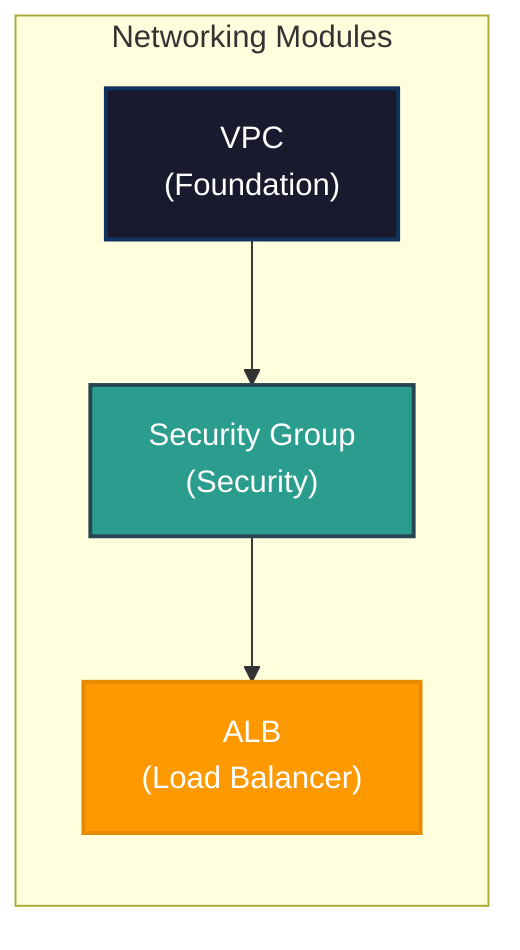
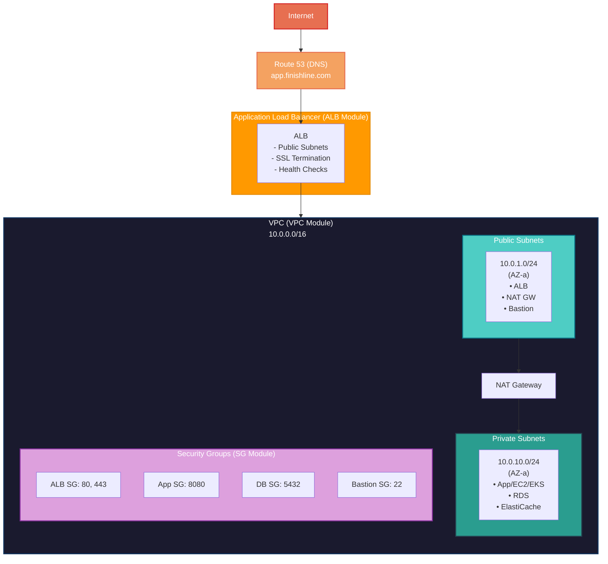
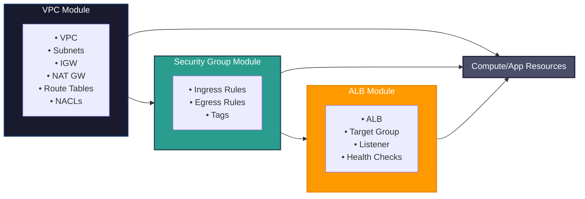
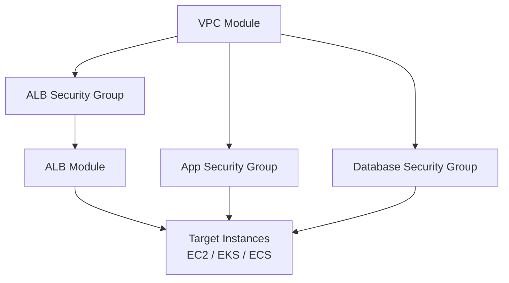
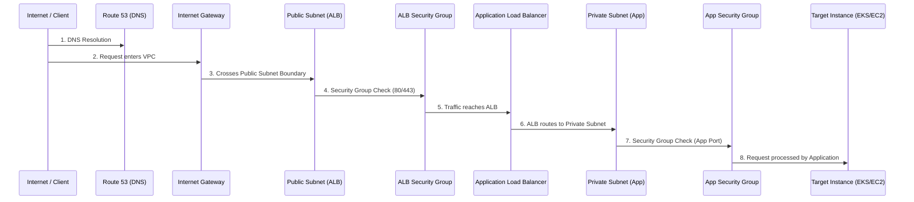
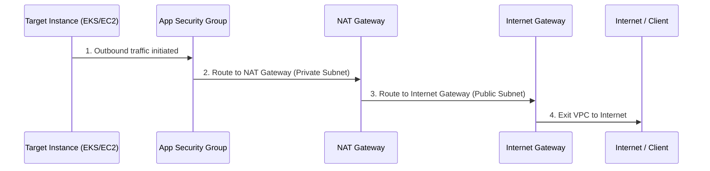
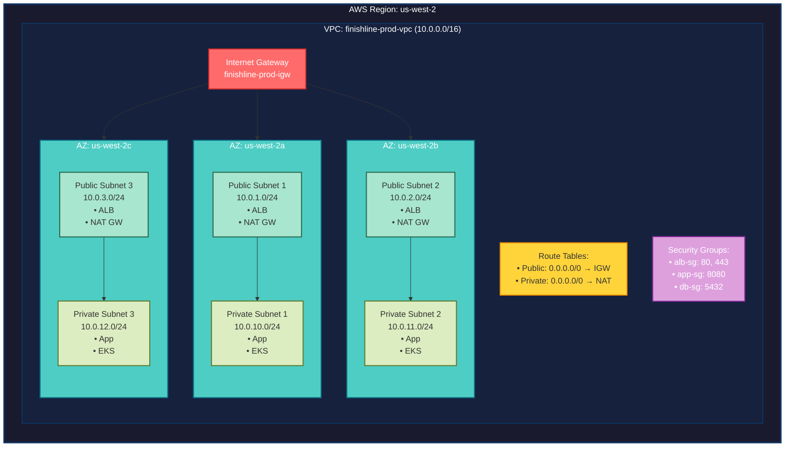
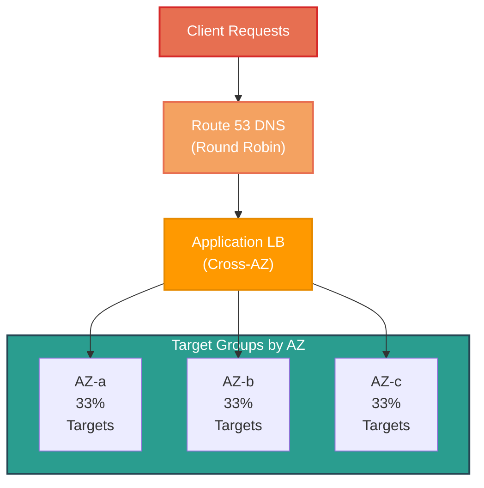
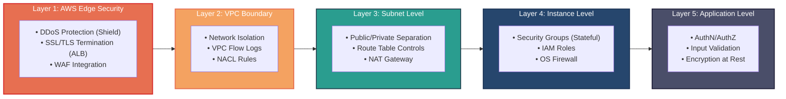
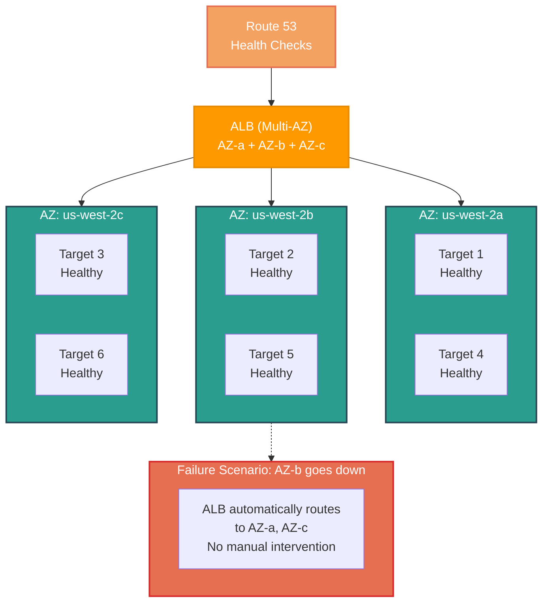

# Networking Modules

This directory contains the core networking infrastructure modules for the Finishline project on AWS. These modules work together to provide a secure, scalable, and highly available network foundation for all application workloads.

---

## Table of Contents

- [Overview](#overview)
- [Module Architecture](#module-architecture)
- [Modules Summary](#modules-summary)
  - [VPC Module](#vpc-module)
  - [Security Group Module](#security-group-module)
  - [ALB Module](#alb-module)
- [Module Relationships](#module-relationships)
- [Infrastructure Flow](#infrastructure-flow)
- [Complete Usage Example](#complete-usage-example)
- [Network Topology](#network-topology)
- [Security Architecture](#security-architecture)
- [High Availability Design](#high-availability-design)
- [Karpenter Integration](#karpenter-integration)
- [Best Practices](#best-practices)
- [Troubleshooting Guide](#troubleshooting-guide)
- [Module Comparison](#module-comparison)
- [Related Documentation](#related-documentation)

---

## Overview

The networking modules provide a production-ready AWS infrastructure foundation following AWS best practices and the Well-Architected Framework. Together, they deliver:

| Capability            | Description                                        |
| --------------------- | -------------------------------------------------- |
| **Network Isolation** | VPC with public/private subnet separation          |
| **Traffic Control**   | Security groups and NACLs for layered security     |
| **Load Balancing**    | Application Load Balancer for traffic distribution |
| **High Availability** | Multi-AZ deployment for fault tolerance            |
| **Scalability**       | Auto-scaling ready with Karpenter integration      |
| **Observability**     | Access logs, VPC Flow Logs, CloudWatch metrics     |

### Module Dependencies



---

## Module Architecture

### High-Level Architecture



### Resource Flow



---

## Modules Summary

### VPC Module

**Path:** [`./vpc/`](./vpc/README.md)

**Purpose:** Creates the foundational network infrastructure including VPC, subnets, gateways, and routing.

**Key Resources:**
| Resource | Description |
|----------|-------------|
| `aws_vpc` | Main network container with CIDR block |
| `aws_subnet` | Public and private subnets across AZs |
| `aws_internet_gateway` | Internet access for public subnets |
| `aws_nat_gateway` | Outbound internet for private subnets |
| `aws_route_table` | Routing rules for public/private traffic |
| `aws_network_acl` | Stateless subnet-level firewall |

**Primary Outputs:**

```hcl
vpc_id                # VPC identifier
public_subnets_ids    # List of public subnet IDs
private_subnets_ids   # List of private subnet IDs
nat_gateway_ids       # NAT gateway IDs
internet_gateway_ids  # Internet gateway ID
route_table_ids       # Route table IDs
```

**Use When:**

- Creating new network infrastructure
- Setting up multi-AZ environments
- Need public/private subnet separation
- Requiring Karpenter-ready subnets

---

### Security Group Module

**Path:** [`./sg/`](./sg/README.md)

**Purpose:** Manages instance-level security (stateful firewalls) for controlling inbound and outbound traffic.

**Key Resources:**
| Resource | Description |
|----------|-------------|
| `aws_security_group` | Virtual firewall for instances |
| Dynamic ingress rules | Inbound traffic rules |
| Dynamic egress rules | Outbound traffic rules |
| Karpenter discovery tags | Optional EKS integration |

**Primary Outputs:**

```hcl
security_group_id       # Security group identifier
security_group_name     # Security group name
security_group_arn      # Security group ARN
security_group_description # Description
```

**Use When:**

- Controlling access to EC2 instances
- Securing ALB endpoints
- Managing database access
- Implementing network segmentation
- Enabling Karpenter node security

---

### ALB Module

**Path:** [`./alb/`](./alb/README.md)

**Purpose:** Provisions Application Load Balancer for distributing HTTP/HTTPS traffic across targets.

**Key Resources:**
| Resource | Description |
|----------|-------------|
| `aws_alb` | Application Load Balancer |
| `aws_lb_target_group` | Target group with health checks |
| `aws_lb_listener` | Listener for incoming traffic |
| Access logs configuration | S3 integration for logging |

**Primary Outputs:**

```hcl
alb_arn                 # ALB ARN
alb_dns_name            # ALB DNS name
alb_zone_id             # Zone ID for Route53
target_group_arn        # Target group ARN
listener_arn            # Listener ARN
```

**Use When:**

- Load balancing web applications
- SSL/TLS termination needed
- Path-based routing required
- Health checks for instances
- Access logging needed

---

## Module Relationships

### Module Dependency Graph



### Data Flow Between Modules

```hcl
# Step 1: Create VPC
module "vpc" {
  source = "./modules/networking/vpc"
  # ... configuration
}

# Step 2: Create Security Groups (depends on VPC)
module "alb_sg" {
  source = "./modules/networking/sg"
  vpc_id = module.vpc.vpc_id  # ← VPC output
  # ... configuration
}

module "app_sg" {
  source = "./modules/networking/sg"
  vpc_id = module.vpc.vpc_id  # ← VPC output
  # ... configuration
}

# Step 3: Create ALB (depends on VPC and Security Group)
module "alb" {
  source = "./modules/networking/alb"
  vpc_id          = module.vpc.vpc_id           # ← VPC output
  subnet_ids      = module.vpc.public_subnets_ids # ← VPC output
  security_group_id = module.alb_sg.security_group_id # ← SG output
  # ... configuration
}

# Step 4: Deploy Applications (depends on all modules)
resource "aws_instance" "app" {
  subnet_id              = module.vpc.private_subnets_ids[0] # ← VPC output
  vpc_security_group_ids = [module.app_sg.security_group_id] # ← SG output
  # ... configuration
}

resource "aws_lb_target_group_attachment" "app" {
  target_group_arn = module.alb.target_group_arn # ← ALB output
  target_id        = aws_instance.app.id
  port             = 8080
}
```

### Shared Variables Pattern

```hcl
# Common variables used across all modules
locals {
  project_name = "finishline"
  environment  = "prod"
  managed_by   = "platform-team"
  aws_region   = "us-west-2"
}

# VPC Module
module "vpc" {
  source         = "./modules/networking/vpc"
  project_name   = local.project_name
  environment    = local.environment
  managed_by     = local.managed_by
  aws_region     = local.aws_region
  # ...
}

# Security Group Module
module "alb_sg" {
  source         = "./modules/networking/sg"
  project_name   = local.project_name
  environment    = local.environment
  managed_by     = local.managed_by
  aws_region     = local.aws_region
  # ...
}

# ALB Module
module "alb" {
  source         = "./modules/networking/alb"
  project_name   = local.project_name
  environment    = local.environment
  managed_by     = local.managed_by
  aws_region     = local.aws_region
  # ...
}
```

---

## Infrastructure Flow

### Request Flow (Inbound)

```
### Inbound Request Flow



### Response Flow (Outbound)

```
### Outbound Response Flow



---

## Complete Usage Example

### Production Environment Setup

```hcl
# ============================================================
# Main Infrastructure Configuration
# ============================================================

terraform {
  required_version = ">= 1.0.0"
  required_providers {
    aws = {
      source  = "hashicorp/aws"
      version = "~> 5.0"
    }
  }
}

provider "aws" {
  region = "us-west-2"
}

# ============================================================
# Local Variables
# ============================================================

locals {
  project_name   = "finishline"
  environment    = "prod"
  managed_by     = "platform-team"
  aws_region     = "us-west-2"

  # VPC Configuration
  vpc_cidr                  = "10.0.0.0/16"
  availability_zones        = ["us-west-2a", "us-west-2b", "us-west-2c"]
  public_subnets_cidr       = ["10.0.1.0/24", "10.0.2.0/24", "10.0.3.0/24"]
  private_subnets_cidr      = ["10.0.10.0/24", "10.0.11.0/24", "10.0.12.0/24"]

  # Karpenter Configuration
  enable_karpenter         = true
  karpenter_cluster_name   = "finishline-prod"
}

# ============================================================
# VPC Module
# ============================================================

module "vpc" {
  source = "./modules/networking/vpc"

  project_name             = local.project_name
  environment              = local.environment
  managed_by               = local.managed_by
  aws_region               = local.aws_region

  vpc_cidr                 = local.vpc_cidr
  availability_zones       = local.availability_zones
  public_subnets_cidr      = local.public_subnets_cidr
  private_subnets_cidr     = local.private_subnets_cidr

  enable_karpenter_discovery = local.enable_karpenter
  karpenter_cluster_name     = local.karpenter_cluster_name

  # Network ACL Rules
  ingress_rules_transform = [
    {
      rule_no    = 100
      from_port  = 80
      to_port    = 80
      protocol   = "tcp"
      action     = "allow"
      cidr_block = "0.0.0.0/0"
    },
    {
      rule_no    = 110
      from_port  = 443
      to_port    = 443
      protocol   = "tcp"
      action     = "allow"
      cidr_block = "0.0.0.0/0"
    },
    {
      rule_no    = 120
      from_port  = 22
      to_port    = 22
      protocol   = "tcp"
      action     = "allow"
      cidr_block = "10.0.0.0/16"
    },
    {
      rule_no    = 32767
      from_port  = 0
      to_port    = 65535
      protocol   = "-1"
      action     = "deny"
      cidr_block = "0.0.0.0/0"
    }
  ]

  egress_rules_transform = [
    {
      rule_no    = 100
      from_port  = 0
      to_port    = 65535
      protocol   = "-1"
      action     = "allow"
      cidr_block = "0.0.0.0/0"
    }
  ]
}

# ============================================================
# Security Groups
# ============================================================

# ALB Security Group
module "alb_sg" {
  source = "./modules/networking/sg"

  project_name    = local.project_name
  environment     = local.environment
  managed_by      = local.managed_by
  aws_region      = local.aws_region
  vpc_id          = module.vpc.vpc_id

  security_group_name        = "${local.project_name}-${local.environment}-alb-sg"
  security_group_description = "Security group for production ALB"

  ingress_rules = [
    {
      description = "HTTPS from internet"
      from_port   = 443
      to_port     = 443
      protocol    = "tcp"
      cidr_blocks = ["0.0.0.0/0"]
    },
    {
      description = "HTTP from internet (redirect)"
      from_port   = 80
      to_port     = 80
      protocol    = "tcp"
      cidr_blocks = ["0.0.0.0/0"]
    }
  ]

  egress_rules = [
    {
      description = "To application servers"
      from_port   = 8080
      to_port     = 8080
      protocol    = "tcp"
      cidr_blocks = [local.vpc_cidr]
    }
  ]
}

# Application Security Group
module "app_sg" {
  source = "./modules/networking/sg"

  project_name    = local.project_name
  environment     = local.environment
  managed_by      = local.managed_by
  aws_region      = local.aws_region
  vpc_id          = module.vpc.vpc_id

  security_group_name        = "${local.project_name}-${local.environment}-app-sg"
  security_group_description = "Security group for application servers"

  ingress_rules = [
    {
      description = "From ALB"
      from_port   = 8080
      to_port     = 8080
      protocol    = "tcp"
      cidr_blocks = [local.vpc_cidr]
    },
    {
      description = "SSH from bastion"
      from_port   = 22
      to_port     = 22
      protocol    = "tcp"
      cidr_blocks = ["10.0.1.0/24"]  # Public subnet
    }
  ]

  egress_rules = [
    {
      description = "To database"
      from_port   = 5432
      to_port     = 5432
      protocol    = "tcp"
      cidr_blocks = ["10.0.20.0/24"]
    },
    {
      description = "To cache"
      from_port   = 6379
      to_port     = 6379
      protocol    = "tcp"
      cidr_blocks = ["10.0.30.0/24"]
    },
    {
      description = "HTTPS for external APIs"
      from_port   = 443
      to_port     = 443
      protocol    = "tcp"
      cidr_blocks = ["0.0.0.0/0"]
    }
  ]
}

# ============================================================
# ALB Module
# ============================================================

module "alb" {
  source = "./modules/networking/alb"

  project_name      = local.project_name
  environment       = local.environment
  managed_by        = local.managed_by
  aws_region        = local.aws_region
  vpc_id            = module.vpc.vpc_id
  subnet_ids        = module.vpc.public_subnets_ids
  security_group_id = module.alb_sg.security_group_id

  alb_name                         = "${local.project_name}-${local.environment}"
  alb_internal                     = false
  alb_type                         = "application"
  enable_deletion_protection       = true
  enable_http2                     = true
  enable_cross_zone_load_balancing = true

  # Access logs
  enable_access_logs      = true
  access_logs_s3_bucket   = "${local.project_name}-${local.environment}-logs"
  access_logs_s3_prefix   = "alb"

  # Target group
  target_group_port     = 8080
  target_group_protocol = "HTTP"
  target_type           = "instance"

  # Health checks
  health_check_path     = "/health"
  health_check_interval = 30
  health_check_timeout  = 5
  healthy_threshold     = 2
  unhealthy_threshold   = 3
  health_check_matcher  = "200"

  # Listener
  listener_port           = 443
  listener_protocol       = "HTTPS"
  listener_default_action = "forward"
}

# ============================================================
# Application Instances
# ============================================================

resource "aws_instance" "app" {
  count = 3

  ami                    = "ami-0c55b159cbfafe1f0"
  instance_type          = "t3.medium"
  subnet_id              = module.vpc.private_subnets_ids[count.index % 3]
  vpc_security_group_ids = [module.app_sg.security_group_id]
  iam_instance_profile   = aws_iam_instance_profile.app.name

  tags = {
    Name        = "${local.project_name}-${local.environment}-app-${count.index + 1}"
    Project     = local.project_name
    Environment = local.environment
  }
}

# Register instances with target group
resource "aws_lb_target_group_attachment" "app" {
  count = length(aws_instance.app)

  target_group_arn = module.alb.target_group_arn
  target_id        = aws_instance.app[count.index].id
  port             = 8080
}

# ============================================================
# Route53 DNS Record
# ============================================================

resource "aws_route53_record" "app" {
  zone_id = "Z1234567890"
  name    = "app.finishline.com"
  type    = "A"

  alias {
    name                   = module.alb.alb_dns_name
    zone_id                = module.alb.alb_zone_id
    evaluate_target_health = true
  }
}

# ============================================================
# Outputs
# ============================================================

output "vpc_id" {
  value = module.vpc.vpc_id
}

output "alb_dns_name" {
  value = module.alb.alb_dns_name
}

output "alb_arn" {
  value = module.alb.alb_arn
}

output "target_group_arn" {
  value = module.alb.target_group_arn
}
```

---

## Network Topology

### Production Topology (3 AZ)



### Traffic Distribution



---

## Security Architecture

### Defense in Depth



### Security Group Rules Matrix

| Security Group | Ingress Source | Port | Protocol | Purpose                |
| -------------- | -------------- | ---- | -------- | ---------------------- |
| alb-sg         | 0.0.0.0/0      | 443  | TCP      | HTTPS from internet    |
| alb-sg         | 0.0.0.0/0      | 80   | TCP      | HTTP redirect          |
| alb-sg         | app-sg         | All  | -        | Health check responses |
| app-sg         | alb-sg         | 8080 | TCP      | Application traffic    |
| app-sg         | bastion-sg     | 22   | TCP      | SSH access             |
| app-sg         | db-sg          | 5432 | TCP      | Database responses     |
| db-sg          | app-sg         | 5432 | TCP      | Database access        |

---

## High Availability Design

### Multi-AZ Deployment



### Failure Handling

| Component        | Failure Scenario   | Automatic Recovery              |
| ---------------- | ------------------ | ------------------------------- |
| ALB              | Single AZ failure  | Traffic rerouted to healthy AZs |
| Target Group     | Unhealthy instance | Removed from rotation           |
| NAT Gateway      | AZ failure         | Use NAT Gateway in another AZ   |
| Route Table      | N/A                | Highly available by design      |
| Internet Gateway | N/A                | Region-level redundancy         |

---

## Karpenter Integration

### Overview

Karpenter is a Kubernetes node provisioning solution that automatically scales worker nodes. The networking modules support Karpenter through discovery tags.

### Configuration

```hcl
# VPC Module - Enable Karpenter on subnets
module "vpc" {
  source = "./modules/networking/vpc"

  enable_karpenter_discovery = true
  karpenter_cluster_name     = "finishline-prod"

  # ... other configuration
}

# Security Group Module - Enable Karpenter on security groups
module "eks_node_sg" {
  source = "./modules/networking/sg"

  enable_karpenter_discovery = true
  karpenter_cluster_name     = "finishline-prod"

  # ... other configuration
}
```

### Karpenter Provisioner

```yaml
apiVersion: karpenter.sh/v1alpha5
kind: Provisioner
metadata:
  name: default
spec:
  requirements:
    - key: 'topology.kubernetes.io/zone'
      operator: In
      values: ['us-west-2a', 'us-west-2b', 'us-west-2c']
  provider:
    subnetSelector:
      karpenter.sh/discovery: 'finishline-prod'
    securityGroupSelector:
      karpenter.sh/discovery: 'finishline-prod'
```

### Resource Tagging

| Resource        | Tag Key                  | Tag Value         |
| --------------- | ------------------------ | ----------------- |
| Subnets         | `karpenter.sh/discovery` | `finishline-prod` |
| Security Groups | `karpenter.sh/discovery` | `finishline-prod` |

---

## Best Practices

### VPC Best Practices

1. **CIDR Planning**
   - Use /16 for VPC (65,536 IPs)
   - Use /24 for subnets (251 usable IPs)
   - Reserve space for future growth

2. **Subnet Design**
   - Deploy across minimum 2 AZs (3 for production)
   - Separate public and private workloads
   - Use consistent naming conventions

3. **Routing**
   - Public subnets: 0.0.0.0/0 → IGW
   - Private subnets: 0.0.0.0/0 → NAT GW
   - Avoid overlapping routes

### Security Group Best Practices

1. **Least Privilege**
   - Allow only required ports
   - Use specific CIDR blocks
   - Reference security groups instead of CIDRs when possible

2. **Documentation**
   - Add descriptions to all rules
   - Use meaningful security group names
   - Tag for cost allocation

3. **Monitoring**
   - Enable VPC Flow Logs
   - Monitor security group changes via CloudTrail
   - Regular security audits

### ALB Best Practices

1. **High Availability**
   - Deploy across multiple AZs
   - Enable cross-zone load balancing
   - Use deletion protection

2. **Security**
   - Use HTTPS with ACM certificates
   - Enable access logs
   - Configure appropriate idle timeout

3. **Performance**
   - Enable HTTP/2
   - Configure appropriate health checks
   - Use connection draining

---

## Troubleshooting Guide

### Common Issues and Solutions

#### Issue: Cannot Access ALB

**Symptoms:** ALB DNS name doesn't respond.

**Checklist:**

```bash
# 1. Verify ALB is active
aws elbv2 describe-load-balancers --names finishline-prod

# 2. Check security group allows 80/443
aws ec2 describe-security-groups --group-ids sg-xxx

# 3. Verify listener configuration
aws elbv2 describe-listeners --load-balancer-arn arn:xxx

# 4. Check target health
aws elbv2 describe-target-health --target-group-arn arn:xxx
```

#### Issue: Targets Unhealthy

**Symptoms:** All targets show unhealthy status.

**Checklist:**

```bash
# 1. Check health check path
aws elbv2 describe-target-groups --names finishline-prod-tg

# 2. Verify application is running
ssh ec2-user@instance-ip "curl localhost:8080/health"

# 3. Check security group allows ALB
aws ec2 describe-security-groups --group-ids app-sg-id

# 4. Review target group attributes
aws elbv2 describe-target-group-attributes --target-group-arn arn:xxx
```

#### Issue: Private Subnet No Internet

**Symptoms:** Instances in private subnet can't reach internet.

**Checklist:**

```bash
# 1. Verify NAT Gateway exists
aws ec2 describe-nat-gateways --filter "Name=vpc-id,Values=vpc-xxx"

# 2. Check NAT Gateway state
aws ec2 describe-nat-gateways --nat-gateway-ids nat-xxx

# 3. Verify private route table
aws ec2 describe-route-tables --filters "Name=tag:Name,Values=*private*"

# 4. Check route to NAT Gateway
aws ec2 describe-route-tables --route-table-ids rt-xxx
```

#### Issue: VPC Flow Logs Not Working

**Symptoms:** No flow logs in CloudWatch.

**Checklist:**

```bash
# 1. Check flow log status
aws ec2 describe-flow-logs --filter "Name=resource-id,Values=vpc-xxx"

# 2. Verify IAM role permissions
aws iam get-role-policy --role-name vpc-flow-logs-role --policy-name vpc-flow-logs-policy

# 3. Check CloudWatch log group
aws logs describe-log-groups --log-group-name-prefix /aws/vpc/flow-logs
```

---

## Module Comparison

| Feature          | VPC Module         | Security Group Module | ALB Module          |
| ---------------- | ------------------ | --------------------- | ------------------- |
| **Purpose**      | Network foundation | Traffic filtering     | Load balancing      |
| **Layer**        | Network (L3)       | Network (L4)          | Application (L7)    |
| **State**        | N/A                | Stateful              | Stateful            |
| **Scope**        | VPC-wide           | Instance-level        | Regional            |
| **Key Output**   | VPC ID, Subnet IDs | Security Group ID     | ALB DNS Name        |
| **Dependencies** | None               | VPC                   | VPC, Security Group |
| **HA Design**    | Multi-AZ subnets   | Redundant rules       | Multi-AZ deployment |
| **Karpenter**    | Subnet tags        | SG tags               | N/A                 |

---

## Related Documentation

### Module Documentation

- [VPC Module](./vpc/README.md) - Detailed VPC configuration and troubleshooting
- [Security Group Module](./sg/README.md) - Security group rules and AWS CLI commands
- [ALB Module](./alb/README.md) - Load balancer configuration and monitoring

### Project Documentation

- [Finishline Infrastructure Docs](../../../docs/README.md) - Overall project documentation
- [Runbook](../../../docs/RUNBOOK.md) - Operational procedures
- [Karpenter Project](../../../docs/Finishline_Karpenter_Project.pdf) - Karpenter integration guide

### AWS Documentation

- [VPC User Guide](https://docs.aws.amazon.com/vpc/latest/userguide/)
- [Security Groups](https://docs.aws.amazon.com/vpc/latest/userguide/VPC_SecurityGroups.html)
- [Application Load Balancers](https://docs.aws.amazon.com/elasticloadbalancing/latest/application/introduction.html)

---

## Version History

| Version | Date       | Module | Changes                                       |
| ------- | ---------- | ------ | --------------------------------------------- |
| 1.0.0   | 2026-03-25 | All    | Initial release with VPC, SG, and ALB modules |

---

## Support

For issues, questions, or contributions:

- **Team:** platform-team
- **Documentation:** [Finishline Infrastructure Docs](../../../docs/README.md)
- **Terraform Version:** >= 1.0.0
- **AWS Provider Version:** ~> 5.0
