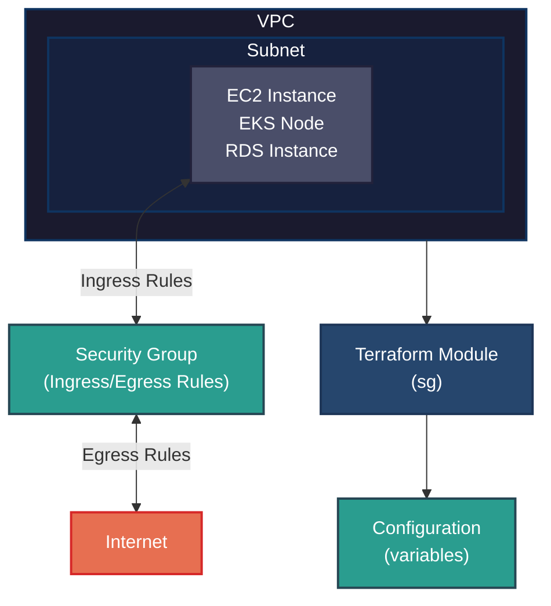
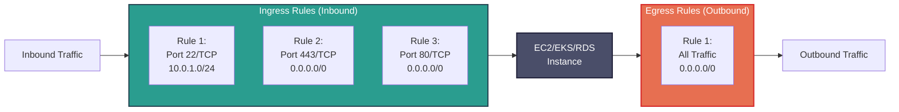

# Security Group Module

This Terraform module creates and configures AWS Security Groups for the Finishline infrastructure project. It provides flexible ingress and egress rule definitions with support for Karpenter integration, enabling secure network access control for EC2 instances, EKS nodes, and other AWS resources within the VPC.

---

## Table of Contents

- [Overview](#overview)
- [Architecture](#architecture)
- [Features](#features)
- [Usage](#usage)
- [Configuration](#configuration)
  - [Required Variables](#required-variables)
  - [Optional Variables](#optional-variables)
  - [Rule Configuration](#rule-configuration)
  - [Protocol Reference](#protocol-reference)
  - [Common Ports Reference](#common-ports-reference)
- [Outputs](#outputs)
- [Karpenter Integration](#karpenter-integration)
- [Tags](#tags)
- [Security Best Practices](#security-best-practices)
- [Examples](#examples)
- [Troubleshooting](#troubleshooting)
- [Module Structure](#module-structure)

---

## Overview

Security groups act as virtual firewalls for your AWS instances, controlling inbound and outbound traffic at the instance level. This module provides a standardized, reusable approach to managing security groups across the Finishline infrastructure with support for:

- Dynamic ingress and egress rule configuration
- Multi-environment deployments (dev, stage, prod)
- Karpenter integration for EKS cluster autoscaling
- Consistent tagging for resource management and cost allocation

---

## Architecture



### Security Group Rule Evaluation



---

## Features

| Feature               | Description                                                    |
| --------------------- | -------------------------------------------------------------- |
| **Dynamic Rules**     | Define ingress and egress rules using flexible list structures |
| **Karpenter Support** | Optional discovery tags for EKS cluster autoscaling            |
| **Multi-Environment** | Consistent configuration across dev, stage, and prod           |
| **Standardized Tags** | Automatic tagging for cost allocation and resource management  |
| **Reusable Module**   | Single source of truth for security group configurations       |

---

## Usage

### Basic Example

```hcl
module "security_group" {
  source = "./modules/networking/sg"

  # Required variables
  project_name    = "finishline"
  environment     = "prod"
  managed_by      = "platform-team"
  aws_region      = "us-west-2"
  vpc_id          = aws_vpc.main.id

  # Optional variables
  security_group_name        = "finishline-prod-sg"
  security_group_description = "Security group for Finishline production workloads"

  # Karpenter integration (optional)
  enable_karpenter_discovery = true
  karpenter_cluster_name     = "finishline-prod"

  # Ingress rules
  ingress_rules = [
    {
      description = "SSH access from jumphost subnet"
      from_port   = 22
      to_port     = 22
      protocol    = "tcp"
      cidr_blocks = ["10.0.1.0/24"]
    },
    {
      description = "HTTPS access from internet"
      from_port   = 443
      to_port     = 443
      protocol    = "tcp"
      cidr_blocks = ["0.0.0.0/0"]
    }
  ]

  # Egress rules
  egress_rules = [
    {
      description = "Allow all outbound traffic"
      from_port   = 0
      to_port     = 0
      protocol    = "-1"
      cidr_blocks = ["0.0.0.0/0"]
    }
  ]
}
```

---

## Configuration

### Required Variables

| Variable        | Type           | Description                                                                     | Example                                       |
| --------------- | -------------- | ------------------------------------------------------------------------------- | --------------------------------------------- |
| `project_name`  | `string`       | Name of the project. Used in resource naming and tagging.                       | `"finishline"`                                |
| `environment`   | `string`       | Environment name. Determines resource naming and access levels.                 | `"dev"`, `"stage"`, `"prod"`                  |
| `managed_by`    | `string`       | Team or department managing this resource. Used for cost allocation.            | `"platform-team"`                             |
| `aws_region`    | `string`       | AWS region where resources will be created.                                     | `"us-west-2"`                                 |
| `vpc_id`        | `string`       | ID of the VPC to associate the security group with. Must be a valid VPC ID.     | `"vpc-0abc123def456"`                         |
| `ingress_rules` | `list(object)` | List of inbound traffic rules. Each rule defines allowed incoming connections.  | See [Rule Configuration](#rule-configuration) |
| `egress_rules`  | `list(object)` | List of outbound traffic rules. Each rule defines allowed outgoing connections. | See [Rule Configuration](#rule-configuration) |

### Optional Variables

| Variable                     | Type     | Default | Description                                                                                        |
| ---------------------------- | -------- | ------- | -------------------------------------------------------------------------------------------------- |
| `security_group_name`        | `string` | `""`    | Custom name for the security group. If not provided, defaults to `{project_name}-{environment}-sg` |
| `security_group_description` | `string` | `""`    | Description of the security group's purpose                                                        |
| `enable_karpenter_discovery` | `bool`   | `false` | When `true`, adds Karpenter discovery tag for EKS node provisioning                                |
| `karpenter_cluster_name`     | `string` | `""`    | EKS cluster name for Karpenter discovery. Required when `enable_karpenter_discovery` is `true`     |

### Rule Configuration

Both `ingress_rules` and `egress_rules` accept a list of objects with the following structure:

```hcl
{
  description = string       # Human-readable description of the rule
  from_port   = number       # Starting port number (0 for all ports)
  to_port     = number       # Ending port number (0 for all ports)
  protocol    = string       # Protocol (tcp, udp, icmp, or -1 for all)
  cidr_blocks = list(string) # List of CIDR blocks to allow/deny
}
```

| Field         | Type           | Required | Description                                                                      |
| ------------- | -------------- | -------- | -------------------------------------------------------------------------------- |
| `description` | `string`       | Yes      | Human-readable description of the rule. AWS requires descriptions for all rules. |
| `from_port`   | `number`       | Yes      | Starting port number. Use `0` for all ports when protocol is `-1`.               |
| `to_port`     | `number`       | Yes      | Ending port number. Use `0` for all ports when protocol is `-1`.                 |
| `protocol`    | `string`       | Yes      | Protocol name or number. Common values: `tcp`, `udp`, `icmp`, `-1` (all)         |
| `cidr_blocks` | `list(string)` | Yes      | List of CIDR blocks. Use `["0.0.0.0/0"]` for internet-wide access.               |

### Protocol Reference

| Protocol | Value         | Description                       | Use Case                             |
| -------- | ------------- | --------------------------------- | ------------------------------------ |
| TCP      | `tcp` or `6`  | Transmission Control Protocol     | HTTP, HTTPS, SSH, RDP, databases     |
| UDP      | `udp` or `17` | User Datagram Protocol            | DNS, NTP, streaming                  |
| ICMP     | `icmp` or `1` | Internet Control Message Protocol | Ping, traceroute                     |
| All      | `-1`          | All protocols                     | Allow all traffic (use with caution) |

### Common Ports Reference

| Port | Protocol | Service    | Typical CIDR        |
| ---- | -------- | ---------- | ------------------- |
| 22   | TCP      | SSH        | VPC internal only   |
| 80   | TCP      | HTTP       | `0.0.0.0/0` or ALB  |
| 443  | TCP      | HTTPS      | `0.0.0.0/0` or ALB  |
| 3306 | TCP      | MySQL      | Application SG only |
| 5432 | TCP      | PostgreSQL | Application SG only |
| 6379 | TCP      | Redis      | Application SG only |
| 8080 | TCP      | HTTP Alt   | Internal services   |
| 3389 | TCP      | RDP        | Bastion host only   |

---

## Outputs

| Output                       | Type     | Description                                                     |
| ---------------------------- | -------- | --------------------------------------------------------------- |
| `security_group_id`          | `string` | The ID of the created security group (e.g., `sg-0abc123def456`) |
| `security_group_name`        | `string` | The name of the created security group                          |
| `security_group_description` | `string` | The description of the created security group                   |
| `security_group_arn`         | `string` | The Amazon Resource Name (ARN) of the security group            |

### Using Outputs

```hcl
# Reference the security group ID for EC2 instances
resource "aws_instance" "app" {
  vpc_security_group_ids = [module.security_group.security_group_id]
}

# Reference for EKS node groups
resource "aws_eks_node_group" "main" {
  vpc_security_group_ids = [module.security_group.security_group_id]
}
```

---

## Karpenter Integration

[Karpenter](https://karpenter.sh/) is an open-source node provisioning project for Kubernetes. This module supports Karpenter discovery tags to enable automatic security group attachment to provisioned nodes.

### Configuration

```hcl
module "karpenter_sg" {
  source = "./modules/networking/sg"

  project_name    = "finishline"
  environment     = "prod"
  managed_by      = "platform-team"
  aws_region      = "us-west-2"
  vpc_id          = aws_vpc.main.id

  # Enable Karpenter discovery
  enable_karpenter_discovery = true
  karpenter_cluster_name     = "finishline-prod"

  ingress_rules = [
    {
      description = "Allow inbound traffic from EKS control plane"
      from_port   = 443
      to_port     = 443
      protocol    = "tcp"
      cidr_blocks = ["10.0.0.0/16"]
    }
  ]

  egress_rules = [
    {
      description = "Allow all outbound traffic"
      from_port   = 0
      to_port     = 0
      protocol    = "-1"
      cidr_blocks = ["0.0.0.0/0"]
    }
  ]
}
```

### How It Works

When `enable_karpenter_discovery` is set to `true`:

1. The module adds the tag `karpenter.sh/discovery = <karpenter_cluster_name>` to the security group
2. Karpenter's AWS provisioner is configured with the same cluster name
3. Karpenter automatically discovers and attaches this security group to provisioned nodes
4. New nodes inherit the security group rules without manual intervention

---

## Tags

The module automatically applies the following tags to the security group:

| Tag Key                  | Value                             | Purpose                        |
| ------------------------ | --------------------------------- | ------------------------------ |
| `Name`                   | `{project_name}-{environment}-sg` | Resource identification        |
| `Project`                | `{project_name}`                  | Cost allocation                |
| `Environment`            | `{environment}`                   | Environment identification     |
| `Managed_By`             | `{managed_by}`                    | Team ownership                 |
| `karpenter.sh/discovery` | `{karpenter_cluster_name}`        | Karpenter discovery (optional) |

---

## Security Best Practices

### 1. Principle of Least Privilege

Only allow traffic that is explicitly required:

```hcl
# ❌ Bad: Too permissive
ingress_rules = [
  {
    description = "Allow all"
    from_port   = 0
    to_port     = 65535
    protocol    = "-1"
    cidr_blocks = ["0.0.0.0/0"]
  }
]

# ✅ Good: Specific ports and sources
ingress_rules = [
  {
    description = "HTTPS from internet"
    from_port   = 443
    to_port     = 443
    protocol    = "tcp"
    cidr_blocks = ["0.0.0.0/0"]
  },
  {
    description = "SSH from jumphost only"
    from_port   = 22
    to_port     = 22
    protocol    = "tcp"
    cidr_blocks = ["10.0.1.0/24"]
  }
]
```

### 2. Use Descriptions for All Rules

AWS requires and displays rule descriptions. Always provide meaningful descriptions:

```hcl
# ✅ Good
{
  description = "PostgreSQL from application servers"
  from_port   = 5432
  to_port     = 5432
  protocol    = "tcp"
  cidr_blocks = ["10.0.2.0/24"]
}
```

### 3. Restrict SSH Access

Never allow SSH from the internet. Use a jumphost/bastion:

```hcl
# ❌ Bad: SSH from anywhere
{
  description = "SSH access"
  from_port   = 22
  to_port     = 22
  protocol    = "tcp"
  cidr_blocks = ["0.0.0.0/0"]
}

# ✅ Good: SSH from jumphost subnet only
{
  description = "SSH from jumphost"
  from_port   = 22
  to_port     = 22
  protocol    = "tcp"
  cidr_blocks = ["10.0.1.0/24"]
}
```

### 4. Database Security

Restrict database ports to application security groups only:

```hcl
# ✅ Good: Database accessible only from app tier
{
  description = "PostgreSQL from application"
  from_port   = 5432
  to_port     = 5432
  protocol    = "tcp"
  cidr_blocks = ["10.0.2.0/24"]  # Application subnet
}
```

### 5. Egress Restrictions

Consider restricting outbound traffic in production:

```hcl
# ✅ Good: Specific egress rules
egress_rules = [
  {
    description = "HTTPS for package updates"
    from_port   = 443
    to_port     = 443
    protocol    = "tcp"
    cidr_blocks = ["0.0.0.0/0"]
  },
  {
    description = "DNS resolution"
    from_port   = 53
    to_port     = 53
    protocol    = "udp"
    cidr_blocks = ["10.0.0.0/16"]
  }
]
```

---

## Examples

### 1. Jumphost/Bastion Security Group

```hcl
module "jumphost_sg" {
  source = "./modules/networking/sg"

  project_name    = "finishline"
  environment     = "prod"
  managed_by      = "platform-team"
  aws_region      = "us-west-2"
  vpc_id          = aws_vpc.main.id

  security_group_name        = "finishline-prod-jumphost-sg"
  security_group_description = "Security group for production jumphost"

  ingress_rules = [
    {
      description = "SSH from corporate network"
      from_port   = 22
      to_port     = 22
      protocol    = "tcp"
      cidr_blocks = ["203.0.113.0/24"]  # Corporate IP range
    }
  ]

  egress_rules = [
    {
      description = "SSH to internal instances"
      from_port   = 22
      to_port     = 22
      protocol    = "tcp"
      cidr_blocks = ["10.0.0.0/16"]
    },
    {
      description = "HTTPS for updates"
      from_port   = 443
      to_port     = 443
      protocol    = "tcp"
      cidr_blocks = ["0.0.0.0/0"]
    }
  ]
}
```

### 2. Application Security Group

```hcl
module "app_sg" {
  source = "./modules/networking/sg"

  project_name    = "finishline"
  environment     = "prod"
  managed_by      = "app-team"
  aws_region      = "us-west-2"
  vpc_id          = aws_vpc.main.id

  ingress_rules = [
    {
      description = "HTTP from ALB"
      from_port   = 80
      to_port     = 80
      protocol    = "tcp"
      cidr_blocks = ["10.0.0.0/16"]
    },
    {
      description = "HTTPS from ALB"
      from_port   = 443
      to_port     = 443
      protocol    = "tcp"
      cidr_blocks = ["10.0.0.0/16"]
    },
    {
      description = "Health checks from ALB"
      from_port   = 8080
      to_port     = 8080
      protocol    = "tcp"
      cidr_blocks = ["10.0.0.0/16"]
    }
  ]

  egress_rules = [
    {
      description = "PostgreSQL to database"
      from_port   = 5432
      to_port     = 5432
      protocol    = "tcp"
      cidr_blocks = ["10.0.10.0/24"]
    },
    {
      description = "Redis to cache layer"
      from_port   = 6379
      to_port     = 6379
      protocol    = "tcp"
      cidr_blocks = ["10.0.11.0/24"]
    },
    {
      description = "HTTPS for external APIs"
      from_port   = 443
      to_port     = 443
      protocol    = "tcp"
      cidr_blocks = ["0.0.0.0/0"]
    }
  ]
}
```

### 3. Database Security Group

```hcl
module "database_sg" {
  source = "./modules/networking/sg"

  project_name    = "finishline"
  environment     = "prod"
  managed_by      = "data-team"
  aws_region      = "us-west-2"
  vpc_id          = aws_vpc.main.id

  ingress_rules = [
    {
      description = "PostgreSQL from application tier"
      from_port   = 5432
      to_port     = 5432
      protocol    = "tcp"
      cidr_blocks = ["10.0.2.0/24"]
    }
  ]

  egress_rules = [
    {
      description = "Allow responses to clients"
      from_port   = 0
      to_port     = 65535
      protocol    = "tcp"
      cidr_blocks = ["10.0.2.0/24"]
    }
  ]
}
```

### 4. EKS Node Security Group with Karpenter

```hcl
module "eks_node_sg" {
  source = "./modules/networking/sg"

  project_name    = "finishline"
  environment     = "prod"
  managed_by      = "platform-team"
  aws_region      = "us-west-2"
  vpc_id          = aws_vpc.main.id

  enable_karpenter_discovery = true
  karpenter_cluster_name     = "finishline-prod"

  ingress_rules = [
    {
      description = "Cluster API from control plane"
      from_port   = 443
      to_port     = 443
      protocol    = "tcp"
      cidr_blocks = ["10.0.0.0/16"]
    },
    {
      description = "Node communication"
      from_port   = 10250
      to_port     = 10250
      protocol    = "tcp"
      cidr_blocks = ["10.0.0.0/16"]
    },
    {
      description = "Calico networking"
      from_port   = 9099
      to_port     = 9099
      protocol    = "tcp"
      cidr_blocks = ["10.0.0.0/16"]
    }
  ]

  egress_rules = [
    {
      description = "All outbound traffic"
      from_port   = 0
      to_port     = 0
      protocol    = "-1"
      cidr_blocks = ["0.0.0.0/0"]
    }
  ]
}
```

---

## Troubleshooting

### Issue: Cannot Connect to Instance

**Symptoms**: SSH or application connection fails.

**Possible Causes**:

1. Missing ingress rule for the required port
2. Incorrect CIDR block in the rule
3. Security group not attached to the instance

**Resolution**:

```hcl
# Verify ingress rules include the required port
ingress_rules = [
  {
    description = "Required service port"
    from_port   = <port>
    to_port     = <port>
    protocol    = "tcp"
    cidr_blocks = ["<correct-cidr>"]
  }
]

# Verify security group is attached
resource "aws_instance" "app" {
  vpc_security_group_ids = [module.security_group.security_group_id]
}
```

### Issue: Karpenter Nodes Missing Security Group

**Symptoms**: Provisioned nodes don't have the expected security group.

**Resolution**:

1. Verify `enable_karpenter_discovery = true`
2. Ensure `karpenter_cluster_name` matches the cluster name in Karpenter provisioner
3. Check the security group has the `karpenter.sh/discovery` tag

### Issue: Too Permissive Rules

**Symptoms**: Security audit flags overly broad CIDR blocks.

**Resolution**:

```hcl
# Replace 0.0.0.0/0 with specific ranges
# ❌ Bad
cidr_blocks = ["0.0.0.0/0"]

# ✅ Good
cidr_blocks = ["10.0.0.0/16"]  # VPC only
cidr_blocks = ["203.0.113.0/24"]  # Specific IP range
```

---

## AWS CLI Troubleshooting Commands

### Security Group Inspection

#### List All Security Groups in VPC

```bash
# List all security groups in a specific VPC
aws ec2 describe-security-groups \
  --filters "Name=vpc-id,Values=vpc-0abc123def456" \
  --query "SecurityGroups[*].[GroupId,GroupName,Description]" \
  --output table

# List security groups with specific tag
aws ec2 describe-security-groups \
  --filters "Name=tag:Project,Values=finishline" \
  --query "SecurityGroups[*].[GroupId,GroupName,Tags]" \
  --output table
```

#### View Security Group Rules

```bash
# Describe a specific security group with all rules
aws ec2 describe-security-groups \
  --group-ids sg-0abc123def456 \
  --query "SecurityGroups[0]" \
  --output json

# View ingress rules only
aws ec2 describe-security-groups \
  --group-ids sg-0abc123def456 \
  --query "SecurityGroups[0].IpPermissions" \
  --output table

# View egress rules only
aws ec2 describe-security-groups \
  --group-ids sg-0abc123def456 \
  --query "SecurityGroups[0].IpPermissionsEgress" \
  --output table

# Pretty print security group details
aws ec2 describe-security-groups \
  --group-ids sg-0abc123def456 \
  --query "SecurityGroups[0].{GroupName:GroupName,GroupId:GroupId,Ingress:IpPermissions,Egress:IpPermissionsEgress}" \
  --output json
```

#### Check Security Group Associations

```bash
# Find instances associated with a security group
aws ec2 describe-instances \
  --filters "Name=instance.group-id,Values=sg-0abc123def456" \
  --query "Reservations[*].Instances[*].[InstanceId,InstanceType,State.Name]" \
  --output table

# Find all resources using a security group (ENIs)
aws ec2 describe-network-interfaces \
  --filters "Name=group-id,Values=sg-0abc123def456" \
  --query "NetworkInterfaces[*].[NetworkInterfaceId,Attachment.InstanceId,Description]" \
  --output table
```

### Connectivity Testing

#### Test SSH Connectivity

```bash
# Test SSH connection (replace with your instance IP)
ssh -i /path/to/key.pem ec2-user@<instance-ip> -v

# Test SSH port connectivity using telnet
telnet <instance-ip> 22

# Test SSH port connectivity using nc (netcat)
nc -vz <instance-ip> 22

# Test SSH port connectivity using nmap
nmap -p 22 <instance-ip>
```

#### Test Application Port Connectivity

```bash
# Test HTTPS port (443)
curl -v https://<instance-ip>:443

# Test HTTP port (80)
curl -v http://<instance-ip>:80

# Test custom application port
nc -vz <instance-ip> 8080

# Test database port (PostgreSQL)
nc -vz <rds-endpoint> 5432
```

#### Verify Security Group Allows Traffic

```bash
# Check if specific port is allowed in ingress rules
aws ec2 describe-security-groups \
  --group-ids sg-0abc123def456 \
  --query "IpPermissions[?contains(IpRanges[].CidrIp, '0.0.0.0/0') && FromPort==`22`]" \
  --output table

# Verify CIDR block in rules
aws ec2 describe-security-groups \
  --group-ids sg-0abc123def456 \
  --query "IpPermissions[*].{FromPort:FromPort,ToPort:ToPort,CidrBlocks:IpRanges[].CidrIp}" \
  --output table
```

### Karpenter-Specific Commands

#### Verify Karpenter Discovery Tags

```bash
# Check security group for Karpenter discovery tag
aws ec2 describe-security-groups \
  --filters "Name=tag:karpenter.sh/discovery,Values=finishline-prod" \
  --query "SecurityGroups[*].[GroupId,GroupName,Tags]" \
  --output table

# List all resources with Karpenter tags
aws ec2 describe-security-groups \
  --filters "Name=tag:karpenter.sh/discovery,Values=*" \
  --query "SecurityGroups[*].[GroupId,GroupName,Tags[?Key=='karpenter.sh/discovery']]" \
  --output table
```

#### Verify Karpenter Node Provisioning

```bash
# Check Karpenter provisioned nodes
aws ec2 describe-instances \
  --filters "Name=tag:karpenter.sh/discovery,Values=finishline-prod" \
  --query "Reservations[*].Instances[*].[InstanceId,InstanceType,State.Name,LaunchTime]" \
  --output table

# Check security groups attached to Karpenter nodes
aws ec2 describe-instances \
  --filters "Name=tag:karpenter.sh/discovery,Values=finishline-prod" \
  --query "Reservations[*].Instances[*].[InstanceId,SecurityGroups[*].GroupId]" \
  --output table
```

### VPC and Network Diagnostics

#### Verify VPC Configuration

```bash
# Describe VPC details
aws ec2 describe-vpcs \
  --vpc-ids vpc-0abc123def456 \
  --query "Vpcs[0].{VpcId:VpcId,CidrBlock:CidrBlock,State:State,Tags:Tags}" \
  --output json

# Check DNS settings
aws ec2 describe-vpc-attribute \
  --vpc-id vpc-0abc123def456 \
  --attribute enableDnsSupport

aws ec2 describe-vpc-attribute \
  --vpc-id vpc-0abc123def456 \
  --attribute enableDnsHostnames
```

#### Verify Subnet Configuration

```bash
# List subnets in VPC
aws ec2 describe-subnets \
  --filters "Name=vpc-id,Values=vpc-0abc123def456" \
  --query "Subnets[*].[SubnetId,CidrBlock,AvailabilityZone,State.AvailableIpAddressCount]" \
  --output table

# Check subnet to security group associations
aws ec2 describe-network-interfaces \
  --filters "Name=subnet-id,Values=subnet-0abc123" \
  --query "NetworkInterfaces[*].[NetworkInterfaceId,Groups[*].GroupId,PrivateIpAddress]" \
  --output table
```

#### Verify Route Tables

```bash
# Describe route tables for VPC
aws ec2 describe-route-tables \
  --filters "Name=vpc-id,Values=vpc-0abc123def456" \
  --query "RouteTables[*].[RouteTableId,Associations[*].SubnetId,Routes[*].[DestinationCidrBlock,GatewayId,State]]" \
  --output table

# Check internet gateway attachment
aws ec2 describe-internet-gateways \
  --filters "Name=attachment.vpc-id,Values=vpc-0abc123def456" \
  --query "InternetGateways[*].[InternetGatewayId,Attachments[0].State]" \
  --output table

# Check NAT Gateway status
aws ec2 describe-nat-gateways \
  --filter "Name=vpc-id,Values=vpc-0abc123def456" \
  --query "NatGateways[*].[NatGatewayId,State,NatGatewayAddresses[0].PublicIp]" \
  --output table
```

### Network ACL Diagnostics

```bash
# Describe network ACLs for VPC
aws ec2 describe-network-acls \
  --filters "Name=vpc-id,Values=vpc-0abc123def456" \
  --query "NetworkAcls[*].[NetworkAclId,Entries[?RuleNumber<=`32000`]]" \
  --output table

# Check NACL associations with subnets
aws ec2 describe-network-acls \
  --filters "Name=association.subnet-id,Values=subnet-0abc123" \
  --query "NetworkAcls[*].[NetworkAclId,Associations[*].SubnetId]" \
  --output table
```

### CloudWatch and VPC Flow Logs

#### Enable and Query VPC Flow Logs

```bash
# Describe flow logs for VPC
aws ec2 describe-flow-logs \
  --filter "Name=resource-id,Values=vpc-0abc123def456" \
  --query "FlowLogs[*].[FlowLogId,ResourceId,LogGroupName,DeliverLogsStatus]" \
  --output table

# Query flow logs for rejected traffic (requires CloudWatch Logs)
aws logs filter-log-events \
  --log-group-name "/aws/vpc/flow-logs" \
  --filter-pattern "REJECT" \
  --start-time $(date -d "1 hour ago" +%s)000 \
  --query "events[*].{message:message}" \
  --output table
```

#### Check Security Group Rule Changes

```bash
# Use CloudTrail to find security group modifications
aws cloudtrail lookup-events \
  --lookup-attributes AttributeKey=EventName,AttributeValue=AuthorizeSecurityGroupIngress \
  --start-time $(date -d "24 hours ago" +%Y-%m-%dT%H:%M:%S) \
  --query "Events[*].[EventName,EventTime,Username,Resources[*].ResourceName]" \
  --output table
```

### Automation Scripts

#### Security Group Audit Script

```bash
#!/bin/bash
# audit_security_groups.sh

VPC_ID="vpc-0abc123def456"
REGION="us-west-2"

echo "=== Security Group Audit for VPC: $VPC_ID ==="
echo

# List all security groups
echo "Security Groups:"
aws ec2 describe-security-groups \
  --region $REGION \
  --filters "Name=vpc-id,Values=$VPC_ID" \
  --query "SecurityGroups[*].[GroupId,GroupName]" \
  --output table

# Find security groups with SSH open to world
echo -e "\n⚠️  SSH (22) open to 0.0.0.0/0:"
aws ec2 describe-security-groups \
  --region $REGION \
  --filters "Name=vpc-id,Values=$VPC_ID" \
  --query "SecurityGroups[?IpPermissions[?contains(IpRanges[].CidrIp, '0.0.0.0/0') && FromPort==`22`]].[GroupId,GroupName]" \
  --output table

# Find security groups with RDP open to world
echo -e "\n⚠️  RDP (3389) open to 0.0.0.0/0:"
aws ec2 describe-security-groups \
  --region $REGION \
  --filters "Name=vpc-id,Values=$VPC_ID" \
  --query "SecurityGroups[?IpPermissions[?contains(IpRanges[].CidrIp, '0.0.0.0/0') && FromPort==`3389`]].[GroupId,GroupName]" \
  --output table

# Find security groups with all traffic open
echo -e "\n⚠️  All traffic (-1) open to 0.0.0.0/0:"
aws ec2 describe-security-groups \
  --region $REGION \
  --filters "Name=vpc-id,Values=$VPC_ID" \
  --query "SecurityGroups[?IpPermissions[?contains(IpRanges[].CidrIp, '0.0.0.0/0') && IpProtocol=='-1']].[GroupId,GroupName]" \
  --output table

echo -e "\n=== Audit Complete ==="
```

#### Connectivity Test Script

```bash
#!/bin/bash
# test_connectivity.sh

INSTANCE_ID="i-0abc123def456"
SECURITY_GROUP_ID="sg-0abc123def456"
REGION="us-west-2"

# Get instance public IP
PUBLIC_IP=$(aws ec2 describe-instances \
  --instance-ids $INSTANCE_ID \
  --region $REGION \
  --query "Reservations[0].Instances[0].PublicIpAddress" \
  --output text)

echo "Testing connectivity to instance: $INSTANCE_ID"
echo "Public IP: $PUBLIC_IP"
echo "Security Group: $SECURITY_GROUP_ID"
echo

# Get security group rules
echo "Ingress Rules:"
aws ec2 describe-security-groups \
  --group-ids $SECURITY_GROUP_ID \
  --query "SecurityGroups[0].IpPermissions[*].{FromPort:FromPort,ToPort:ToPort,Protocol:IpProtocol,CidrBlocks:IpRanges[].CidrIp}" \
  --output table

# Test common ports
for PORT in 22 80 443 8080; do
  echo -n "Testing port $PORT... "
  if nc -vz -w 5 $PUBLIC_IP $PORT 2>/dev/null; then
    echo "✓ OPEN"
  else
    echo "✗ CLOSED"
  fi
done
```

### Quick Reference Commands

```bash
# Get security group ID by name
aws ec2 describe-security-groups \
  --filters "Name=group-name,Values=finishline-prod-sg" \
  --query "SecurityGroups[0].GroupId" \
  --output text

# Get all instances with their security groups
aws ec2 describe-instances \
  --query "Reservations[*].Instances[*].[InstanceId,SecurityGroups[*].GroupId,State.Name]" \
  --output table

# Find unused security groups (not attached to any ENI)
aws ec2 describe-security-groups \
  --query "SecurityGroups[*].[GroupId,GroupName]" \
  --output text | while read SG_ID SG_NAME; do
    ATTACHMENTS=$(aws ec2 describe-network-interfaces \
      --filters "Name=group-id,Values=$SG_ID" \
      --query "length(NetworkInterfaces)" \
      --output text)
    if [ "$ATTACHMENTS" -eq 0 ]; then
      echo "Unused: $SG_ID ($SG_NAME)"
    fi
  done
```

---

## Module Structure

```
sg/
├── main.tf         # Security group resource definition
├── variables.tf    # Input variables
├── outputs.tf      # Output values
└── README.md       # This documentation
```

### Related Modules

- [`../vpc/`](../vpc/README.md) - VPC module for network infrastructure
- [`../../compute/jumphost/`](../../compute/jumphost/README.md) - Jumphost instance module
- [`../../eks/`](../../eks/README.md) - EKS cluster module

---

## Version History

| Version | Date       | Changes                                |
| ------- | ---------- | -------------------------------------- |
| 1.0.0   | 2026-03-25 | Initial release with Karpenter support |

---

## Support

For issues, questions, or contributions, please contact the **platform-team** or refer to the [Finishline Infrastructure Documentation](../../docs/README.md).
