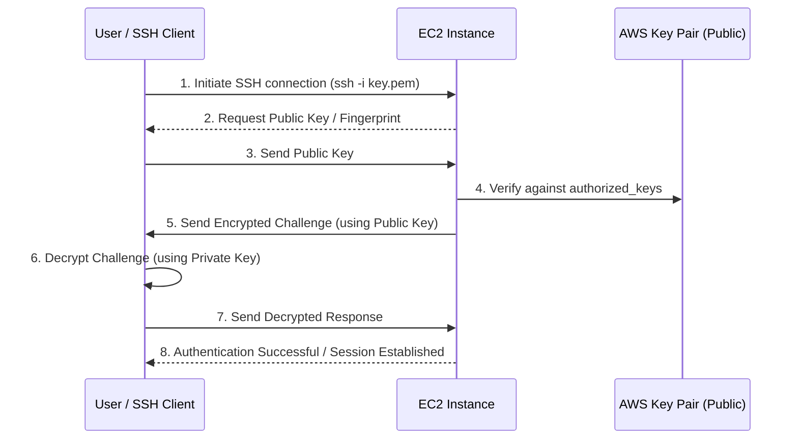
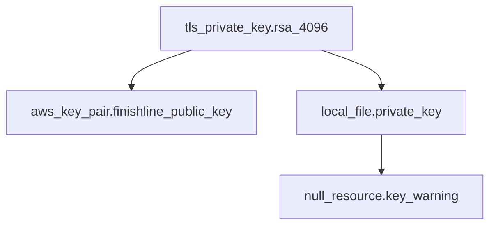

# Key Pair Module

This Terraform module generates RSA 4096-bit SSH key pairs and registers the public key with AWS EC2 for secure instance access. It automatically saves the private key to your local filesystem with secure permissions and provides clear instructions for key management.

---

## Table of Contents

- [Overview](#overview)
- [Architecture](#architecture)
- [Features](#features)
- [Usage](#usage)
- [Configuration](#configuration)
  - [Required Variables](#required-variables)
  - [Optional Variables](#optional-variables)
  - [Key Algorithm Options](#key-algorithm-options)
  - [RSA Bits Configuration](#rsa-bits-configuration)
- [Outputs](#outputs)
- [Key Management](#key-management)
- [Security Best Practices](#security-best-practices)
- [Examples](#examples)
- [Troubleshooting](#troubleshooting)
- [AWS CLI Commands](#aws-cli-commands)
- [Module Structure](#module-structure)

---

## Overview

The Key Pair module provides automated SSH key pair generation and management for EC2 instance access. It eliminates the need for manual key generation and ensures consistent key management across environments.

**Key Capabilities:**

- **Automated Generation** - Creates RSA 4096-bit key pairs using Terraform's TLS provider
- **AWS Registration** - Automatically registers public key with AWS EC2
- **Secure Storage** - Saves private key with restrictive file permissions (0600)
- **Clear Instructions** - Outputs step-by-step instructions for key management
- **Multi-Environment** - Supports different keys for dev, stage, and prod environments

**When to Use:**

- Creating SSH access for EC2 instances
- Setting up bastion/jumphost servers
- Managing SSH keys for EKS nodes (if not using SSM Session Manager)
- Automating key pair provisioning in CI/CD pipelines

---

## Architecture

### Key Generation and Distribution Flow

```mermaid
graph TD
    Start[Terraform Apply<br/>module 'key_pair']
    Gen[tls_private_key<br/>RSA 4096-bit Generation]
    
    Start --> Gen
    
    subgraph Keys [Generated Keys]
        Priv[Private Key<br/>OpenSSH format]
        Pub[Public Key<br/>OpenSSH format]
    end
    
    Gen --> Priv
    Gen --> Pub
    
    Save[local_file<br/>Save to {key_name}.pem]
    Reg[aws_key_pair<br/>Register with AWS]
    
    Priv --> Save
    Pub --> Reg
    
    Perms[chmod 400<br/>Secure permissions]
    Access[EC2 Instances<br/>SSH Access]
    
    Save --> Perms
    Reg --> Access
```

### SSH Authentication Flow



---

## Features

| Feature                     | Description                                             |
| --------------------------- | ------------------------------------------------------- |
| **RSA 4096-bit Keys**       | Strong encryption using industry-standard RSA algorithm |
| **OpenSSH Format**          | Compatible with all SSH clients and AWS EC2             |
| **Automatic Registration**  | Public key automatically uploaded to AWS EC2            |
| **Secure File Permissions** | Private key saved with 0600 permissions                 |
| **Automatic chmod**         | Runs `chmod 400` on private key file                    |
| **Clear Instructions**      | Outputs step-by-step key management instructions        |
| **Configurable Key Name**   | Custom key names per environment                        |
| **Configurable Algorithm**  | Support for different RSA key sizes                     |
| **Standardized Tags**       | Consistent tagging for cost allocation and management   |

---

## Usage

### Basic Example

```hcl
module "key_pair" {
  source = "./modules/security/key_pair"

  # Required variables
  project_name    = "finishline"
  environment     = "prod"
  managed_by      = "platform-team"
  aws_region      = "us-west-2"

  # Key configuration
  key_name        = "finishline-prod-ssh-key"
  key_algorithm   = "RSA"
  rsa_bits        = 4096
}
```

### Using with EC2 Instances

```hcl
# Create key pair
module "key_pair" {
  source = "./modules/security/key_pair"

  project_name    = "finishline"
  environment     = "prod"
  managed_by      = "platform-team"
  aws_region      = "us-west-2"

  key_name        = "finishline-prod-ssh-key"
  key_algorithm   = "RSA"
  rsa_bits        = 4096
}

# Launch EC2 instance with key pair
resource "aws_instance" "bastion" {
  ami           = "ami-0c55b159cbfafe1f0"
  instance_type = "t3.micro"
  key_name      = module.key_pair.key_name

  subnet_id              = aws_subnet.public.id
  vpc_security_group_ids = [aws_security_group.bastion.id]

  tags = {
    Name        = "finishline-prod-bastion"
    Project     = "finishline"
    Environment = "prod"
  }
}

# Output key information
output "ssh_key_instructions" {
  value = <<-EOT
    SSH Key Information:
    ====================
    Key Name: ${module.key_pair.key_name}
    Private Key Path: ${module.key_pair.private_key_path}

    To connect to your instance:
    1. Move the key to ~/.ssh/:
       mv ${module.key_pair.private_key_path} ~/.ssh/

    2. Set correct permissions:
       chmod 400 ~/.ssh/$(basename ${module.key_pair.private_key_path})

    3. Connect to instance:
       ssh -i ~/.ssh/$(basename ${module.key_pair.private_key_path}) ec2-user@<instance-ip>
    EOT
}
```

---

## Configuration

### Required Variables

| Variable        | Type     | Description                                               | Example                      |
| --------------- | -------- | --------------------------------------------------------- | ---------------------------- |
| `project_name`  | `string` | Name of the project. Used in resource naming and tagging. | `"finishline"`               |
| `environment`   | `string` | Environment name. Determines resource naming.             | `"dev"`, `"stage"`, `"prod"` |
| `managed_by`    | `string` | Team or department managing this resource.                | `"platform-team"`            |
| `aws_region`    | `string` | AWS region where the key pair will be created.            | `"us-west-2"`                |
| `key_name`      | `string` | Name of the key pair. Must be unique per region.          | `"finishline-prod-ssh-key"`  |
| `key_algorithm` | `string` | Algorithm for key generation. Use `"RSA"`.                | `"RSA"`                      |
| `rsa_bits`      | `number` | Number of bits for the RSA key. Recommended: 4096.        | `4096`                       |

### Optional Variables

| Variable        | Type          | Default | Description                                  |
| --------------- | ------------- | ------- | -------------------------------------------- |
| `computed_tags` | `map(string)` | `{}`    | Additional tags to apply to the AWS key pair |

### Key Algorithm Options

| Algorithm | Value   | Description           | Support         |
| --------- | ------- | --------------------- | --------------- |
| RSA       | `"RSA"` | Rivest-Shamir-Adleman | Fully supported |

**Note:** The module currently supports RSA algorithm only. For ED25519 or ECDSA keys, generate keys externally and import using `aws_key_pair` resource.

### RSA Bits Configuration

| Bits | Security Level | Use Case                        | Recommendation     |
| ---- | -------------- | ------------------------------- | ------------------ |
| 2048 | Good           | Development, testing            | Minimum acceptable |
| 3072 | Better         | Staging, production             | Good balance       |
| 4096 | Best           | Production, sensitive workloads | **Recommended**    |

**Why 4096 bits?**

- Provides 128 bits of security (equivalent to AES-128)
- Recommended by NIST until 2030
- Protects against future advances in computing power
- Minimal performance impact for SSH authentication

---

## Outputs

| Output             | Type     | Description                                       |
| ------------------ | -------- | ------------------------------------------------- |
| `key_name`         | `string` | The name of the key pair (as registered with AWS) |
| `key_pair_id`      | `string` | The AWS key pair ID (e.g., `key-0abc123def456`)   |
| `private_key_path` | `string` | Local filesystem path where private key is saved  |
| `public_key`       | `string` | Public key in OpenSSH format (non-sensitive)      |

### Using Outputs

```hcl
# Reference key name for EC2 instances
resource "aws_instance" "app" {
  ami           = "ami-0c55b159cbfafe1f0"
  instance_type = "t3.micro"
  key_name      = module.key_pair.key_name
}

# Get key pair ID for tagging
output "ssh_key_id" {
  value = module.key_pair.key_pair_id
}

# Display private key path
output "private_key_location" {
  value = "Private key saved at: ${module.key_pair.private_key_path}"
}

# Get public key for verification
output "public_key" {
  value = module.key_pair.public_key
}
```

---

## Key Management

### After Terraform Apply

When you run `terraform apply`, the module will:

1. Generate a new RSA 4096-bit key pair
2. Register the public key with AWS EC2
3. Save the private key to your project directory
4. Set file permissions to 0600
5. Display instructions for key management

**Example Output:**

```
Location: /path/to/project/finishline-prod-ssh-key.pem
Permissions: 0600

IMPORTANT:
1. Move this file to a secure location:
   mv /path/to/project/finishline-prod-ssh-key.pem ~/.ssh/

2. Set correct permissions:
   chmod 400 ~/.ssh/finishline-prod-ssh-key.pem

3. Delete from terraform directory after copying!
```

### Secure Key Storage

**Step 1: Move to SSH Directory**

```bash
# Create .ssh directory if it doesn't exist
mkdir -p ~/.ssh

# Move private key
mv finishline-prod-ssh-key.pem ~/.ssh/
```

**Step 2: Set Secure Permissions**

```bash
# Owner read-only (SSH requires this)
chmod 400 ~/.ssh/finishline-prod-ssh-key.pem

# Verify permissions
ls -la ~/.ssh/finishline-prod-ssh-key.pem
# Should show: -r-------- 1 user user ... finishline-prod-ssh-key.pem
```

**Step 3: Delete from Project Directory**

```bash
# Remove from Terraform directory
rm /path/to/project/finishline-prod-ssh-key.pem

# Verify deletion
ls /path/to/project/finishline-prod-ssh-key.pem
# Should show: No such file or directory
```

**Step 4: Test SSH Connection**

```bash
# Get instance public IP
INSTANCE_IP=$(aws ec2 describe-instances \
  --filters "Name=key-name,Values=finishline-prod-ssh-key" \
  --query "Reservations[*].Instances[*].PublicIpAddress" \
  --output text)

# Test SSH connection
ssh -i ~/.ssh/finishline-prod-ssh-key.pem ec2-user@$INSTANCE_IP
```

### Adding to SSH Agent

For convenience, add the key to your SSH agent:

```bash
# Start ssh-agent (if not running)
eval "$(ssh-agent -s)"

# Add key to agent
ssh-add ~/.ssh/finishline-prod-ssh-key.pem

# Verify key is added
ssh-add -l

# Now you can SSH without specifying the key file
ssh ec2-user@$INSTANCE_IP
```

### SSH Config Entry

Add an entry to your SSH config for easier access:

```bash
# Edit SSH config
nano ~/.ssh/config

# Add entry
Host finishline-prod-*
  IdentityFile ~/.ssh/finishline-prod-ssh-key.pem
  User ec2-user
  IdentitiesOnly yes
  ServerAliveInterval 60
  ServerAliveCountMax 3

# Now you can connect with
ssh finishline-prod-bastion
```

---

## Security Best Practices

### 1. Never Commit Private Keys to Version Control

```bash
# Add to .gitignore
echo "*.pem" >> .gitignore
echo "*_private_key" >> .gitignore

# Verify .gitignore
git check-ignore -v finishline-prod-ssh-key.pem
```

### 2. Use Separate Keys Per Environment

```hcl
# Development
module "key_pair_dev" {
  source        = "./modules/security/key_pair"
  project_name  = "finishline"
  environment   = "dev"
  key_name      = "finishline-dev-ssh-key"
}

# Production
module "key_pair_prod" {
  source        = "./modules/security/key_pair"
  project_name  = "finishline"
  environment   = "prod"
  key_name      = "finishline-prod-ssh-key"
}
```

**Why?**

- Limits blast radius if a key is compromised
- Easier key rotation per environment
- Clear audit trail for access

### 3. Rotate Keys Periodically

```bash
# Generate new key (manual rotation)
ssh-keygen -t rsa -b 4096 -f ~/.ssh/finishline-prod-ssh-key-new -N ""

# Update AWS key pair
aws ec2 import-key-pair \
  --key-name "finishline-prod-ssh-key" \
  --public-key-material fileb://~/.ssh/finishline-prod-ssh-key-new.pub \
  --tag-specifications 'ResourceType=key-pair,Tags=[{Key=Project,Value=finishline}]'

# Update all instances with new key
# (Requires automation or configuration management)

# Revoke old key
aws ec2 delete-key-pair --key-name finishline-prod-ssh-key-old
```

**Recommended Rotation Schedule:**

| Environment | Rotation Frequency |
| ----------- | ------------------ |
| Development | Every 6 months     |
| Staging     | Every 3 months     |
| Production  | Every 90 days      |

### 4. Use SSM Session Manager When Possible

Instead of SSH keys, use AWS Systems Manager Session Manager:

**Benefits:**

- No SSH keys required
- No open ports needed
- Audit logging built-in
- IAM-based access control

```hcl
# IAM role for SSM
resource "aws_iam_role" "ssm" {
  name = "finishline-prod-ssm-role"

  assume_role_policy = jsonencode({
    Version = "2012-10-17"
    Statement = [
      {
        Effect = "Allow"
        Principal = {
          Service = "ec2.amazonaws.com"
        }
        Action = "sts:AssumeRole"
      }
    ]
  })
}

# Attach managed policy
resource "aws_iam_role_policy_attachment" "ssm" {
  role       = aws_iam_role.ssm.name
  policy_arn = "arn:aws:iam::aws:policy/AmazonSSMManagedInstanceCore"
}

# Instance profile
resource "aws_iam_instance_profile" "ssm" {
  name = "finishline-prod-ssm-profile"
  role = aws_iam_role.ssm.name
}

# EC2 instance with SSM
resource "aws_instance" "app" {
  ami           = "ami-0c55b159cbfafe1f0"
  instance_type = "t3.micro"

  iam_instance_profile = aws_iam_instance_profile.ssm.name

  # No key_name needed!
}
```

**Connect using Session Manager:**

```bash
# Start session
aws ssm start-session --target i-0abc123def456

# Session ends when you type 'exit'
```

### 5. Restrict Key Pair Usage

Use IAM policies to restrict who can use key pairs:

```json
{
	"Version": "2012-10-17",
	"Statement": [
		{
			"Sid": "DenyRunInstancesWithoutKeyPair",
			"Effect": "Deny",
			"Action": "ec2:RunInstances",
			"Resource": "arn:aws:ec2:*:*:instance/*",
			"Condition": {
				"Null": {
					"ec2:KeyPair": "true"
				}
			}
		},
		{
			"Sid": "AllowOnlySpecificKeyPair",
			"Effect": "Deny",
			"Action": "ec2:RunInstances",
			"Resource": "arn:aws:ec2:*:*:instance/*",
			"Condition": {
				"StringNotLike": {
					"ec2:KeyPair": "finishline-prod-*"
				}
			}
		}
	]
}
```

### 6. Monitor Key Pair Usage

```bash
# CloudWatch Logs Insights query for key pair usage
fields @timestamp, @message
| filter @message like /KeyPair/
| filter @message like /RunInstances/
| sort @timestamp desc
| limit 20
```

---

## Examples

### Development Environment

```hcl
module "key_pair_dev" {
  source = "./modules/security/key_pair"

  project_name    = "finishline"
  environment     = "dev"
  managed_by      = "dev-team"
  aws_region      = "us-west-2"

  key_name        = "finishline-dev-ssh-key"
  key_algorithm   = "RSA"
  rsa_bits        = 2048  # Smaller key for dev

  computed_tags = {
    Environment = "dev"
    Purpose     = "development"
  }
}

# Bastion host for dev
resource "aws_instance" "bastion_dev" {
  ami           = "ami-0c55b159cbfafe1f0"
  instance_type = "t3.micro"
  key_name      = module.key_pair_dev.key_name

  # ... instance configuration
}
```

### Production Environment

```hcl
module "key_pair_prod" {
  source = "./modules/security/key_pair"

  project_name    = "finishline"
  environment     = "prod"
  managed_by      = "platform-team"
  aws_region      = "us-west-2"

  key_name        = "finishline-prod-ssh-key"
  key_algorithm   = "RSA"
  rsa_bits        = 4096  # Maximum security

  computed_tags = {
    Environment = "prod"
    Purpose     = "production"
    Compliance  = "required"
  }
}

# Production bastion hosts (multi-AZ)
resource "aws_instance" "bastion_prod_az1" {
  ami           = "ami-0c55b159cbfafe1f0"
  instance_type = "t3.small"
  key_name      = module.key_pair_prod.key_name

  availability_zone = "us-west-2a"

  # ... instance configuration
}

resource "aws_instance" "bastion_prod_az2" {
  ami           = "ami-0c55b159cbfafe1f0"
  instance_type = "t3.small"
  key_name      = module.key_pair_prod.key_name

  availability_zone = "us-west-2b"

  # ... instance configuration
}
```

### Multi-Environment Setup

```hcl
# Create key pairs for all environments
locals {
  environments = ["dev", "stage", "prod"]
}

module "key_pair" {
  for_each = toset(local.environments)

  source = "./modules/security/key_pair"

  project_name    = "finishline"
  environment     = each.key
  managed_by      = "platform-team"
  aws_region      = "us-west-2"

  key_name        = "finishline-${each.key}-ssh-key"
  key_algorithm   = "RSA"
  rsa_bits        = each.key == "prod" ? 4096 : 2048
}

# Output all key paths
output "ssh_key_paths" {
  value = {
    for env, module in module.key_pair :
    env => {
      key_name       = module.key_name
      private_key_path = module.private_key_path
    }
  }
}
```

### EKS Node Group with Key Pair

```hcl
module "key_pair_eks" {
  source = "./modules/security/key_pair"

  project_name    = "finishline"
  environment     = "prod"
  managed_by      = "platform-team"
  aws_region      = "us-west-2"

  key_name        = "finishline-prod-eks-nodes"
  key_algorithm   = "RSA"
  rsa_bits        = 4096
}

# EKS nodegroup with key pair (for SSH access if needed)
resource "aws_eks_node_group" "main" {
  cluster_name    = aws_eks_cluster.main.name
  node_group_name = "managed-nodes"
  node_role_arn   = aws_iam_role.eks_nodes.arn
  subnet_ids      = aws_subnet.private[*].id

  # Key pair for SSH access (optional - SSM preferred)
  remote_access {
    ec2_ssh_key               = module.key_pair_eks.key_name
    source_security_group_ids = [aws_security_group.ssh_access.id]
  }

  # ... nodegroup configuration
}
```

---

## Troubleshooting

### Issue: Permission Denied (Public Key)

**Symptoms**: SSH connection fails with `Permission denied (publickey)`.

**Possible Causes**:

1. Wrong private key file
2. Incorrect file permissions
3. Key pair not associated with instance

**Resolution**:

```bash
# Verify file permissions
ls -la ~/.ssh/finishline-prod-ssh-key.pem
# Should be: -r-------- (400)

# Fix permissions if needed
chmod 400 ~/.ssh/finishline-prod-ssh-key.pem

# Verify key is registered with AWS
aws ec2 describe-key-pairs --key-names finishline-prod-ssh-key

# Verify instance is using the key
aws ec2 describe-instances --instance-ids i-xxx \
  --query "Reservations[*].Instances[*].KeyName"

# Test with verbose SSH
ssh -i ~/.ssh/finishline-prod-ssh-key.pem ec2-user@<ip> -v
```

### Issue: WARNING: UNPROTECTED PRIVATE KEY FILE

**Symptoms**: SSH refuses to use the key with warning about permissions.

**Resolution**:

```bash
# Check current permissions
ls -la ~/.ssh/finishline-prod-ssh-key.pem

# Fix permissions (owner read-only)
chmod 400 ~/.ssh/finishline-prod-ssh-key.pem

# Verify ownership
chown $(whoami):$(whoami) ~/.ssh/finishline-prod-ssh-key.pem
```

### Issue: Key Pair Already Exists

**Symptoms**: Terraform fails with `InvalidKeyPair.Duplicate`.

**Resolution**:

```bash
# Check if key pair exists
aws ec2 describe-key-pairs --key-names finishline-prod-ssh-key

# Option 1: Delete existing key pair (if safe)
aws ec2 delete-key-pair --key-name finishline-prod-ssh-key

# Option 2: Use different key name
# Update key_name variable to unique value

# Option 3: Import existing public key
aws ec2 import-key-pair \
  --key-name "finishline-prod-ssh-key" \
  --public-key-material fileb://existing-key.pub
```

### Issue: Private Key File Not Created

**Symptoms**: Terraform applies successfully but private key file is missing.

**Possible Causes**:

1. File created in unexpected location
2. File deleted after apply
3. Terraform working directory changed

**Resolution**:

```bash
# Check Terraform state for file path
terraform state show module.key_pair.local_file.private_key

# Search for .pem files
find . -name "*.pem" -type f

# Check current working directory
pwd

# Re-run terraform apply to regenerate
terraform apply
```

### Issue: Cannot SSH to Instance

**Symptoms**: SSH connection times out or is refused.

**Possible Causes**:

1. Security group blocking SSH (port 22)
2. Instance in private subnet
3. Wrong public IP or DNS

**Resolution**:

```bash
# Check security group rules
aws ec2 describe-security-groups \
  --group-ids sg-xxx \
  --query "SecurityGroups[*].IpPermissions"

# Verify instance has public IP
aws ec2 describe-instances --instance-ids i-xxx \
  --query "Reservations[*].Instances[*].[PublicIpAddress,PrivateIpAddress]"

# Check instance state
aws ec2 describe-instances --instance-ids i-xxx \
  --query "Reservations[*].Instances[*].State.Name"

# Test connectivity
ping <instance-ip>
telnet <instance-ip> 22
```

---

## AWS CLI Commands

### Key Pair Management

```bash
# List all key pairs
aws ec2 describe-key-pairs --query "KeyPairs[*].[KeyName,KeyPairId,KeyFingerprint]" --output table

# Describe specific key pair
aws ec2 describe-key-pairs --key-names finishline-prod-ssh-key

# Get key pair with tags
aws ec2 describe-key-pairs \
  --filters "Name=tag:Project,Values=finishline" \
  --query "KeyPairs[*].[KeyName,KeyPairId,Tags]" \
  --output table

# Delete key pair
aws ec2 delete-key-pair --key-name finishline-prod-ssh-key

# Import existing public key
aws ec2 import-key-pair \
  --key-name "finishline-prod-ssh-key" \
  --public-key-material fileb://~/.ssh/id_rsa.pub
```

### Find Instances Using Key Pair

```bash
# Find instances by key name
aws ec2 describe-instances \
  --filters "Name=key-name,Values=finishline-prod-ssh-key" \
  --query "Reservations[*].Instances[*].[InstanceId,KeyName,State.Name,PublicIpAddress]" \
  --output table

# Find running instances
aws ec2 describe-instances \
  --filters "Name=key-name,Values=finishline-prod-ssh-key" "Name=instance-state-name,Values=running" \
  --query "Reservations[*].Instances[*].[InstanceId,PublicIpAddress,LaunchTime]" \
  --output table
```

### SSH Connection

```bash
# Get instance public IP
INSTANCE_IP=$(aws ec2 describe-instances \
  --filters "Name=key-name,Values=finishline-prod-ssh-key" "Name=instance-state-name,Values=running" \
  --query "Reservations[0].Instances[0].PublicIpAddress" \
  --output text)

# Connect to instance
ssh -i ~/.ssh/finishline-prod-ssh-key.pem ec2-user@$INSTANCE_IP

# Connect with specific user (Amazon Linux)
ssh -i ~/.ssh/finishline-prod-ssh-key.pem ec2-user@$INSTANCE_IP

# Connect with specific user (Ubuntu)
ssh -i ~/.ssh/finishline-prod-ssh-key.pem ubuntu@$INSTANCE_IP

# Connect with specific user (CentOS)
ssh -i ~/.ssh/finishline-prod-ssh-key.pem centos@$INSTANCE_IP
```

### Key Fingerprint Verification

```bash
# Get AWS key pair fingerprint
aws ec2 describe-key-pairs --key-names finishline-prod-ssh-key \
  --query "KeyPairs[0].KeyFingerprint"

# Calculate local public key fingerprint
ssh-keygen -lf ~/.ssh/finishline-prod-ssh-key.pem

# Compare fingerprints (should match)
```

---

## Module Structure

```
key_pair/
├── main.tf          # Key pair resources
├── variables.tf     # Input variables
├── outputs.tf       # Output values
└── README.md        # This documentation
```

### File Descriptions

| File           | Description                                                             |
| -------------- | ----------------------------------------------------------------------- |
| `main.tf`      | Creates TLS private key, AWS key pair, local file, and warning resource |
| `variables.tf` | Defines input variables with descriptions and defaults                  |
| `outputs.tf`   | Exports key name, ID, private key path, and public key                  |
| `README.md`    | Comprehensive documentation                                             |

### Resources Created

| Resource                             | Type            | Description                         |
| ------------------------------------ | --------------- | ----------------------------------- |
| `tls_private_key.rsa_4096`           | TLS Private Key | Generates RSA 4096-bit key pair     |
| `aws_key_pair.finishline_public_key` | AWS Key Pair    | Registers public key with EC2       |
| `local_file.private_key`             | Local File      | Saves private key to filesystem     |
| `null_resource.key_warning`          | Null Resource   | Outputs key management instructions |

### Resource Dependencies



---

## Related Documentation

- [Security Modules Parent README](../README.md) - Overview of all security modules
- [IAM Module](../iam/README.md) - IAM roles and policies
- [AWS EC2 Key Pairs](https://docs.aws.amazon.com/AWSEC2/latest/UserGuide/ec2-key-pairs.html)
- [AWS Systems Manager Session Manager](https://docs.aws.amazon.com/systems-manager/latest/userguide/session-manager.html)
- [SSH Key Best Practices](https://docs.github.com/en/authentication/connecting-to-github-with-ssh/generating-a-new-ssh-key-and-adding-it-to-the-ssh-agent)

---

## Quick Reference

### Default User Names by AMI

| AMI               | Default User |
| ----------------- | ------------ |
| Amazon Linux 2    | `ec2-user`   |
| Amazon Linux 2023 | `ec2-user`   |
| Ubuntu            | `ubuntu`     |
| CentOS            | `centos`     |
| RHEL              | `ec2-user`   |
| Debian            | `admin`      |
| SUSE              | `ec2-user`   |

### Common SSH Commands

```bash
# Connect to instance
ssh -i ~/.ssh/key.pem ec2-user@<ip>

# Copy file to instance
scp -i ~/.ssh/key.pem file.txt ec2-user@<ip>:~/

# Copy directory to instance
scp -r -i ~/.ssh/key.pem directory/ ec2-user@<ip>:~/

# Copy file from instance
scp -i ~/.ssh/key.pem ec2-user@<ip>:~/file.txt .

# SSH with port forwarding
ssh -i ~/.ssh/key.pem -L 8080:localhost:80 ec2-user@<ip>

# SSH with agent forwarding
ssh -i ~/.ssh/key.pem -A ec2-user@<ip>

# Run command on instance
ssh -i ~/.ssh/key.pem ec2-user@<ip> "uptime"
```

### File Permission Reference

| Permission                   | Octal | SSH Accepts?     |
| ---------------------------- | ----- | ---------------- |
| Owner read-only              | `400` | ✅ Yes           |
| Owner read-write             | `600` | ✅ Yes           |
| Owner read, group read       | `440` | ❌ No            |
| Owner read-write, group read | `640` | ❌ No            |
| World readable               | `644` | ❌ No (WARNING!) |
